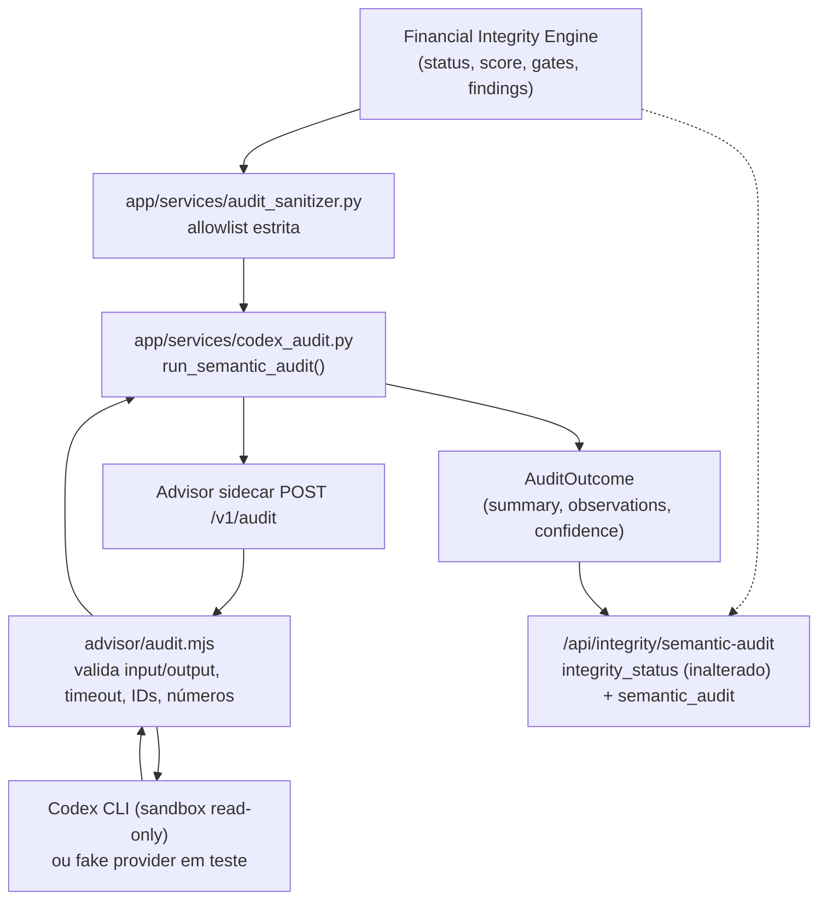

# Arquitetura

## Princípios

1. **Dados locais:** o Git contém somente código, documentação e testes.
2. **Cálculo determinístico:** imposto, projeção, deduplicação e conciliação não dependem de resposta probabilística.
3. **IA assistiva:** OCR, transcrição e Codex sugerem; não alteram o livro financeiro silenciosamente.
4. **Rastreabilidade:** todo lançamento importado mantém documento, linha, conta, titular e nível de confiança.
5. **Correção sem apagamento:** revisão altera status e classificação, preservando o evento original e a trilha de auditoria.

## Componentes

### Aplicação

FastAPI serve a interface web e a API. Para o MVP, o processamento ocorre no próprio serviço porque o volume é familiar. Um worker separado poderá ser adicionado quando OCR ou modelos locais exigirem filas demoradas.

### PostgreSQL

Armazena usuários, contas, categorias, documentos, lançamentos, pendências, comissões, holerites, compromissos, perfil financeiro e auditoria.

### Documentos

O arquivo original é criptografado com Fernet antes de ser persistido no volume. O banco guarda SHA-256, nome original, tipo, status e caminho criptografado.

### Central inteligente

Texto e documentos entram em `capture_drafts`. Regras locais, Tesseract e Whisper montam propostas editáveis. Somente a confirmação cria lançamentos, obrigações ou registros de folha. O arquivo original permanece criptografado e a captura registra processador, confiança, proposta e resultado.

### Consultor Codex

O motor financeiro consulta e consolida o banco, calcula o veredito e monta um resumo. O serviço `advisor` recebe esse resumo por uma rede Docker sem PostgreSQL e executa o Codex em sandbox somente leitura. A resposta é descartada se tentar mudar o veredito. A indisponibilidade do Codex aciona o fallback local.

Em redes que bloqueiam a saída HTTPS de WSL/Docker, o mesmo `advisor` pode executar nativamente no
Windows. Nesse modo, a aplicação o acessa por `host.docker.internal`, enquanto banco e documentos
permanecem exclusivamente nos contêineres/volumes. O processo recebe somente o segredo interno e o
JSON sanitizado, trabalha em um diretório vazio e executa o Codex com sandbox somente leitura.

### Fronteira do Codex Semantic Audit (PR 6)

O sidecar `advisor` expõe três contratos, todos read-only em relação ao livro financeiro:

| Rota | Uso | Pode alterar o veredito? |
|---|---|---|
| `POST /v1/classify` | Sugere categoria/tipo para um lançamento ambíguo capturado | Não; a sugestão só é aceita após confirmação humana |
| `POST /v1/analyze` | Explica o veredito do Advisor de compra em prosa | Não; a resposta só é usada quando o `verdict` declarado é **idêntico** ao calculado localmente (nunca mais permissivo, nunca mais conservador) |
| `POST /v1/audit` | Auditoria semântica consultiva sobre o `IntegrityAssessment`/findings já calculados | **Estruturalmente impossível**: o schema de saída (`advisor/audit-schema.json`) não tem nenhum campo `status`/`score`/`trusted_for_*`/`findings` |

`/v1/audit` é o contrato dedicado da iniciativa de integridade (ver `docs/INTEGRITY_IMPLEMENTATION_PLAN.md`, seção 10). O fluxo:



Garantias estruturais (não apenas convenção):

- **Schema de saída sem campo de autoridade.** `advisor/audit-schema.json` não declara `status`, `score`, `trusted_for_projection`, `trusted_for_reports` ou `findings`; `additionalProperties: false` faz qualquer tentativa de incluí-los falhar a validação, não "ser ignorada silenciosamente" -- a resposta inteira vira `available: false`.
- **Severidade consultiva limitada.** `observations[].severity` só aceita `info`/`review`; `critical`/`block` seguem exclusivos do Financial Integrity Engine.
- **`AuditOutcome` sem campo para veredito.** Em `app/services/codex_audit.py`, o dataclass que representa o resultado do Codex não tem `status`/`score`/`trusted_for_*`/`findings`; mesmo que uma validação anterior falhasse, não há onde esses valores seriam armazenados.
- **Dados não confiáveis nunca viram instrução.** Todo conteúdo originado de usuário/documento (por exemplo, nome de categoria) chega ao prompt somente dentro de um bloco `DADOS_JSON=` cercado por regras explícitas que mandam ignorar qualquer instrução encontrada ali dentro (`advisor/audit.mjs:buildAuditPrompt`).
- **IDs e números são verificados, não apenas confiados.** `evidence_ref` só pode citar ids opacos que já estavam no pacote enviado; números citados em texto livre que não aparecem em nenhum lugar do pacote são removidos da observação antes de ela ser devolvida.
- **Timeout/erro/schema inválido nunca viram `pass`.** Toda falha (timeout, indisponibilidade, JSON malformado, schema inválido, id desconhecido, número inventado) produz `available: false` com uma `reason` explícita; o motor financeiro nunca espera por isso além do timeout configurado e o `/api/integrity/status` determinístico não é afetado.
- **Isolamento preservado.** O sidecar continua sem `DATABASE_URL`, sem volume de documentos e sem rede com o PostgreSQL; `/v1/audit` não abriu nenhuma exceção a isso.

### Acesso remoto

Tailscale Serve é executado no Windows e publica a porta local em HTTPS somente dentro da tailnet. Vinicius e Kelly mantêm identidades próprias no Tailscale e no sistema financeiro.

### Backup

Um contêiner isolado executa `pg_dump` diariamente. A retenção local padrão é de 30 dias. A cópia externa deve ser implementada na operação do servidor.

## Fluxo de importação

```text
Upload
  -> valida tamanho e extensão
  -> calcula SHA-256
  -> bloqueia arquivo idêntico
  -> criptografa original
  -> escolhe parser CSV / OFX / PDF
  -> separa as duas colunas de faturas Itaú quando aplicável
  -> extrai totais e consignado de holerites compatíveis
  -> normaliza sinais e valores
  -> classifica
  -> calcula fingerprint de transação
  -> marca possíveis duplicidades
  -> cria fila de revisão
  -> registra auditoria
```

Um documento inválido ou incompatível não interrompe o sistema: o original permanece criptografado e uma pendência é criada para revisão.

## Modelo de deduplicação

Existem dois níveis:

- **arquivo idêntico:** SHA-256 igual; importação bloqueada;
- **lançamento possivelmente repetido:** conta, data, valor, descrição normalizada, titular e parcela iguais; registro preservado, excluído provisoriamente dos totais e encaminhado para revisão.

Essa estratégia evita dupla contagem sem apagar duas compras legítimas que eventualmente tenham o mesmo valor.

## Evolução

Se o volume familiar crescer, OCR e transcrição podem migrar para um worker assíncrono. O modelo `capture_drafts` preserva a compatibilidade dessa evolução sem alterar o livro financeiro.
