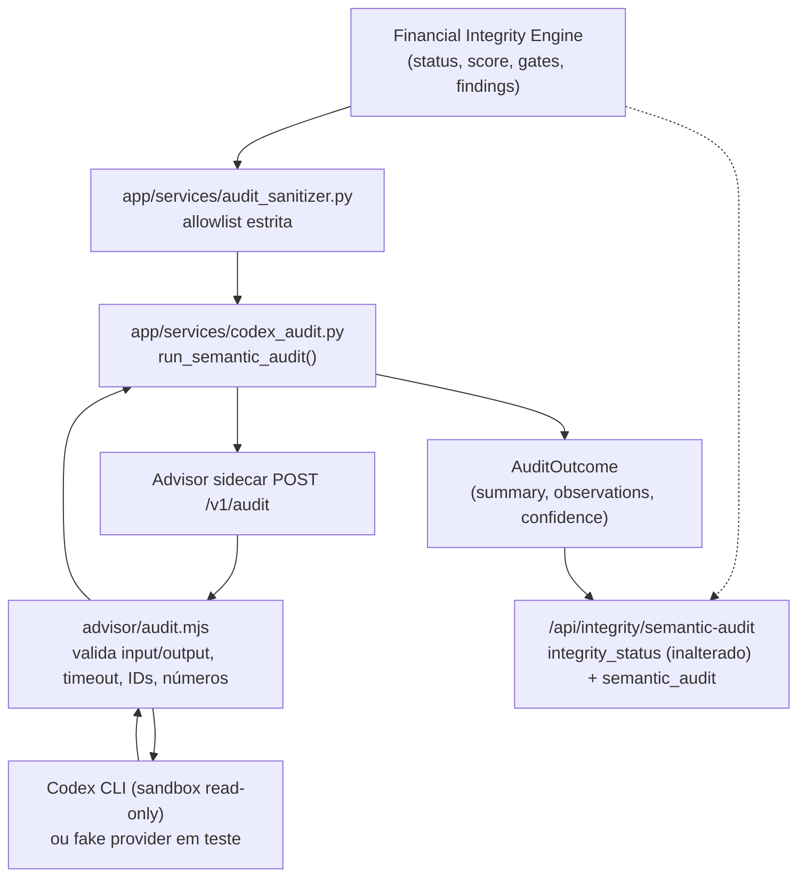

# Arquitetura

## Princípios

1. **Dados locais:** o Git contém somente código, documentação e testes.
2. **Cálculo determinístico:** imposto, projeção, deduplicação e conciliação não dependem de resposta probabilística.
3. **IA assistiva:** OCR, transcrição e Codex sugerem; não alteram o livro financeiro silenciosamente.
4. **Rastreabilidade:** todo lançamento importado mantém documento, linha, conta, titular e nível de confiança.
5. **Correção sem apagamento:** revisão altera status e classificação, preservando o evento original e a trilha de auditoria.

## Componentes

### Aplicação

FastAPI serve a interface web e a API. Para o MVP, o processamento ocorre no próprio serviço porque o volume é familiar. Um worker separado poderá ser adicionado quando OCR ou modelos locais exigirem filas demoradas.

### PostgreSQL

Armazena usuários, contas, categorias, documentos, lançamentos, pendências, comissões, holerites, compromissos, perfil financeiro e auditoria.

### Documentos

O arquivo original é criptografado com Fernet antes de ser persistido no volume. O banco guarda SHA-256, nome original, tipo, status e caminho criptografado.

### Central inteligente

Texto e documentos entram em `capture_drafts`. Regras locais, Tesseract e Whisper montam propostas editáveis. Somente a confirmação cria lançamentos, obrigações ou registros de folha. O arquivo original permanece criptografado e a captura registra processador, confiança, proposta e resultado.

### Consultor Codex

O motor financeiro consulta e consolida o banco, calcula o veredito e monta um resumo. O serviço `advisor` recebe esse resumo por uma rede Docker sem PostgreSQL e executa o Codex em sandbox somente leitura. A resposta é descartada se tentar mudar o veredito. A indisponibilidade do Codex aciona o fallback local.

Em redes que bloqueiam a saída HTTPS de WSL/Docker, o mesmo `advisor` pode executar nativamente no
Windows. Nesse modo, a aplicação o acessa por `host.docker.internal`, enquanto banco e documentos
permanecem exclusivamente nos contêineres/volumes. O processo recebe somente o segredo interno e o
JSON sanitizado, trabalha em um diretório vazio e executa o Codex com sandbox somente leitura.

### Fronteira do Codex Semantic Audit (PR 6)

O sidecar `advisor` expõe três contratos, todos read-only em relação ao livro financeiro:

| Rota | Uso | Pode alterar o veredito? |
|---|---|---|
| `POST /v1/classify` | Sugere categoria/tipo para um lançamento ambíguo capturado | Não; a sugestão só é aceita após confirmação humana |
| `POST /v1/analyze` | Explica o veredito do Advisor de compra em prosa | Não; a resposta só é usada quando o `verdict` declarado é **idêntico** ao calculado localmente (nunca mais permissivo, nunca mais conservador) |
| `POST /v1/audit` | Auditoria semântica consultiva sobre o `IntegrityAssessment`/findings já calculados | **Estruturalmente impossível**: o schema de saída (`advisor/audit-schema.json`) não tem nenhum campo `status`/`score`/`trusted_for_*`/`findings` |

`/v1/audit` é o contrato dedicado da iniciativa de integridade (ver `docs/INTEGRITY_IMPLEMENTATION_PLAN.md`, seção 10). O fluxo:



Garantias estruturais (não apenas convenção):

- **Schema de saída sem campo de autoridade.** `advisor/audit-schema.json` não declara `status`, `score`, `trusted_for_projection`, `trusted_for_reports` ou `findings`; `additionalProperties: false` faz qualquer tentativa de incluí-los falhar a validação, não "ser ignorada silenciosamente" -- a resposta inteira vira `available: false`.
- **Severidade consultiva limitada.** `observations[].severity` só aceita `info`/`review`; `critical`/`block` seguem exclusivos do Financial Integrity Engine.
- **`AuditOutcome` sem campo para veredito.** Em `app/services/codex_audit.py`, o dataclass que representa o resultado do Codex não tem `status`/`score`/`trusted_for_*`/`findings`; mesmo que uma validação anterior falhasse, não há onde esses valores seriam armazenados.
- **Dados não confiáveis nunca viram instrução.** Todo conteúdo originado de usuário/documento (por exemplo, nome de categoria) chega ao prompt somente dentro de um bloco `DADOS_JSON=` cercado por regras explícitas que mandam ignorar qualquer instrução encontrada ali dentro (`advisor/audit.mjs:buildAuditPrompt`).
- **IDs e números são verificados, não apenas confiados.** `evidence_ref` só pode citar ids opacos que já estavam no pacote enviado; números citados em texto livre que não aparecem em nenhum lugar do pacote são removidos da observação antes de ela ser devolvida.
- **Timeout/erro/schema inválido nunca viram `pass`.** Toda falha (timeout, indisponibilidade, JSON malformado, schema inválido, id desconhecido, número inventado) produz `available: false` com uma `reason` explícita; o motor financeiro nunca espera por isso além do timeout configurado e o `/api/integrity/status` determinístico não é afetado.
- **Isolamento preservado.** O sidecar continua sem `DATABASE_URL`, sem volume de documentos e sem rede com o PostgreSQL; `/v1/audit` não abriu nenhuma exceção a isso.

### Acesso remoto

Tailscale Serve é executado no Windows e publica a porta local em HTTPS somente dentro da tailnet. Vinicius e Kelly mantêm identidades próprias no Tailscale e no sistema financeiro.

### Backup

Um contêiner isolado executa `pg_dump` diariamente. A retenção local padrão é de 30 dias. A cópia externa deve ser implementada na operação do servidor.

### Integração contínua (PR 8)

`.github/workflows/ci.yml` roda doze jobs nomeados e obrigatórios em paralelo a cada PR/push em
`main`: `lint` (Ruff), `unit` (suíte completa sobre SQLite -- a rede de segurança que cobre qualquer
dimensão sem gate dedicado), `financial-invariants`, `property-tests`, `parser-reconciliation`,
`projection-parity`, `snapshot-channel-consistency`, `advisor-contract-security`, `frontend-syntax`,
`docker-build` e, com um serviço `postgres:17-alpine` real (a mesma imagem de `compose.yaml`, não
apenas SQLite): `alembic-migration` (upgrade de banco vazio até `head`, upgrade da baseline legada
`0002` preservando linhas existentes, downgrade seguro da revisão final) e `integration-postgres`
(idempotência e não mutação de fatos do `app.cli.backfill`, com o locking real do PostgreSQL que
`SELECT ... FOR UPDATE` exige -- SQLite não tem lock de linha entre conexões; ver
`app/services/financial_integrity.py` e `app/models.py::HouseholdFinancialRevision`). CI verde é
necessário para revisão, nunca suficiente
para merge -- ver `docs/INTEGRITY_IMPLEMENTATION_PLAN.md` seções 17-18.

### Backfill (`app.cli.backfill`, PR 8)

Reprocessa famílias já existentes contra o Financial Integrity Engine sem reimplementar nenhuma
regra financeira própria: reutiliza `unknown_reconciliation`/`persist_reconciliation`,
`discover_transaction_duplicates`, `build_snapshot` e `execute_integrity_run` -- serviços que
compartilham a mesma regra determinística que o fluxo de importação já usa. Documentos sem
reconciliação recebem um registro `unknown` explícito (nunca um total declarado/reconstruído
fabricado); transações ainda não examinadas por nenhum passe de duplicidade têm evidência derivada
(`DuplicateGroup`/`DuplicateGroupMember`) criada pela mesma regra determinística do fluxo ao vivo, mas
sem aplicar a classificação à própria `Transaction` (ver abaixo); cada competência tem seus achados de
integridade avaliados antes do snapshot correspondente ser construído (ordem necessária para
convergência -- ver o docstring de `_backfill_snapshots_and_period_integrity`). Nunca escreve em
`Transaction`, `Document`, `PayrollRecord`, `Commission` ou `Obligation` -- nem mesmo nas colunas de
classificação de duplicidade (`canonical_status`/`possible_duplicate`/`excluded`/
`duplicate_group_id`): aplicar essa classificação a uma transação já publicada continua sendo uma
decisão humana (`resolve_duplicate_group`) ou efeito de uma transação genuinamente nova no fluxo ao
vivo (`register_transaction_duplicates`), nunca um efeito colateral automático do backfill. Nunca
fabrica uma `AccountBalanceObservation` ou data efetiva para um saldo legado -- o fallback já
existente de `build_snapshot` mantém essa evidência `unknown`/não confiável. Idempotente e retomável
por
construção (cada passo é um no-op sobre dado inalterado ou fica restrito às linhas que ainda
precisam dele), não por um checkpoint de retomada separado. `--dry-run` executa o mesmo caminho de
código e reverte a transação em vez de persistir; o manifesto `BackfillRun` da execução em dry-run é
gravado à parte, após o rollback, para preservar a evidência de auditoria mesmo assim. Ver
`docs/RUNBOOK_PR8_BACKFILL.md`.

## Fluxo de importação

```text
Upload
  -> valida tamanho e extensão
  -> calcula SHA-256
  -> bloqueia arquivo idêntico
  -> criptografa original
  -> escolhe parser CSV / OFX / PDF
  -> separa as duas colunas de faturas Itaú quando aplicável
  -> extrai totais e consignado de holerites compatíveis
  -> normaliza sinais e valores
  -> classifica
  -> calcula fingerprint de transação
  -> marca possíveis duplicidades
  -> cria fila de revisão
  -> registra auditoria
```

Um documento inválido ou incompatível não interrompe o sistema: o original permanece criptografado e uma pendência é criada para revisão.

## Importação em lote (Fase 2)

`POST /api/imports/batch` (`app/api.py`) não é um segundo fluxo de importação: é orquestração sobre o
mesmo fluxo acima, executado uma vez por arquivo através de `_import_one_document`, a função
compartilhada com `POST /api/imports`. Cada arquivo do lote é persistido e comitado de forma
independente -- o mesmo `db.commit()` por documento que o envio individual já fazia -- então a falha de
um arquivo (parser não reconhecido, exceção inesperada, limite de tamanho excedido) nunca desfaz nem
reescreve o resultado já persistido de um arquivo anterior do mesmo lote; uma exceção fora do já tratado
`ValueError` de parsing aciona `db.rollback()` apenas do trabalho não comitado desse arquivo antes de
seguir para o próximo. A resposta é sempre a lista real de resultados por arquivo (`imported`/
`imported_with_review`/`review_required`/`rejected`), nunca um "sucesso" agregado quando algum arquivo
falhou. `account_id`/`document_type` são únicos para todo o lote, espelhando o mesmo contrato do envio
individual (inclusive a dispensa de conta para holerite). Limites: `MAX_UPLOAD_MB` por arquivo (igual ao
envio individual), mais `MAX_BATCH_FILES` arquivos e `MAX_BATCH_TOTAL_MB` combinados por envio
(`app/config.py`). Nenhuma migração foi necessária -- `Document`, `Transaction` e
`DocumentReconciliation` já carregam, por linha, tudo que um resultado por arquivo precisa expor. A
interface (`app/templates/index.html`, `app/static/app.js`) só exibe os campos que o backend já
calculou por arquivo; nunca soma, parseia, classifica ou reconcilia no navegador.

## Modelo de deduplicação

Existem dois níveis:

- **arquivo idêntico:** SHA-256 igual; importação bloqueada;
- **lançamento possivelmente repetido:** conta, data, valor, descrição normalizada, titular e parcela iguais; registro preservado, excluído provisoriamente dos totais e encaminhado para revisão.

Essa estratégia evita dupla contagem sem apagar duas compras legítimas que eventualmente tenham o mesmo valor.

## Conciliação visual de pagamento de fatura (Fase 2)

Um mesmo evento real -- o pagamento de uma fatura -- pode gerar duas linhas independentes, cada
uma já `transaction_type = "reconciliation"` pelo classificador único (`PAYMENT_PATTERN`,
`app/services/classifier.py`) e portanto já excluída de todo total operacional antes de qualquer
vínculo existir: a própria fatura (linha "pagamento recebido" no cartão, valor positivo) e o
extrato bancário (débito que saiu da conta corrente, valor negativo). `app/services/
card_payment_reconciliation.py` apenas liga essas duas linhas já canônicas para consulta humana --
não é um novo cálculo financeiro. Um candidato só é sugerido automaticamente quando é o único
dentro da tolerância de R$ 0,01 e da janela de 45 dias do lançamento da fatura; ausência ou mais de
um candidato permanece `unmatched`/`ambiguous`, nunca resolvido sozinho. Confirmar (`POST
/api/card-payment-reconciliations/link`) ou desfazer (`.../unlink`) um vínculo é sempre uma ação
humana, com motivo obrigatório e trilha de auditoria, e altera somente a coluna já existente
`Transaction.linked_transaction_id` (migração `0004`) nos dois lados -- nunca o valor, tipo,
categoria ou exclusão de qualquer lançamento, por isso não pode afetar INV-002 nem nenhum
snapshot/relatório/projeção. Dashboard, relatórios, projeção e Monthly Close continuam consumindo
exatamente as mesmas linhas `Transaction`/`DocumentReconciliation` de sempre; esta tela não introduz
uma segunda fonte de verdade.

## Evolução

Se o volume familiar crescer, OCR e transcrição podem migrar para um worker assíncrono. O modelo `capture_drafts` preserva a compatibilidade dessa evolução sem alterar o livro financeiro.
