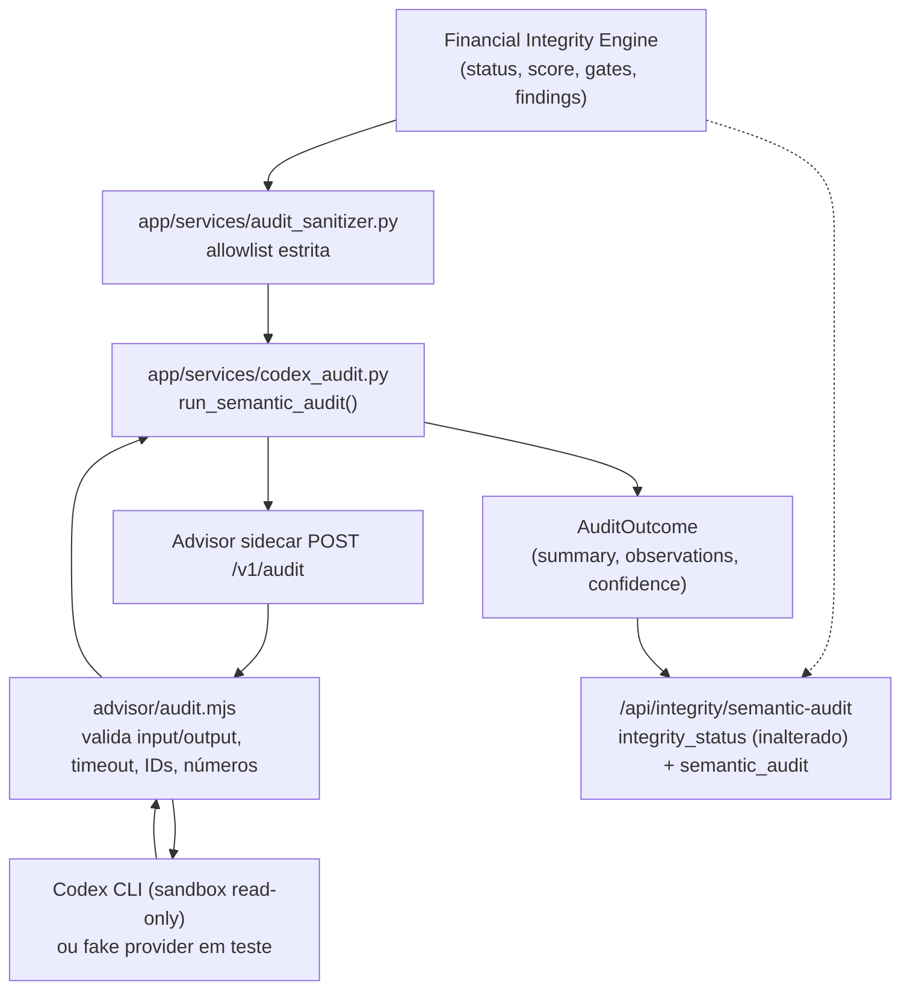

# Arquitetura

## Princípios

1. **Dados locais:** o Git contém somente código, documentação e testes.
2. **Cálculo determinístico:** imposto, projeção, deduplicação e conciliação não dependem de resposta probabilística.
3. **IA assistiva:** OCR, transcrição e Codex sugerem; não alteram o livro financeiro silenciosamente.
4. **Rastreabilidade:** todo lançamento importado mantém documento, linha, conta, titular e nível de confiança.
5. **Correção sem apagamento:** revisão altera status e classificação, preservando o evento original e a trilha de auditoria.

## Componentes

### Aplicação

FastAPI serve a interface web e a API. O processamento continua no próprio serviço/contêiner (nenhum broker ou processo separado foi introduzido, adequado ao volume familiar de uma instalação), mas o OCR/transcrição de captura roda fora do caminho da requisição HTTP -- ver "Fila assíncrona de OCR/áudio" abaixo. Um worker realmente separado (processo/contêiner próprio) poderá ser adicionado depois, quando o volume exigir, sem mudar o modelo de dados.

### PostgreSQL

Armazena usuários, contas, categorias, documentos, lançamentos, pendências, comissões, holerites, compromissos, perfil financeiro e auditoria.

### Documentos

O arquivo original é criptografado com Fernet antes de ser persistido no volume. O banco guarda SHA-256, nome original, tipo, status e caminho criptografado.

### Central inteligente

Texto e documentos entram em `capture_drafts`. Regras locais, Tesseract e Whisper montam propostas editáveis. Somente a confirmação cria lançamentos, obrigações ou registros de folha. O arquivo original permanece criptografado e a captura registra processador, confiança, proposta e resultado.

#### Fila assíncrona de OCR/áudio

`POST /captures/preview` para imagem, PDF ou áudio cria o `Document`/`CaptureDraft` (status
`queued`) e uma linha em `capture_processing_jobs` (household, draft e documento correlacionados,
`job_type` `ocr`/`audio`, `status` `queued`/`processing`/`completed`/`failed`, tentativas, erro
sanitizado, `trace_id`) e responde sem esperar o OCR/Whisper terminar; o processamento roda em
segundo plano (`BackgroundTasks` do FastAPI) chamando exatamente os mesmos
`extract_document_text`/`transcribe_audio`/`preview_capture` do caminho síncrono -- nenhum segundo
motor de OCR, transcrição, classificação ou importação. Texto simples e CSV/OFX continuam
síncronos, por serem rápidos.

O claim de um job é uma única `UPDATE ... WHERE status = ...` (sem depender de `SELECT ... FOR
UPDATE SKIP LOCKED`), por isso é seguro contra corrida em PostgreSQL e SQLite igualmente: entrega
duplicada, uma nova tentativa manual (`POST /captures/{id}/retry`) e o reconciliador de recuperação
de falhas nunca processam o mesmo job duas vezes nem duplicam `Document`/`CaptureDraft`. Um job
travado em `processing` além do tempo configurado (worker morto/reiniciado) é reclamado pelo
reconciliador (`python -m app.cli.capture_worker`, executado manualmente ou por cron/systemd-timer
fora do processo web) até esgotar as tentativas, quando é marcado `failed` explicitamente --
nunca promovido a sucesso silenciosamente. Falha ou timeout nunca apaga ou reescreve o documento
original; a confirmação humana continua sendo a única ação que cria lançamento, obrigação ou
registro de folha.

### Consultor Codex

O motor financeiro consulta e consolida o banco, calcula o veredito e monta um resumo. O serviço `advisor` recebe esse resumo por uma rede Docker sem PostgreSQL e executa o Codex em sandbox somente leitura. A resposta é descartada se tentar mudar o veredito. A indisponibilidade do Codex aciona o fallback local.

Em redes que bloqueiam a saída HTTPS de WSL/Docker, o mesmo `advisor` pode executar nativamente no
Windows. Nesse modo, a aplicação o acessa por `host.docker.internal`, enquanto banco e documentos
permanecem exclusivamente nos contêineres/volumes. O processo recebe somente o segredo interno e o
JSON sanitizado, trabalha em um diretório vazio e executa o Codex com sandbox somente leitura.

### Fronteira do Codex Semantic Audit (PR 6)

O sidecar `advisor` expõe três contratos, todos read-only em relação ao livro financeiro:

| Rota | Uso | Pode alterar o veredito? |
|---|---|---|
| `POST /v1/classify` | Sugere categoria/tipo para um lançamento ambíguo capturado | Não; a sugestão só é aceita após confirmação humana |
| `POST /v1/analyze` | Explica o veredito do Advisor de compra em prosa | Não; a resposta só é usada quando o `verdict` declarado é **idêntico** ao calculado localmente (nunca mais permissivo, nunca mais conservador) |
| `POST /v1/audit` | Auditoria semântica consultiva sobre o `IntegrityAssessment`/findings já calculados | **Estruturalmente impossível**: o schema de saída (`advisor/audit-schema.json`) não tem nenhum campo `status`/`score`/`trusted_for_*`/`findings` |

`/v1/audit` é o contrato dedicado da iniciativa de integridade (ver `docs/INTEGRITY_IMPLEMENTATION_PLAN.md`, seção 10). O fluxo:



Garantias estruturais (não apenas convenção):

- **Schema de saída sem campo de autoridade.** `advisor/audit-schema.json` não declara `status`, `score`, `trusted_for_projection`, `trusted_for_reports` ou `findings`; `additionalProperties: false` faz qualquer tentativa de incluí-los falhar a validação, não "ser ignorada silenciosamente" -- a resposta inteira vira `available: false`.
- **Severidade consultiva limitada.** `observations[].severity` só aceita `info`/`review`; `critical`/`block` seguem exclusivos do Financial Integrity Engine.
- **`AuditOutcome` sem campo para veredito.** Em `app/services/codex_audit.py`, o dataclass que representa o resultado do Codex não tem `status`/`score`/`trusted_for_*`/`findings`; mesmo que uma validação anterior falhasse, não há onde esses valores seriam armazenados.
- **Dados não confiáveis nunca viram instrução.** Todo conteúdo originado de usuário/documento (por exemplo, nome de categoria) chega ao prompt somente dentro de um bloco `DADOS_JSON=` cercado por regras explícitas que mandam ignorar qualquer instrução encontrada ali dentro (`advisor/audit.mjs:buildAuditPrompt`).
- **IDs e números são verificados, não apenas confiados.** `evidence_ref` só pode citar ids opacos que já estavam no pacote enviado; números citados em texto livre que não aparecem em nenhum lugar do pacote são removidos da observação antes de ela ser devolvida.
- **Timeout/erro/schema inválido nunca viram `pass`.** Toda falha (timeout, indisponibilidade, JSON malformado, schema inválido, id desconhecido, número inventado) produz `available: false` com uma `reason` explícita; o motor financeiro nunca espera por isso além do timeout configurado e o `/api/integrity/status` determinístico não é afetado.
- **Isolamento preservado.** O sidecar continua sem `DATABASE_URL`, sem volume de documentos e sem rede com o PostgreSQL; `/v1/audit` não abriu nenhuma exceção a isso.

### Acesso remoto

Tailscale Serve é executado no Windows e publica a porta local em HTTPS somente dentro da tailnet. Vinicius e Kelly mantêm identidades próprias no Tailscale e no sistema financeiro.

### Backup

Um contêiner isolado executa `pg_dump` diariamente. A retenção local padrão é de 30 dias. A cópia externa deve ser implementada na operação do servidor.

### Integração contínua (PR 8)

`.github/workflows/ci.yml` roda doze jobs nomeados e obrigatórios em paralelo a cada PR/push em
`main`: `lint` (Ruff), `unit` (suíte completa sobre SQLite -- a rede de segurança que cobre qualquer
dimensão sem gate dedicado), `financial-invariants`, `property-tests`, `parser-reconciliation`,
`projection-parity`, `snapshot-channel-consistency`, `advisor-contract-security`, `frontend-syntax`,
`docker-build` e, com um serviço `postgres:17-alpine` real (a mesma imagem de `compose.yaml`, não
apenas SQLite): `alembic-migration` (upgrade de banco vazio até `head`, upgrade da baseline legada
`0002` preservando linhas existentes, downgrade seguro da revisão final) e `integration-postgres`
(idempotência e não mutação de fatos do `app.cli.backfill`, com o locking real do PostgreSQL que
`SELECT ... FOR UPDATE` exige -- SQLite não tem lock de linha entre conexões; ver
`app/services/financial_integrity.py` e `app/models.py::HouseholdFinancialRevision`). CI verde é
necessário para revisão, nunca suficiente
para merge -- ver `docs/INTEGRITY_IMPLEMENTATION_PLAN.md` seções 17-18.

### Backfill (`app.cli.backfill`, PR 8)

Reprocessa famílias já existentes contra o Financial Integrity Engine sem reimplementar nenhuma
regra financeira própria: reutiliza `unknown_reconciliation`/`persist_reconciliation`,
`discover_transaction_duplicates`, `build_snapshot` e `execute_integrity_run` -- serviços que
compartilham a mesma regra determinística que o fluxo de importação já usa. Documentos sem
reconciliação recebem um registro `unknown` explícito (nunca um total declarado/reconstruído
fabricado); transações ainda não examinadas por nenhum passe de duplicidade têm evidência derivada
(`DuplicateGroup`/`DuplicateGroupMember`) criada pela mesma regra determinística do fluxo ao vivo, mas
sem aplicar a classificação à própria `Transaction` (ver abaixo); cada competência tem seus achados de
integridade avaliados antes do snapshot correspondente ser construído (ordem necessária para
convergência -- ver o docstring de `_backfill_snapshots_and_period_integrity`). Nunca escreve em
`Transaction`, `Document`, `PayrollRecord`, `Commission` ou `Obligation` -- nem mesmo nas colunas de
classificação de duplicidade (`canonical_status`/`possible_duplicate`/`excluded`/
`duplicate_group_id`): aplicar essa classificação a uma transação já publicada continua sendo uma
decisão humana (`resolve_duplicate_group`) ou efeito de uma transação genuinamente nova no fluxo ao
vivo (`register_transaction_duplicates`), nunca um efeito colateral automático do backfill. Nunca
fabrica uma `AccountBalanceObservation` ou data efetiva para um saldo legado -- o fallback já
existente de `build_snapshot` mantém essa evidência `unknown`/não confiável. Idempotente e retomável
por
construção (cada passo é um no-op sobre dado inalterado ou fica restrito às linhas que ainda
precisam dele), não por um checkpoint de retomada separado. `--dry-run` executa o mesmo caminho de
código e reverte a transação em vez de persistir; o manifesto `BackfillRun` da execução em dry-run é
gravado à parte, após o rollback, para preservar a evidência de auditoria mesmo assim. Ver
`docs/RUNBOOK_PR8_BACKFILL.md`.

## Fluxo de importação

```text
Upload
  -> valida tamanho e extensão
  -> calcula SHA-256
  -> bloqueia arquivo idêntico
  -> criptografa original
  -> escolhe parser CSV / OFX / PDF
  -> separa as duas colunas de faturas Itaú quando aplicável
  -> extrai totais e consignado de holerites compatíveis
  -> normaliza sinais e valores
  -> classifica
  -> calcula fingerprint de transação
  -> marca possíveis duplicidades
  -> cria fila de revisão
  -> registra auditoria
```

Um documento inválido ou incompatível não interrompe o sistema: o original permanece criptografado e uma pendência é criada para revisão.

## Importação em lote (Fase 2)

`POST /api/imports/batch` (`app/api.py`) não é um segundo fluxo de importação: é orquestração sobre o
mesmo fluxo acima, executado uma vez por arquivo através de `_import_one_document`, a função
compartilhada com `POST /api/imports`. Cada arquivo do lote é persistido e comitado de forma
independente -- o mesmo `db.commit()` por documento que o envio individual já fazia -- então a falha de
um arquivo (parser não reconhecido, exceção inesperada, limite de tamanho excedido) nunca desfaz nem
reescreve o resultado já persistido de um arquivo anterior do mesmo lote; uma exceção fora do já tratado
`ValueError` de parsing aciona `db.rollback()` apenas do trabalho não comitado desse arquivo antes de
seguir para o próximo. A resposta é sempre a lista real de resultados por arquivo (`imported`/
`imported_with_review`/`review_required`/`rejected`), nunca um "sucesso" agregado quando algum arquivo
falhou. `account_id`/`document_type` são únicos para todo o lote, espelhando o mesmo contrato do envio
individual (inclusive a dispensa de conta para holerite). Limites: `MAX_UPLOAD_MB` por arquivo (igual ao
envio individual), mais `MAX_BATCH_FILES` arquivos e `MAX_BATCH_TOTAL_MB` combinados por envio
(`app/config.py`). Nenhuma migração foi necessária -- `Document`, `Transaction` e
`DocumentReconciliation` já carregam, por linha, tudo que um resultado por arquivo precisa expor. A
interface (`app/templates/index.html`, `app/static/app.js`) só exibe os campos que o backend já
calculou por arquivo; nunca soma, parseia, classifica ou reconcilia no navegador.

O lote inteiro é correlacionado por um `batch_id` (UUID) gravado no evento de auditoria agregado
`document.import_batch` (`AuditEvent.details`, JSON já existente, nenhuma coluna nova). Cada entrada de
`outcomes[]` nesse evento carrega `index`, `status`, `document_id` (o `Document.id` real quando o
arquivo foi processado; `null` quando o arquivo foi rejeitado antes de qualquer `Document` existir --
limite de tamanho, duplicidade de arquivo, falha inesperada) e `error_category`. Isso torna a
trilha de auditoria persistida, por si só, a lineage determinística entre um lote e os `Document`s que
ele produziu -- sem depender de reconstruir por proximidade de horário.

## Exportação Excel/PDF (Fase 2)

`GET /api/reports/export?format=xlsx|pdf` não é um segundo motor de relatório: `app.api._build_report_payload`
é a mesma função que `GET /api/reports` já usava (extraída sem qualquer mudança de comportamento), e ambas
as rotas a chamam -- mesma validação de `months`/`end_month`, mesmas snapshots via `build_snapshot`, mesmas
funções de publicação canônica (`report_month_monetary_publication`, `category_monetary_publication`,
`report_summary_monetary_publication`, `category_spending_rows`, `account_cash_flow_rows`). O exportador
(`app/services/report_export.py`) recebe esse dict já pronto e apenas o renderiza; nenhuma soma, média,
participação percentual, reclassificação, deduplicação ou reconciliação é recalculada por ele -- se um
valor está errado no Excel/PDF, ele já estava errado no JSON de `/reports`.

Duas renderizações independentes, uma única fonte:

- **Excel** (`build_report_workbook`): `openpyxl` (já dependência do projeto, usada também pelo importador
  de planilha de planejamento) escreve células de dado puro com formatação de apresentação apenas
  (`R$ #,##0.00`, etc.) -- nunca uma fórmula de planilha, para que o Excel nunca possa se tornar uma segunda
  fonte de verdade que recalcula um valor de forma diferente do backend. Uma aba por seção canônica:
  Resumo, Mensal, Categorias, Contas. Todo valor textual (categoria, conta, instituição, o nome
  configurável da reserva de liquidez, etc.) passa pelo único ponto de escrita de célula
  (`_write_cell`), que força o tipo de dado openpyxl `'s'` (texto puro) mesmo quando o texto começa com
  `=`, `+`, `-` ou `@` -- caracteres que o openpyxl, por padrão, classifica como fórmula na atribuição.
  Isso neutraliza injeção de fórmula/DDE em texto de origem do usuário sem jamais alterar, normalizar ou
  remover o valor exibido.
- **PDF** (`build_report_pdf`): `pymupdf` (`Page.insert_htmlbox`, já dependência do projeto, usada também
  para leitura de PDF na importação) renderiza uma string HTML montada pelo próprio backend através do
  motor de layout nativo do PyMuPDF -- sem navegador, sem Chrome headless, sem dependência nova. É um
  mecanismo diferente do botão "Imprimir / PDF" já existente (`window.print()` em `app/static/app.js`), que
  depende do navegador do usuário e continua funcionando exatamente como antes, sem nenhuma mudança.
  Cada seção tabular é paginada em blocos de até 28 linhas (nunca uma única página que estoura e corta
  dados silenciosamente), com auto-redução de escala (`scale_low=0`) como segunda defesa independente; se
  mesmo assim uma seção não couber, a geração falha alto (exceção) em vez de devolver um PDF que parece
  completo mas está com dados faltando.

Nenhuma migração foi necessária -- a exportação não introduz nenhum modelo, coluna ou tabela nova; ela só
lê o mesmo dict que `/reports` já monta a partir de dados existentes. Nome de arquivo
(`relatorio_<início>_a_<fim>.<formato>`) carrega apenas o período do próprio relatório, nunca nome de
família, usuário ou conta -- sem PII. `Content-Disposition: attachment` força o download em vez de exibição
inline. Autenticação e isolamento por família são os mesmos de `GET /reports` (a mesma função, o mesmo
`user.household_id`). A interface (`app/templates/index.html`, `app/static/app.js`) só solicita o formato e
baixa o arquivo (`downloadReportExport`); nenhum total é somado, parseado ou recalculado no navegador.

## Modelo de deduplicação

Existem dois níveis:

- **arquivo idêntico:** SHA-256 igual; importação bloqueada;
- **lançamento possivelmente repetido:** conta, data, valor, descrição normalizada, titular e parcela iguais; registro preservado, excluído provisoriamente dos totais e encaminhado para revisão.

Essa estratégia evita dupla contagem sem apagar duas compras legítimas que eventualmente tenham o mesmo valor.

## Conciliação visual de pagamento de fatura (Fase 2)

Um mesmo evento real -- o pagamento de uma fatura -- pode gerar duas linhas independentes, cada
uma já `transaction_type = "reconciliation"` pelo classificador único (`PAYMENT_PATTERN`,
`app/services/classifier.py`) e portanto já excluída de todo total operacional antes de qualquer
vínculo existir: a própria fatura (linha "pagamento recebido" no cartão, valor positivo) e o
extrato bancário (débito que saiu da conta corrente, valor negativo). `app/services/
card_payment_reconciliation.py` apenas liga essas duas linhas já canônicas para consulta humana --
não é um novo cálculo financeiro. Um candidato só é sugerido automaticamente quando é o único
dentro da tolerância de R$ 0,01 e da janela de 45 dias do lançamento da fatura; ausência ou mais de
um candidato permanece `unmatched`/`ambiguous`, nunca resolvido sozinho. Confirmar (`POST
/api/card-payment-reconciliations/link`) ou desfazer (`.../unlink`) um vínculo é sempre uma ação
humana, com motivo obrigatório e trilha de auditoria, e altera somente a coluna já existente
`Transaction.linked_transaction_id` (migração `0004`) nos dois lados -- nunca o valor, tipo,
categoria ou exclusão de qualquer lançamento, por isso não pode afetar INV-002 nem nenhum
snapshot/relatório/projeção. Dashboard, relatórios, projeção e Monthly Close continuam consumindo
exatamente as mesmas linhas `Transaction`/`DocumentReconciliation` de sempre; esta tela não introduz
uma segunda fonte de verdade.

## Comparação visual de cenários de compra (Fase 3)

`POST /api/purchases/scenario-comparison` (`app/api.py::compare_purchase_scenarios`) compara duas a
cinco alternativas hipotéticas de compra (preço, entrada, quantidade de parcelas, juros mensal e
mês da compra) sem introduzir um segundo motor de cálculo. Cada alternativa é convertida em um
`month -> valor` de parcelas (`_purchase_scenario_candidate_schedule`, reusando a fórmula de
amortização price/Gauss, extraída de `_advisor_payment` para
`app.services.finance.amortized_installment_payment` para nunca existir em duas cópias) e somada,
sem duplicar, às parcelas futuras já persistidas do household (`_future_installments`). O resultado
alimenta o mesmo `_build_projection_gate_checks` que `GET /forecast` já usa -- agora com um
parâmetro opcional `extra_installments` --, então cada alternativa é literalmente rodada pelo
Projection Engine (`build_forecast`) e pelo Projection Validator (`validate_projection`) canônicos,
preservando os três cenários normativos (`no_commission`/`delayed`/`expected`) e a autoridade de
INV-005/006/018/022 sobre `trusted_for_projection`.

`purchase_month` é, sem exceção, o primeiro mês em que a compra afeta a projeção: a entrada (se
houver) e a primeira parcela do valor financiado (se houver) caem nesse mesmo mês, e cada parcela
seguinte cai um mês depois da anterior -- aritmética de calendário direta, sem política financeira
embutida (`for offset in range(installment_count): month_key(add_months(purchase_month, offset))`).
Uma segunda revisão de engenharia neste PR bloqueou uma versão anterior que inferia "primeira
parcela financiada só no mês seguinte" como convenção de mercado ("common retail installment
plans") e reusava `_installment_remaining_schedule` (o contrato de parcelas *remanescentes após*
uma parcela já observada em um `Transaction` real) com `installment_current=0` para fabricar um
"mês zero" -- ambas eram semântica financeira nova não reutilizada de nenhum contrato canônico
existente, e a primeira contradizia a própria documentação do campo `purchase_month`
(`PurchaseScenarioAlternativeRequest`, `app/schemas.py`). A versão atual não usa
`_installment_remaining_schedule` nesta função; ela continua sendo a fonte única para as parcelas de
cartão já persistidas (`_future_installments`/`_project_installments`), que descrevem um cenário
genuinamente diferente (uma parcela já observada em um `Transaction` real).

Cada cenário publica apenas fatos determinísticos e não prescritivos (`final_balance`,
`minimum_balance`, `final_uncovered_deficit`, `maximum_uncovered_deficit`,
`minimum_distance_to_floor`, `crosses_safety_floor`, `has_uncovered_deficit`) -- não existe um
campo `viable`/veredito que colapse os três cenários em uma única decisão. Uma revisão de
engenharia neste PR bloqueou uma versão anterior que publicava `"viable": min(balance_delayed) >=
emergency_floor`: isso tratava o piso como bloqueio (contrariando `FINANCIAL_RULES`/o Work Order,
que definem o piso como referência/alerta) e elegia `delayed` como cenário decisório sem contrato
normativo para isso. `crosses_safety_floor`/`has_uncovered_deficit` são apenas leituras booleanas de
campos que o Projection Engine/Validator já produzem e o INV-018 já valida (`distance_to_floor` é
`balance - safety_floor`, com sinal, em `projection_validator.py`); nenhum dos dois bloqueia,
recomenda ou decide -- apenas descrevem o que a projeção calculou, por cenário.

A comparação é inteiramente simulativa e somente leitura: nenhuma `Transaction`, `Obligation`,
`Commission`, `PayrollRecord` ou `Document` é lida além do necessário para reconstruir a projeção
real do household, nenhuma é criada, e a sessão do banco nunca é commitada nesta rota -- inclusive
o `FinancialSnapshot` que `build_snapshot` eventualmente prepara internamente (idempotente; só gera
uma linha nova quando o checksum do período corrente já mudou) é descartado ao final da requisição
sem commit. Cada invariant é avaliado em memória (`evaluate_invariant`/`assess_integrity`, funções
puras, sem acesso a banco) em vez de `execute_integrity_run`, para que uma compra apenas comparada
--nunca confirmada-- não deixe `IntegrityRun`/`IntegrityFinding` como se tivesse sido avaliada de
verdade. Um `purchase_month` fora de `[próximo mês da projeção, projection_end]` é rejeitado (422)
em vez de silenciosamente não aparecer na projeção. O frontend (`view-planning`, painel "Comparar
cenários de compra") só reformata a resposta desta rota; não existe fórmula financeira paralela em
`app/static/app.js` para esta funcionalidade (ver `tests/test_purchase_scenario_comparison_frontend.py`).

## Notificações de vencimento no navegador (Fase 3)

`docs/WORK_ORDER_BROWSER_DUE_NOTIFICATIONS.md`. Este slice não introduz nenhuma rota, tabela,
migração ou coluna nova: o módulo em `app/static/app.js` (funções `checkDueNotifications`,
`renderDueNotificationsPanel`, `fireDueNotification`, etc.) apenas reutiliza `GET /obligations`
(`app/api.py::obligations` → `_obligation_rows`), a mesma função canônica, autenticada e isolada por
família que já alimenta a tabela de "Planejamento" e o painel "Obrigações próximas do vencimento" do
dashboard. Nenhuma data, recorrência, parcela, projeção, juros, saldo, piso ou classificação é
recalculada no navegador: o único critério usado no cliente é a pertença categórica ao
`alert_level` que o backend já calculou (`overdue`/`urgent`/`soon`/`scheduled`), nunca uma diferença
de datas refeita em JavaScript. O sino no topo da aplicação (`#due-notifications-toggle`/`#due-
notifications-panel`) sempre mostra essa lista (janela de 30 dias, mesmo recorte do painel do
dashboard) como superfície interna sempre disponível; a API `Notification` do navegador é uma camada
opcional por cima dela, reservada aos itens `urgent`/`overdue` (últimos 7 dias e atrasados). Como o
canal nativo do sistema operacional (central de notificações/lock screen do dispositivo) fica fora
da superfície autenticada da aplicação, seu título e corpo são deliberadamente genéricos -- nunca o
nome do compromisso, o valor ou o rótulo com contagem de dias (`dueNotificationBody`, `fireDueNotification`);
somente o painel interno autenticado mostra esses detalhes.

A permissão do navegador só é solicitada por clique explícito (`enableDueNotifications`, nunca
chamada a partir de `bootstrap()`/`showApp()`); `Notification` indisponível, permissão `denied` ou
uma chamada que lance exceção degradam para o painel interno sem quebrar a aplicação --
`checkDueNotifications` nunca deixa uma falha de rede ou de permissão se propagar como erro da UI. O
estado "ativado/desativado" e a lista de alertas já disparados (`localStorage`, chaves
`ffp:due-notifications:*:<user.id>`, nunca `household_id` -- que a API nunca expõe ao navegador) só
existem no navegador do usuário: nunca é enviado ao backend, nunca é um fato financeiro e nunca
persiste em `Obligation` ou qualquer outra entidade. A chave de deduplicação
(`id:next_due_date:alert_level`) evita notificar duas vezes o mesmo fato na mesma janela no mesmo
cliente, mas ainda assim renotifica quando uma ocorrência recorrente cruza para um `alert_level` mais
urgente -- nunca uma segunda política de agenda, apenas leitura categórica do que o backend já
publica.

Faturas de cartão (`GET /card-payment-reconciliations/invoices`) são deliberadamente excluídas desta
superfície: `CardInvoiceObligation` (`app/services/card_payment_reconciliation.py`) documenta que
nenhum parser grava a data impressa de "VENCIMENTO" da fatura, então um vencimento de fatura aqui
seria um fato fabricado -- o Work Order proíbe exatamente isso ("não inferir vencimentos
inexistentes"). Somente `Obligation` (campo `due_date` obrigatório, sem valor nulo) alimenta esta
funcionalidade.

## Perfis de administrador e consulta (Fase 4)

`docs/WORK_ORDER_ADMIN_READONLY_PROFILES.md`. Reutiliza `User.is_admin` (já existente desde o
bootstrap) como o único fato de autorização; não há uma segunda tabela ou enum de papéis. A fronteira
canônica é `app.api._require_admin(user)`: uma função pura, sem estado, que levanta `403` quando
`user.is_admin` é falso. Toda rota mutável (`create`/`update`/`delete`/`import`/`confirm`/`link`/
`unlink`/`resolve`/`run`/`trust`/`reopen`/`rebuild`/configuração) chama essa mesma função como a
primeira instrução do corpo do handler, antes de qualquer busca no banco -- inclusive antes de
resolver se o id do path existe ou pertence ao household do usuário. Isso é deliberado: um usuário de
consulta recebe sempre `403`, nunca `404`, o que evitaria vazar se um recurso de outro household
existe. As únicas rotas mutáveis que **não** exigem `_require_admin` são `POST
/integrity/semantic-audit` e `POST /advisor/chat`: ambas são análises consultivas sobre um veredito já
calculado (ver "Fronteira do Codex Semantic Audit" acima) -- nunca criam, alteram ou resolvem um fato
financeiro, mesmo escrevendo um evento de auditoria da própria consulta.

`GET /users` continua exigindo administrador (comportamento pré-existente, não introduzido por este
slice): consulta nunca lista ou administra outros usuários da família. Toda demais rota de leitura
(`dashboard`, lançamentos, contas, relatórios, projeções, obrigações etc.) permanece acessível a
qualquer usuário autenticado do household, papel algum. `POST /users` já era, antes deste slice, a
única rota que decide `is_admin` de um novo usuário -- como ela mesma passou a exigir
`_require_admin`, um usuário de consulta nunca cria nem promove um administrador; não existe rota de
auto-edição de papel.

O isolamento por `household_id` continua sendo a camada abaixo de `_require_admin`, não substituída
por ela: os dois fecham falhas diferentes (papel dentro do household vs. fronteira entre households) e
ambos permanecem fail-closed independentemente um do outro.

No frontend (`app/static/app.js`, `app/templates/index.html`), a classe CSS `admin-only` e o
helper `isAdmin()` escondem ou desabilitam formulários e botões mutáveis para consulta -- inclusive o
formulário de perfil financeiro, que fica visível (leitura) porém com campos desabilitados e o botão
de salvar oculto. Isso é UX pura, documentado como tal em cada ponto do código: a barreira real é
sempre `_require_admin` no backend, nunca esta classe ou este helper.

## Evolução

OCR e transcrição já rodam de forma assíncrona (fila `capture_processing_jobs`, ver "Fila
assíncrona de OCR/áudio"), mas ainda dentro do mesmo processo/contêiner da aplicação. Se o volume
familiar justificar, essa fila pode migrar para um worker/contêiner realmente separado sem mudar o
modelo de dados nem o contrato de `capture_drafts` -- o desenho do claim atômico e do reconciliador
de recuperação já foi feito pensando nessa migração futura, sem exigir Redis ou outro broker.
