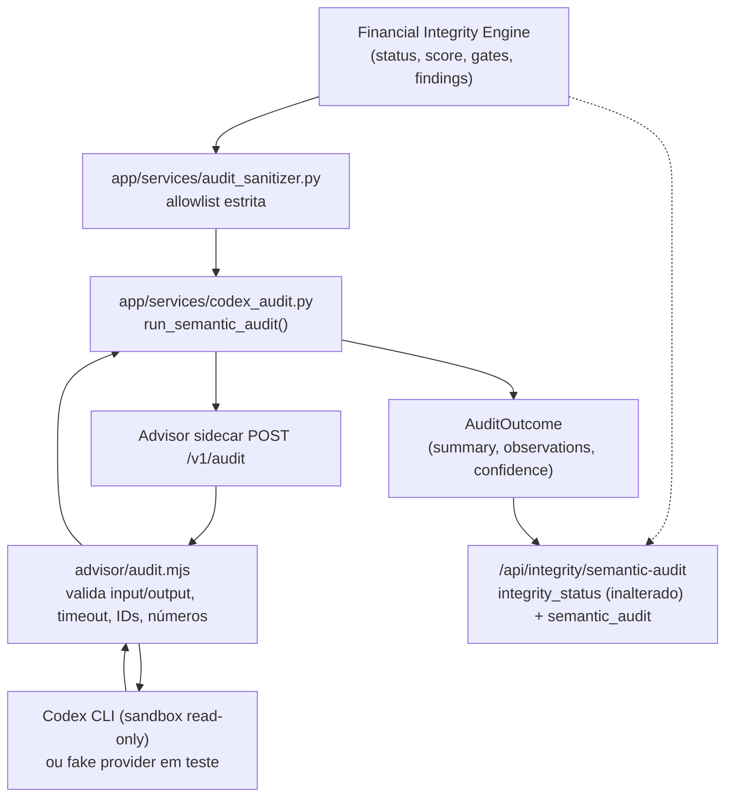

# Arquitetura

## Princípios

1. **Dados locais:** o Git contém somente código, documentação e testes.
2. **Cálculo determinístico:** imposto, projeção, deduplicação e conciliação não dependem de resposta probabilística.
3. **IA assistiva:** OCR, transcrição e Codex sugerem; não alteram o livro financeiro silenciosamente.
4. **Rastreabilidade:** todo lançamento importado mantém documento, linha, conta, titular e nível de confiança.
5. **Correção sem apagamento:** revisão altera status e classificação, preservando o evento original e a trilha de auditoria.

## Componentes

### Aplicação

FastAPI serve a interface web e a API. O processamento continua no próprio serviço/contêiner (nenhum broker ou processo separado foi introduzido, adequado ao volume familiar de uma instalação), mas o OCR/transcrição de captura roda fora do caminho da requisição HTTP -- ver "Fila assíncrona de OCR/áudio" abaixo. Um worker realmente separado (processo/contêiner próprio) poderá ser adicionado depois, quando o volume exigir, sem mudar o modelo de dados.

### PostgreSQL

Armazena usuários, contas, categorias, documentos, lançamentos, pendências, comissões, holerites, compromissos, perfil financeiro e auditoria.

### Documentos

O arquivo original é criptografado com Fernet antes de ser persistido no volume. O banco guarda SHA-256, nome original, tipo, status e caminho criptografado.

### Central inteligente

Texto e documentos entram em `capture_drafts`. Regras locais, Tesseract e Whisper montam propostas editáveis. Somente a confirmação cria lançamentos, obrigações ou registros de folha. O arquivo original permanece criptografado e a captura registra processador, confiança, proposta e resultado.

#### Fila assíncrona de OCR/áudio

`POST /captures/preview` para imagem, PDF ou áudio cria o `Document`/`CaptureDraft` (status
`queued`) e uma linha em `capture_processing_jobs` (household, draft e documento correlacionados,
`job_type` `ocr`/`audio`, `status` `queued`/`processing`/`completed`/`failed`, tentativas, erro
sanitizado, `trace_id`) e responde sem esperar o OCR/Whisper terminar; o processamento roda em
segundo plano (`BackgroundTasks` do FastAPI) chamando exatamente os mesmos
`extract_document_text`/`transcribe_audio`/`preview_capture` do caminho síncrono -- nenhum segundo
motor de OCR, transcrição, classificação ou importação. Texto simples e CSV/OFX continuam
síncronos, por serem rápidos.

O claim de um job é uma única `UPDATE ... WHERE status = ...` (sem depender de `SELECT ... FOR
UPDATE SKIP LOCKED`), por isso é seguro contra corrida em PostgreSQL e SQLite igualmente: entrega
duplicada, uma nova tentativa manual (`POST /captures/{id}/retry`) e o reconciliador de recuperação
de falhas nunca processam o mesmo job duas vezes nem duplicam `Document`/`CaptureDraft`. Um job
travado em `processing` além do tempo configurado (worker morto/reiniciado) é reclamado pelo
reconciliador (`python -m app.cli.capture_worker`, executado manualmente ou por cron/systemd-timer
fora do processo web) até esgotar as tentativas, quando é marcado `failed` explicitamente --
nunca promovido a sucesso silenciosamente. Falha ou timeout nunca apaga ou reescreve o documento
original; a confirmação humana continua sendo a única ação que cria lançamento, obrigação ou
registro de folha.

### Consultor Codex

O motor financeiro consulta e consolida o banco, calcula o veredito e monta um resumo. O serviço `advisor` recebe esse resumo por uma rede Docker sem PostgreSQL e executa o Codex em sandbox somente leitura. A resposta é descartada se tentar mudar o veredito. A indisponibilidade do Codex aciona o fallback local.

Em redes que bloqueiam a saída HTTPS de WSL/Docker, o mesmo `advisor` pode executar nativamente no
Windows. Nesse modo, a aplicação o acessa por `host.docker.internal`, enquanto banco e documentos
permanecem exclusivamente nos contêineres/volumes. O processo recebe somente o segredo interno e o
JSON sanitizado, trabalha em um diretório vazio e executa o Codex com sandbox somente leitura.

### Fronteira do Codex Semantic Audit (PR 6)

O sidecar `advisor` expõe três contratos, todos read-only em relação ao livro financeiro:

| Rota | Uso | Pode alterar o veredito? |
|---|---|---|
| `POST /v1/classify` | Sugere categoria/tipo para um lançamento ambíguo capturado | Não; a sugestão só é aceita após confirmação humana |
| `POST /v1/analyze` | Explica o veredito do Advisor de compra em prosa | Não; a resposta só é usada quando o `verdict` declarado é **idêntico** ao calculado localmente (nunca mais permissivo, nunca mais conservador) |
| `POST /v1/audit` | Auditoria semântica consultiva sobre o `IntegrityAssessment`/findings já calculados | **Estruturalmente impossível**: o schema de saída (`advisor/audit-schema.json`) não tem nenhum campo `status`/`score`/`trusted_for_*`/`findings` |

`/v1/audit` é o contrato dedicado da iniciativa de integridade (ver `docs/INTEGRITY_IMPLEMENTATION_PLAN.md`, seção 10). O fluxo:



Garantias estruturais (não apenas convenção):

- **Schema de saída sem campo de autoridade.** `advisor/audit-schema.json` não declara `status`, `score`, `trusted_for_projection`, `trusted_for_reports` ou `findings`; `additionalProperties: false` faz qualquer tentativa de incluí-los falhar a validação, não "ser ignorada silenciosamente" -- a resposta inteira vira `available: false`.
- **Severidade consultiva limitada.** `observations[].severity` só aceita `info`/`review`; `critical`/`block` seguem exclusivos do Financial Integrity Engine.
- **`AuditOutcome` sem campo para veredito.** Em `app/services/codex_audit.py`, o dataclass que representa o resultado do Codex não tem `status`/`score`/`trusted_for_*`/`findings`; mesmo que uma validação anterior falhasse, não há onde esses valores seriam armazenados.
- **Dados não confiáveis nunca viram instrução.** Todo conteúdo originado de usuário/documento (por exemplo, nome de categoria) chega ao prompt somente dentro de um bloco `DADOS_JSON=` cercado por regras explícitas que mandam ignorar qualquer instrução encontrada ali dentro (`advisor/audit.mjs:buildAuditPrompt`).
- **IDs e números são verificados, não apenas confiados.** `evidence_ref` só pode citar ids opacos que já estavam no pacote enviado; números citados em texto livre que não aparecem em nenhum lugar do pacote são removidos da observação antes de ela ser devolvida.
- **Timeout/erro/schema inválido nunca viram `pass`.** Toda falha (timeout, indisponibilidade, JSON malformado, schema inválido, id desconhecido, número inventado) produz `available: false` com uma `reason` explícita; o motor financeiro nunca espera por isso além do timeout configurado e o `/api/integrity/status` determinístico não é afetado.
- **Isolamento preservado.** O sidecar continua sem `DATABASE_URL`, sem volume de documentos e sem rede com o PostgreSQL; `/v1/audit` não abriu nenhuma exceção a isso.

### Acesso remoto

Tailscale Serve é executado no Windows e publica a porta local em HTTPS somente dentro da tailnet. Vinicius e Kelly mantêm identidades próprias no Tailscale e no sistema financeiro.

### Backup

Um contêiner isolado executa `pg_dump` diariamente. A retenção local padrão é de 30 dias. A cópia externa deve ser implementada na operação do servidor.

### Integração contínua (PR 8)

`.github/workflows/ci.yml` roda doze jobs nomeados e obrigatórios em paralelo a cada PR/push em
`main`: `lint` (Ruff), `unit` (suíte completa sobre SQLite -- a rede de segurança que cobre qualquer
dimensão sem gate dedicado), `financial-invariants`, `property-tests`, `parser-reconciliation`,
`projection-parity`, `snapshot-channel-consistency`, `advisor-contract-security`, `frontend-syntax`,
`docker-build` e, com um serviço `postgres:17-alpine` real (a mesma imagem de `compose.yaml`, não
apenas SQLite): `alembic-migration` (upgrade de banco vazio até `head`, upgrade da baseline legada
`0002` preservando linhas existentes, downgrade seguro da revisão final) e `integration-postgres`
(idempotência e não mutação de fatos do `app.cli.backfill`, com o locking real do PostgreSQL que
`SELECT ... FOR UPDATE` exige -- SQLite não tem lock de linha entre conexões; ver
`app/services/financial_integrity.py` e `app/models.py::HouseholdFinancialRevision`). CI verde é
necessário para revisão, nunca suficiente
para merge -- ver `docs/INTEGRITY_IMPLEMENTATION_PLAN.md` seções 17-18.

### Backfill (`app.cli.backfill`, PR 8)

Reprocessa famílias já existentes contra o Financial Integrity Engine sem reimplementar nenhuma
regra financeira própria: reutiliza `unknown_reconciliation`/`persist_reconciliation`,
`discover_transaction_duplicates`, `build_snapshot` e `execute_integrity_run` -- serviços que
compartilham a mesma regra determinística que o fluxo de importação já usa. Documentos sem
reconciliação recebem um registro `unknown` explícito (nunca um total declarado/reconstruído
fabricado); transações ainda não examinadas por nenhum passe de duplicidade têm evidência derivada
(`DuplicateGroup`/`DuplicateGroupMember`) criada pela mesma regra determinística do fluxo ao vivo, mas
sem aplicar a classificação à própria `Transaction` (ver abaixo); cada competência tem seus achados de
integridade avaliados antes do snapshot correspondente ser construído (ordem necessária para
convergência -- ver o docstring de `_backfill_snapshots_and_period_integrity`). Nunca escreve em
`Transaction`, `Document`, `PayrollRecord`, `Commission` ou `Obligation` -- nem mesmo nas colunas de
classificação de duplicidade (`canonical_status`/`possible_duplicate`/`excluded`/
`duplicate_group_id`): aplicar essa classificação a uma transação já publicada continua sendo uma
decisão humana (`resolve_duplicate_group`) ou efeito de uma transação genuinamente nova no fluxo ao
vivo (`register_transaction_duplicates`), nunca um efeito colateral automático do backfill. Nunca
fabrica uma `AccountBalanceObservation` ou data efetiva para um saldo legado -- o fallback já
existente de `build_snapshot` mantém essa evidência `unknown`/não confiável. Idempotente e retomável
por
construção (cada passo é um no-op sobre dado inalterado ou fica restrito às linhas que ainda
precisam dele), não por um checkpoint de retomada separado. `--dry-run` executa o mesmo caminho de
código e reverte a transação em vez de persistir; o manifesto `BackfillRun` da execução em dry-run é
gravado à parte, após o rollback, para preservar a evidência de auditoria mesmo assim. Ver
`docs/RUNBOOK_PR8_BACKFILL.md`.

## Fluxo de importação

```text
Upload
  -> valida tamanho e extensão
  -> calcula SHA-256
  -> bloqueia arquivo idêntico
  -> criptografa original
  -> escolhe parser CSV / OFX / PDF
  -> separa as duas colunas de faturas Itaú quando aplicável
  -> extrai totais e consignado de holerites compatíveis
  -> normaliza sinais e valores
  -> classifica
  -> calcula fingerprint de transação
  -> marca possíveis duplicidades
  -> cria fila de revisão
  -> registra auditoria
```

Um documento inválido ou incompatível não interrompe o sistema: o original permanece criptografado e uma pendência é criada para revisão.

## Importação em lote (Fase 2)

`POST /api/imports/batch` (`app/api.py`) não é um segundo fluxo de importação: é orquestração sobre o
mesmo fluxo acima, executado uma vez por arquivo através de `_import_one_document`, a função
compartilhada com `POST /api/imports`. Cada arquivo do lote é persistido e comitado de forma
independente -- o mesmo `db.commit()` por documento que o envio individual já fazia -- então a falha de
um arquivo (parser não reconhecido, exceção inesperada, limite de tamanho excedido) nunca desfaz nem
reescreve o resultado já persistido de um arquivo anterior do mesmo lote; uma exceção fora do já tratado
`ValueError` de parsing aciona `db.rollback()` apenas do trabalho não comitado desse arquivo antes de
seguir para o próximo. A resposta é sempre a lista real de resultados por arquivo (`imported`/
`imported_with_review`/`review_required`/`rejected`), nunca um "sucesso" agregado quando algum arquivo
falhou. `account_id`/`document_type` são únicos para todo o lote, espelhando o mesmo contrato do envio
individual (inclusive a dispensa de conta para holerite). Limites: `MAX_UPLOAD_MB` por arquivo (igual ao
envio individual), mais `MAX_BATCH_FILES` arquivos e `MAX_BATCH_TOTAL_MB` combinados por envio
(`app/config.py`). Nenhuma migração foi necessária -- `Document`, `Transaction` e
`DocumentReconciliation` já carregam, por linha, tudo que um resultado por arquivo precisa expor. A
interface (`app/templates/index.html`, `app/static/app.js`) só exibe os campos que o backend já
calculou por arquivo; nunca soma, parseia, classifica ou reconcilia no navegador.

O lote inteiro é correlacionado por um `batch_id` (UUID) gravado no evento de auditoria agregado
`document.import_batch` (`AuditEvent.details`, JSON já existente, nenhuma coluna nova). Cada entrada de
`outcomes[]` nesse evento carrega `index`, `status`, `document_id` (o `Document.id` real quando o
arquivo foi processado; `null` quando o arquivo foi rejeitado antes de qualquer `Document` existir --
limite de tamanho, duplicidade de arquivo, falha inesperada) e `error_category`. Isso torna a
trilha de auditoria persistida, por si só, a lineage determinística entre um lote e os `Document`s que
ele produziu -- sem depender de reconstruir por proximidade de horário.

## Exportação Excel/PDF (Fase 2)

`GET /api/reports/export?format=xlsx|pdf` não é um segundo motor de relatório: `app.api._build_report_payload`
é a mesma função que `GET /api/reports` já usava (extraída sem qualquer mudança de comportamento), e ambas
as rotas a chamam -- mesma validação de `months`/`end_month`, mesmas snapshots via `build_snapshot`, mesmas
funções de publicação canônica (`report_month_monetary_publication`, `category_monetary_publication`,
`report_summary_monetary_publication`, `category_spending_rows`, `account_cash_flow_rows`). O exportador
(`app/services/report_export.py`) recebe esse dict já pronto e apenas o renderiza; nenhuma soma, média,
participação percentual, reclassificação, deduplicação ou reconciliação é recalculada por ele -- se um
valor está errado no Excel/PDF, ele já estava errado no JSON de `/reports`.

Duas renderizações independentes, uma única fonte:

- **Excel** (`build_report_workbook`): `openpyxl` (já dependência do projeto, usada também pelo importador
  de planilha de planejamento) escreve células de dado puro com formatação de apresentação apenas
  (`R$ #,##0.00`, etc.) -- nunca uma fórmula de planilha, para que o Excel nunca possa se tornar uma segunda
  fonte de verdade que recalcula um valor de forma diferente do backend. Uma aba por seção canônica:
  Resumo, Mensal, Categorias, Contas. Todo valor textual (categoria, conta, instituição, o nome
  configurável da reserva de liquidez, etc.) passa pelo único ponto de escrita de célula
  (`_write_cell`), que força o tipo de dado openpyxl `'s'` (texto puro) mesmo quando o texto começa com
  `=`, `+`, `-` ou `@` -- caracteres que o openpyxl, por padrão, classifica como fórmula na atribuição.
  Isso neutraliza injeção de fórmula/DDE em texto de origem do usuário sem jamais alterar, normalizar ou
  remover o valor exibido.
- **PDF** (`build_report_pdf`): `pymupdf` (`Page.insert_htmlbox`, já dependência do projeto, usada também
  para leitura de PDF na importação) renderiza uma string HTML montada pelo próprio backend através do
  motor de layout nativo do PyMuPDF -- sem navegador, sem Chrome headless, sem dependência nova. É um
  mecanismo diferente do botão "Imprimir / PDF" já existente (`window.print()` em `app/static/app.js`), que
  depende do navegador do usuário e continua funcionando exatamente como antes, sem nenhuma mudança.
  Cada seção tabular é paginada em blocos de até 28 linhas (nunca uma única página que estoura e corta
  dados silenciosamente), com auto-redução de escala (`scale_low=0`) como segunda defesa independente; se
  mesmo assim uma seção não couber, a geração falha alto (exceção) em vez de devolver um PDF que parece
  completo mas está com dados faltando.

Nenhuma migração foi necessária -- a exportação não introduz nenhum modelo, coluna ou tabela nova; ela só
lê o mesmo dict que `/reports` já monta a partir de dados existentes. Nome de arquivo
(`relatorio_<início>_a_<fim>.<formato>`) carrega apenas o período do próprio relatório, nunca nome de
família, usuário ou conta -- sem PII. `Content-Disposition: attachment` força o download em vez de exibição
inline. Autenticação e isolamento por família são os mesmos de `GET /reports` (a mesma função, o mesmo
`user.household_id`). A interface (`app/templates/index.html`, `app/static/app.js`) só solicita o formato e
baixa o arquivo (`downloadReportExport`); nenhum total é somado, parseado ou recalculado no navegador.

## Modelo de deduplicação

Existem dois níveis:

- **arquivo idêntico:** SHA-256 igual; importação bloqueada;
- **lançamento possivelmente repetido:** conta, data, valor, descrição normalizada, titular e parcela iguais; registro preservado, excluído provisoriamente dos totais e encaminhado para revisão.

Essa estratégia evita dupla contagem sem apagar duas compras legítimas que eventualmente tenham o mesmo valor.

## Conciliação visual de pagamento de fatura (Fase 2)

Um mesmo evento real -- o pagamento de uma fatura -- pode gerar duas linhas independentes, cada
uma já `transaction_type = "reconciliation"` pelo classificador único (`PAYMENT_PATTERN`,
`app/services/classifier.py`) e portanto já excluída de todo total operacional antes de qualquer
vínculo existir: a própria fatura (linha "pagamento recebido" no cartão, valor positivo) e o
extrato bancário (débito que saiu da conta corrente, valor negativo). `app/services/
card_payment_reconciliation.py` apenas liga essas duas linhas já canônicas para consulta humana --
não é um novo cálculo financeiro. Um candidato só é sugerido automaticamente quando é o único
dentro da tolerância de R$ 0,01 e da janela de 45 dias do lançamento da fatura; ausência ou mais de
um candidato permanece `unmatched`/`ambiguous`, nunca resolvido sozinho. Confirmar (`POST
/api/card-payment-reconciliations/link`) ou desfazer (`.../unlink`) um vínculo é sempre uma ação
humana, com motivo obrigatório e trilha de auditoria, e altera somente a coluna já existente
`Transaction.linked_transaction_id` (migração `0004`) nos dois lados -- nunca o valor, tipo,
categoria ou exclusão de qualquer lançamento, por isso não pode afetar INV-002 nem nenhum
snapshot/relatório/projeção. Dashboard, relatórios, projeção e Monthly Close continuam consumindo
exatamente as mesmas linhas `Transaction`/`DocumentReconciliation` de sempre; esta tela não introduz
uma segunda fonte de verdade.

## Ciclo de vida de fatura de cartão (October Go-Live Slice 2, P0 #87)

`CardInvoice` (migração `0015`, `app/services/card_invoice_lifecycle.py`) é a entidade canônica do
ciclo `open -> closed -> partially_paid -> paid`, complementar às fontes já existentes -- nunca um
segundo motor de competência ou de conciliação:

- competência/janela do ciclo: `app.services.card_competence.card_invoice_window`, a função inversa
  de `card_invoice_competence` (mesmos `card_closing_day`/`card_due_day`, nunca uma segunda regra);
- quais compras pertencem ao ciclo: soma de `Transaction.amount` já persistido
  (`transaction_type="expense"`, mesma `competence` já resolvida por `resolve_expense_competence`) --
  nenhuma segunda classificação;
- o leg bancário de um pagamento (`pay_invoice`) reaproveita a mesma construção de `Transaction`
  (`ParsedTransaction`/`transaction_fingerprint`, categoria "Conciliação", `excluded=True`) e a mesma
  detecção de duplicidade (`register_transaction_duplicates`) que
  `card_payment_reconciliation.pay_card_invoice` já usa -- não é uma segunda política de
  reconciliação, é uma extensão que aceita valor parcial (`GET/POST /card-invoices/...`, superset do
  contrato acima, que continua existindo e sem alteração de comportamento).

`Transaction.card_invoice_id` (FK aditiva, mesmo padrão de `linked_transaction_id`) associa cada
compra/pagamento à fatura -- atribuída apenas quando `get_or_sync_invoice` sincroniza aquele
`(account, competence)`, nunca em uma leitura pura (`GET /card-invoices` só sincroniza a exceção
estrita e documentada do ciclo *atual* de um cartão sem nenhuma fatura ainda; qualquer outra
competência exige um `POST /card-invoices/sync`/`.../close`/`.../pay`/`.../divergence` explícito).
`Transaction.refund_of_transaction_id` (FK aditiva autorreferente) é o vínculo explícito e nunca
inferido de um estorno à compra original (`link_refund`/`POST /transactions/{id}/link-refund`);
apenas um estorno *vinculado* reduz `CardInvoice.computed_total` do ciclo em que o próprio estorno
foi lançado -- nunca o ciclo da compra original quando os dois divergem, preservando uma fatura já
paga sem reescrevê-la.

`principal_carried_in`/`principal_carried_out` são o único par de campos com estado genuíno além de
`paid_total`/`status`/`closed_at`: o saldo em aberto de um ciclo fechado é transportado ao próximo
apenas como esse campo numérico, nunca como uma nova `Transaction`. `computed_total`/`declared_total`
são recalculados a cada sincronização a partir de `Transaction`/`CardInvoice` já persistidos -- nunca
uma fonte independente. `invoice_divergence` nunca ajusta silenciosamente uma diferença entre o total
declarado (evidência de fatura/extrato já importado) e o total calculado: procura causa
determinística ainda não contada (estorno não vinculado, encargo ainda não reclamado por nenhuma
fatura) e, sem uma, publica `unreconciled_unexplained` para revisão humana.

**Revisão de engenharia (2026-09-12, `BLOQUEIO DE MERGE`), corrigida neste PR:**

- **Idempotência de pagamento.** `pay_invoice` computa o mesmo `transaction_fingerprint`
  determinístico que uma nova `Transaction` de conciliação receberia e, antes de criar qualquer
  coisa, procura um pagamento já persistido nesta exata fatura com esse fingerprint -- mesma
  filosofia de "idempotência documental" já usada pelos parsers de importação deste projeto, não um
  conceito novo. Uma repetição exata da mesma requisição (mesma conta/valor/descrição/data) devolve o
  lançamento existente sem incrementar `paid_total`/criar um segundo leg
  (`tests/test_card_invoice_lifecycle.py::test_pay_card_invoice_lifecycle_endpoint_retry_is_idempotent`).
- **INV-025..INV-028 integradas ao Financial Integrity Engine.** `app.api._run_card_invoice_integrity_checks`
  chama `execute_integrity_run` (scope `ENTITY`, trigger `TRANSACTION`) a partir de
  `sync`/`close`/`pay`/`divergence`/`link-refund`, usando fatos observados em runtime (contagem de
  `expense` antes/depois, `db.new` para provar que nenhuma `Transaction` nova foi criada onde não
  deveria, snapshot da fatura original antes/depois de um vínculo de estorno) -- nunca uma segunda
  fórmula, apenas evidência direta do que a própria chamada acabou de fazer. Um resultado `fail`
  reverte a transação e aborta a requisição.
- **`principal_carried_in` não oscila retroativamente.** `get_or_sync_invoice` só recomputa
  `principal_carried_in`/`principal_carried_out` a partir do ciclo anterior enquanto a própria fatura
  ainda não recebeu nenhum pagamento (`paid_total <= 0`); uma vez paga (total ou parcialmente), o
  valor fica congelado, mesmo que um pagamento tardio no ciclo anterior mude o outstanding daquele
  ciclo depois.
- **Parcelamento exposto (`GET /card-invoices/{id}/lines`).** Reaproveita apenas
  `Transaction.amount`/`installment_current`/`installment_total` já confirmados -- nunca o motor de
  projeção mês-a-mês de `_project_installments`/`_future_installments` (que resolve "em quais meses
  futuros", não usado aqui) -- para expor compra contratada, impacto no mês e parcelas futuras por
  compra da fatura.
- **UI "Conferir e pagar".** `app/templates/index.html`/`app/static/app.js` (tela Contas a pagar,
  painel "Faturas de cartão") ganharam o modal do rebaseline §6.2/§6.3, ao lado (não em substituição)
  da UI já existente do contrato legado `/card-payment-reconciliations/*`.
- **Downgrade de `0015` deixa de ser destrutivo silencioso.** Recusa (levanta `RuntimeError`) quando
  existe algum `refund_of_transaction_id` confirmado -- ver `alembic/versions/0015_card_invoice_lifecycle.py`.

## Obrigações e projeção REALIZADO/COMPROMETIDO/PREVISTO (October Go-Live Slice 3, P0 #87)

`app.services.financial_state` (`REALIZADO`/`COMPROMETIDO`/`PREVISTO`) é o único vocabulário que
qualquer superfície pode usar para rotular um fato/compromisso/hipótese financeira -- rebaseline §3.
Nenhuma coluna nova é persistida: seguindo a recomendação de
`docs/OCTOBER_GO_LIVE_CONFLICT_MATRIX.md` §3.3, o rótulo é sempre computado na camada de
serialização a partir de um dado que já é autoritativo por si só -- nunca um segundo classificador
que poderia divergir da fonte:

- `Obligation.status == "paid"` -> REALIZADO; `"pending"` -> COMPROMETIDO, inclusive vencida
  (`app.api._obligation_rows`);
- `CardInvoice.status == "paid"` -> REALIZADO (liquidação real); `closed`/`partially_paid` ->
  COMPROMETIDO (total consolidado, desembolso ainda não ocorrido -- rebaseline §6.2); `open` ->
  PREVISTO (`app.services.card_invoice_lifecycle.invoice_financial_state`, usado por
  `serialize_card_invoice`) -- este rótulo descreve a fatura *como objeto de liquidação*, nunca as
  compras dentro dela (que já são, individualmente, REALIZADO desde que lançadas, rebaseline §6.1,
  independentemente do estado da fatura). Uma fatura `open` ainda não fechou -- "o total é
  consolidado" só no fechamento (rebaseline §6.2) -- então seu total corrente é uma estimativa que
  ainda pode crescer, não uma obrigação rígida nem um fato liquidado (revisão de engenharia,
  2026-09-14, Round 2 de PR #91: a versão anterior rotulava `open` como REALIZADO só porque as
  compras subjacentes já eram REALIZADO, conflando os dois conceitos);
- `Commission.received_date` preenchido -> REALIZADO; ausente -> PREVISTO
  (`GET /commissions`, `app.api._build_projection_gate_checks`) -- rótulo puramente descritivo, ver
  abaixo por que uma comissão PREVISTA nunca contribui para nenhum total projetado;
- toda linha de `GET /forecast` -> PREVISTO (a projeção inteira é hipótese, rebaseline §3/§13.1),
  com `salary_financial_state`/`salary_reconciled_transaction_id` isolando o único componente que
  este slice promove a REALIZADO quando há evidência (ver reconciliação abaixo).

**Sem desaparecimento silencioso da projeção (rebaseline §7, "atraso não vira gasto duplicado nem
desaparece da projeção").** Antes deste slice, `_forecast_obligations` bucketava cada ocorrência
pela sua própria data de vencimento; uma obrigação vencida cujo mês já ficou no passado nunca era
revisitada pelo cursor somente-para-frente de `build_projection` (que começa em `start_month`,
sempre o próximo mês) -- o valor simplesmente nunca aparecia em nenhuma linha da projeção. Faturas de
cartão fechadas/parcialmente pagas (`CardInvoice`) tinham o mesmo problema, mas de outra forma: nunca
entravam em `ForecastInput` de forma alguma. Ambas as funções agora recebem `start_month` e dobram
(`clamp`) qualquer vencimento anterior a ele para dentro do próprio `start_month` -- o compromisso
aparece exatamente uma vez, no mês mais próximo que a projeção realmente exibe, nunca em um mês que o
cursor não visita:

- `app.api._forecast_obligations(items, start_month=None)` -- `start_month` opcional preserva o
  comportamento anterior byte a byte para quem não o passa (ex.: `tests/test_plan_workbook.py`);
- `app.api._forecast_card_invoices(db, household_id, start_month)` -- soma `outstanding_balance` de
  toda `CardInvoice` `closed`/`partially_paid` da família, nunca `open`/`paid`.

`ForecastInput` (`app.services.finance.py`) ganhou dois campos aditivos, ambos com default vazio
(zero regressão para todo chamador existente):

- `card_invoices: dict[str, Decimal]` -- soma-se a `obligations`/`installments` na fórmula de
  despesas de `build_projection`/`independently_calculate` (INV-018 continua provando que motor e
  validador concordam com a fórmula estendida); `PROJECTION_CALCULATION_VERSION` avançou de
  `2026.09.2` para `2026.10.1`;
- `monthly_salary_overrides: dict[str, Decimal]` -- ver reconciliação de renda recorrente abaixo.

**Reconciliação de renda recorrente (`app.services.recurring_income.reconcile_recurring_income`,
rebaseline §8.4).** O salário recorrente configurado (`FinancialProfile.monthly_salary_net`) é
aplicado linearmente em todo mês futuro como PREVISTO. Quando já existe uma `Transaction` real de
renda para a mesma competência dentro da tolerância monetária padrão (`MONEY_TOLERANCE`) **e**
identidade material suficiente, essa competência passa a usar o valor real em vez do valor previsto
-- nunca a soma dos dois ("PREVISTO -> REALIZADO... a conciliação não pode criar uma segunda
receita"). A função nunca cria, edita ou apaga `Transaction`; uma competência sem correspondência
simplesmente permanece PREVISTO. Não fixa nenhum nome de pessoa no código -- `owner_label` é um
filtro opcional, o salário recorrente pertence a quem quer que o perfil tenha configurado.

*Identidade material (revisão de engenharia, 2026-09-14, Round 2 de PR #91).* Valor + competência
sozinhos não são evidência suficiente -- qualquer renda de valor parecido no mesmo mês (reembolso,
recebimento avulso) podia ser promovida a REALIZADO por coincidência. Agora, sem `owner_label`
explícito (que já restringe a consulta a uma pessoa -- identidade por si só), cada candidato precisa
carregar um marcador de descrição plausível de folha de pagamento
(`recurring_income.SALARY_DESCRIPTION_MARKERS`). Quando mais de um candidato identificado existe
para o mesmo período, o resultado permanece PREVISTO com `ambiguous=True` em vez de escolher um por
desempate -- "não escolher `best` por tie-break e tratar como fato". `app.api.
_build_projection_gate_checks` chama essa função uma vez por mês do horizonte de projeção e monta
`monthly_salary_overrides`; o mesmo mapa alimenta os campos informativos
`salary_financial_state`/`salary_reconciled_transaction_id`/`salary_reconciliation_ambiguous` de
cada linha de `/forecast`.

**Comissão nunca infla a projeção automaticamente (rebaseline §8.3).** "Comissões nunca entram como
receita PREVISTA automaticamente ... não deve inflar projeções futuras por expectativa." O
`ForecastInput.commissions` que `_build_projection_gate_checks` monta para o gate canônico
(`GET /forecast`, `POST /monthly-closes/{period}/run`) é **sempre uma tupla vazia** -- nenhuma
`Commission`, recebida ou não, é derivada automaticamente para essa lista (revisão de engenharia,
2026-09-14, Round 2 de PR #91: a primeira versão deste slice só excluía uma comissão *já recebida*
de reentrar -- INV-029 -- mas continuava somando toda comissão pendente antes disso, violando a regra
primária). `POST /commissions/{id}/receive` (ato explícito e humano-confirmado que marca
`Commission.status = "received"`/`Commission.received_date`; nunca cria, edita ou apaga nenhuma
`Transaction`) só muda o rótulo `financial_state` de `GET /commissions`, de PREVISTO para REALIZADO
-- fecha a lacuna que `docs/OCTOBER_GO_LIVE_CONFLICT_MATRIX.md` §2.4 documentava desde o Slice 0
(`Commission.received_date` existia no modelo desde a migração original mas nunca era lido em lugar
algum). A engine (`app.services.projection_engine.build_projection`) continua sabendo somar um
`ForecastCommission` explícito quando recebido -- essa capacidade é preservada para um futuro
mecanismo de opt-in explícito e auditável (ainda não implementado); apenas o gate canônico nunca a
aciona sozinho.

**INV-029/INV-030/INV-031 (`app/services/invariant_registry.py`).** Todas avaliadas em tempo real
por `GET /forecast` e `POST /monthly-closes/{period}/run`
(`app.api._build_projection_gate_checks`), o mesmo ponto único que já avalia
INV-005/006/018/022/023/024: INV-029 prova que nenhuma comissão já recebida está entre as
efetivamente projetadas (defesa em profundidade -- estruturalmente garantido por INV-031 também);
INV-030 prova que o primeiro mês exibido pela projeção usa exclusivamente um valor para o salário
recorrente -- o real quando há evidência, o previsto caso contrário -- nunca a soma dos dois; INV-031
prova, contra a saída real de `build_projection` (não apenas contra a construção do input), que
nenhuma comissão pendente contribui automaticamente para nenhum cenário projetado.

**`GET /dashboard` — commitments (revisão de engenharia, 2026-09-14, Round 2 de PR #91).**
`noncanonical.commitments` responde rebaseline §44 ("o que tenho para pagar", "quanto devo nos
cartões") com dois totais COMPROMETIDO -- `obligations_pending` (soma de `app.api._obligation_rows`)
e `card_invoices_outstanding` (soma de `app.api._forecast_card_invoices`) -- as mesmas fontes
canônicas que `GET /obligations` e `GET /forecast` já usam, nunca um segundo motor de cálculo.
`GET /reports` permanece inerentemente REALIZADO-only (toda cifra vem de `build_snapshot`, que só lê
`Transaction` já lançada) -- não há COMPROMETIDO/PREVISTO ali para separar.

## Assistente Financeiro operacional — typed actions (October Go-Live Slice 4, P0 #87)

`docs/WORK_ORDER_OCTOBER_GO_LIVE_SLICE_4.md`, `docs/OCTOBER_GO_LIVE_CONFLICT_MATRIX.md` §3.5/§4.
Transforma o Assistente de um chat consultivo (`/advisor/chat`, já existente, inalterado) em uma
interface operacional: linguagem natural -> interpretação estruturada -> ação tipada de backend ->
resultado persistido, sem nunca deixar a interpretação do Codex virar fato por si só.

**Quarto contrato consultivo do sidecar: `POST /v1/interpret`.** Mesmo padrão estrutural de
`/v1/classify`/`/v1/analyze`/`/v1/audit` (`advisor/server.mjs`, `advisor/interpret-schema.json`):
schema de saída sem nenhum campo de autoridade -- apenas `intent` (vocabulário fechado),
`extracted_fields` (texto livre, nunca um id), `missing_fields`, `clarifying_question` e
`confidence`. O sidecar não recebe nenhum dado financeiro do household -- apenas a mensagem e um
histórico curto (`app.services.assistant_sanitizer.build_interpret_payload`).

**Fronteira de autoridade em Python:** `app.services.assistant_interpreter.interpret_message`
espelha exatamente `app.services.codex_audit.run_semantic_audit` -- `StructuredInterpretation` é
fail-safe (`available=False` cobre Codex desabilitado/indisponível/timeout/schema inválido) e
`_coerce_interpretation` é a única função autorizada a ler a resposta do sidecar, lendo somente as
cinco chaves do contrato.

**Resolução determinística, nunca uma segunda interpretação por IA:**
`app.services.assistant_actions.build_typed_action_proposal` resolve cada `extracted_fields` (nome
de conta/cartão, obrigação, fatura, compra original de estorno) contra os dados reais do household
com consultas SQL simples e explícitas -- nunca um palpite. Quando um indício não resolve a
exatamente um candidato, ou falta um campo materialmente necessário (origem do recurso para saída
em caixa/cheque, rebaseline §4.4/§11.1), a função devolve uma pergunta de desambiguação (e,
quando aplicável, a lista de candidatos) em vez de uma proposta executável -- nunca uma ação
ambígua passa para execução automática. Inclui uma checagem prévia de duplicidade provável
(`_check_possible_duplicate`, reusando `app.services.duplicates.assess_duplicate` -- a mesma regra
de pontuação, nunca um segundo motor) para `create_expense`/`create_income`: quando o lançamento
ainda não existe mas é parecido com um já registrado, a proposta devolve `candidate_kind ==
"possible_duplicate"` com as três escolhas humanas (pular/importar mesmo assim/ver existente) em vez
de seguir direto para uma proposta executável -- ver "Revisão de engenharia" abaixo.

**Autoridade de execução: proposta persistida pelo servidor, nunca um payload que o cliente
resupra.** `POST /assistant/interpret` (`app.services.assistant_actions.persist_action_proposal`)
persiste, *somente* quando `build_typed_action_proposal` devolve `can_execute=True`, um
`AssistantActionProposal` (migração `0018`) de uso único e com validade (`expires_at`, 30 minutos)
contendo `typed_action`/`payload`/`path_params`/`original_message`/`structured_interpretation`
exatamente como resolvidos -- e devolve apenas o `proposal_id` gerado. `POST /assistant/execute`
(`AssistantExecuteRequest`) não aceita mais nenhum desses campos do cliente: aceita só `proposal_id`
(mais `disambiguation_qa`, informativo). `execute_typed_action` carrega a proposta pelo id
(household-scoped), rejeita se não encontrada/expirada/já consumida, e só então despacha -- fechando
o caminho que antes permitia a um cliente pular `/assistant/interpret` e executar um `typed_action`/
`payload` fabricado à mão, mesmo para uma mensagem originalmente ambígua.

**Execução: sempre uma chamada real ao *corpo* de um endpoint determinístico já existente.**
`execute_typed_action` nunca reimplementa lógica financeira: dado o `typed_action` do vocabulário
fechado (`create_expense`, `create_income`, `create_internal_transfer`, `pay_obligation`,
`pay_card_invoice`, `register_refund`) lido da proposta, valida o `payload` contra o *mesmo* schema
Pydantic (`ManualTransactionRequest`, `TransferRequest`, `ObligationPaymentRequest`,
`CardInvoicePayRequest`, `RefundLinkRequest`) e despacha, em processo (import tardio de `app.api`,
evitando import circular), para a *mesma* implementação que o endpoint HTTP manual já chama --
`_create_manual_transaction_impl`, `_create_manual_transfer_impl`, `_pay_obligation_impl`,
`_pay_card_invoice_lifecycle_impl`, `_link_refund_transaction_impl` (cada rota pública
correspondente, ex. `create_manual_transaction`, é hoje um wrapper fino que chama o `_impl` com
`commit=True`; o contrato HTTP/schema de cada rota não mudou). Household isolation, `_require_admin`,
confirmação de valor elevado, deduplicação e o `AuditEvent` do fato financeiro em si já são impostos
exatamente pelo mesmo código que o caminho humano exercita -- este módulo não amplia essa superfície,
apenas a narra.

**Atomicidade: mutação de domínio e trilha do Assistente em uma única transação.** Cada `_impl`
aceita `commit: bool = True`; `execute_typed_action` despacha com `commit=False` e só então grava o
segundo `AuditEvent` (`assistant.execute`) e o `AssistantActionEvent`, consumindo a proposta -- um
único `db.commit()` finaliza tudo junto, e qualquer falha entre o despacho e esse commit é revertida
por inteiro (`db.rollback()`), nunca deixando o fato financeiro persistido sem a trilha do Assistente
(revisão de engenharia do PR #92, bloqueio 5). `undo_assistant_action` segue o mesmo padrão com a
reversão (`_unpay_obligation_impl`/`_unlink_refund_transaction_impl`/`_delete_manual_transaction_impl`,
`commit=False`) e seu próprio `AuditEvent` de estorno.

**Auditoria: `AssistantActionEvent`, 1:1 com `AuditEvent` (migração `0016`).** Cada execução grava
um segundo `AuditEvent` (`event_type="assistant.execute"`) e um `AssistantActionEvent` pareado com
mensagem original, interpretação estruturada, perguntas/respostas de desambiguação, ids
criados/alterados e `before_state`/`after_state`. Para uma mutação sobre entidade *existente*
(`pay_obligation`/`pay_card_invoice`/`register_refund`), `before_state`/`after_state` são copiados
verbatim do próprio `AuditEvent` de domínio que o `_impl` já grava (parâmetro `domain_audit_sink`) --
nunca recalculados uma segunda vez; para uma criação, `before_state=None` é o formato aceito (nada
existia antes). Idempotência: a proposta é de uso único -- uma repetição com o mesmo `proposal_id`
já consumido devolve o resultado já persistido em vez de executar de novo (chave mais forte que um
`trace_id` fornecido pelo cliente) -- convivendo com, nunca substituindo, a proteção de duplicidade
por fingerprint que cada endpoint já possui. Uso único sob concorrência real, não só sob retry
sequencial de uma sessão (revisão de engenharia do PR #92, segunda rodada, 2026-09-14): a leitura
inicial da proposta em `execute_typed_action` usa `SELECT ... FOR UPDATE` no PostgreSQL (no-op no
SQLite, mesmo padrão de dialeto de `lock_household_financial_revision`), e o lock é mantido por toda
a transação, até o `db.commit()` final. Duas execuções concorrentes do mesmo `proposal_id` nunca
observam ambas `consumed_at IS NULL`: a segunda bloqueia no lock até a primeira commitar ou
reverter; se a primeira commitou, a segunda enxerga a proposta já consumida e devolve
`idempotent_replay=True` em vez de despachar de novo; se a primeira reverteu, a segunda prossegue
como execução legítima. Provado sob duas conexões PostgreSQL reais em
`tests/test_postgresql_integration.py::test_assistant_execute_concurrent_same_proposal_is_serialized_to_a_single_mutation`.

**Undo: nunca apaga a trilha.** `POST /assistant/actions/{id}/undo`
(`app.services.assistant_actions.undo_assistant_action`) despacha para a reversão determinística já
existente de cada ação (`_delete_manual_transaction_impl`, `_unpay_obligation_impl`,
`_unlink_refund_transaction_impl`) e grava um *novo* `AuditEvent` da reversão -- nunca deleta o
`AssistantActionEvent` original, apenas marca `undone_at`/`undone_by`. `pay_card_invoice` é declarado
`undoable=False`: não existe reversão determinística para um pagamento de fatura já liquidado nesta
versão (rebaseline: "quando uma operação não puder ser revertida com segurança, a API deve declarar
isso de forma explícita"). INV-032/INV-033 (`docs/FINANCIAL_INVARIANTS.md`) registram
estruturalmente essas duas garantias.

**Aprendizado — `entry_type_templates` (migração `0017`).** Copia o ciclo de vida já comprovado de
`classification_rules` (`observed -> suggested -> pending_acceptance -> active`,
`app.services.entry_type_templates`) para rótulos de "Outra entrada"/"Outra saída": evidência
acumula em `POST /entry-type-templates`, ativação exige três confirmações e é restrita a
administrador (`POST /entry-type-templates/{id}/activate`, mesma barreira de
`POST /classification-rules/{id}/activate`). A deduplicação usa o mesmo normalizador de texto já
usado para comerciantes, então "Aluguel"/"Recebi aluguel"/"Aluguel recebido" colapsam no mesmo
template quando normalizam igual.

**Decisões de escopo deste slice (não são Technical Challenge -- refinamento de implementação):**

- Nenhuma ação tipada de patrimônio/investimento (`UPDATE_ASSET_VALUE`/
  `REGISTER_ASSET_CONTRIBUTION`) foi exposta neste slice: o modelo `Investment` ainda não existia
  (October Go-Live Slice 6, não implementado). Antecipar essas ações apontaria para um contrato que
  não existe. **Atualização (Slice 6):** o modelo `Investment`/`InvestmentValuation` existe agora e
  `update_asset_value`/`register_asset_contribution` já são typed actions integradas -- ver a seção
  "Patrimônio e investimentos" abaixo.
- `register_refund` espera que o lançamento de estorno já exista (importado ou criado manualmente/
  via `create_expense` com `movement_type="refund"`) e apenas confirma o vínculo -- não cria e
  vincula em uma única ação composta. Mantém `execute_typed_action` como despachante puro de um
  único endpoint por ação tipada, sem introduzir uma transação composta de dois efeitos.
- Nenhuma UI nova: o Slice 5 é o dono da navegação/apresentação alvo
  (`docs/OCTOBER_GO_LIVE_REBASELINE.md` §19 Slice 5); este slice entrega o contrato de API completo
  e testado, pronto para a tela "Assistente Financeiro" consumir. **Atualização (Slice 5):** a tela
  "Assistente Financeiro" (`#view-advisor`) já consome exatamente este contrato -- ver a seção
  abaixo.
- A checagem prévia de duplicidade provável (bloqueio 4 da revisão de engenharia do PR #92) só se
  aplica a `create_expense`/`create_income`: é o único par de ações tipadas que cria uma
  `Transaction` do zero através do motor de duplicidade genérico
  (`app.services.duplicates.assess_duplicate`). `pay_obligation` já recusa (409) uma saída bancária
  compatível na mesma conta/janela de datas antes de criar qualquer lançamento;
  `pay_card_invoice` já detecta e reutiliza um pagamento idêntico (`idempotent_replay`) via
  `app.services.card_invoice_lifecycle.pay_invoice`; `register_refund` depende das próprias
  invariantes de vínculo (INV-027). Nenhuma dessas três precisa de uma segunda checagem redundante.

### Orquestrador LLM tool-driven e Tool Layer genérica (WA-02, `docs/WORK_ORDER_WA_02.md`, issue #74)

Preenche o gap documentado em `docs/ADR_WA_00_AI_ASSISTANT_DISCOVERY.md` §1.4/§6: a intent `query`
do `/v1/interpret` (acima) nunca teve implementação -- toda pergunta de consulta/agregação/
comparação/projeção caía em desambiguação. O WA-02 não altera `/assistant/interpret`/
`/assistant/execute` (Slice 4, inalterados) nem o vocabulário fechado de `TYPED_ACTIONS`; adiciona
uma camada nova, aditiva, para perguntas em linguagem natural que exigem compor mais de uma
consulta determinística:

**Quinto contrato consultivo do sidecar: `POST /v1/plan`** (`advisor/server.mjs`,
`advisor/plan-schema.json`). Mesmo padrão estrutural dos quatro anteriores -- nenhum campo de
autoridade, `additionalProperties: false` -- mas em vez de uma única `intent`, o modelo devolve um
plano: `{needs_clarification, clarifying_question, steps: [{tool, arguments}]}`, onde `tool` vem de
um vocabulário fechado (`app.services.assistant_tool_catalog.ALLOWED_TOOLS`: `query_facts`,
`aggregate_spending`, `compare_periods`, `project_horizon`, `draft_typed_action`,
`confirm_typed_action`, `undo_typed_action`) e `arguments` são sempre texto livre -- nunca um id,
nunca um valor monetário, nunca SQL/nome de tabela.

**Fronteira de autoridade em Python:** `app.services.assistant_orchestrator.get_plan`/`_coerce_plan`
re-validam a resposta do sidecar do zero (mesmo idioma de `_coerce_interpretation`): um passo com um
`tool` fora do allowlist derruba o plano inteiro (`available=False`), nunca executa parcialmente;
mais de `MAX_PLAN_STEPS` (5) passos também é rejeitado. `app.services.assistant_tools.run_tool`
re-checa `tool`/`arguments` uma segunda vez, independente do que o `/v1/plan` já validou -- duas
portas independentes, nenhuma confia que a outra estava certa.

**Nenhuma tool é um segundo motor financeiro.** Toda tool de leitura chama exclusivamente serviços
determinísticos já existentes e devolve os mesmos números que `/dashboard`/`/reports`/`/forecast`
já publicam -- nunca uma soma/agregação nova:

| Tool | Fonte determinística reaproveitada |
|---|---|
| `query_facts` (saldo/gasto_mes/fatura/obrigacoes) | `financial_snapshots.build_snapshot`/`dashboard_monetary_publication`, `card_invoice_lifecycle.list_invoices`, `app.api._obligation_rows` |
| `aggregate_spending`/`compare_periods` (categoria/conta/cartão) | `financial_snapshots.category_spending_rows`/`account_cash_flow_rows` -- as mesmas linhas que o Dashboard/Relatórios já publicam |
| `project_horizon` (30/60/90 dias) | `app.api.forecast` (mesmo endpoint, chamado em processo) |
| `draft_typed_action`/`confirm_typed_action`/`undo_typed_action` | wrappers finos sobre `assistant_interpreter.interpret_message`/`assistant_actions.build_typed_action_proposal`/`execute_typed_action`/`undo_assistant_action`, inalterados -- o único caminho de escrita continua sendo exatamente o mesmo do Slice 4 |

Resolução de período ("setembro", "mês passado", "este mês") é determinística
(`app.services.assistant_tools.resolve_period`), ancorada em `America/Sao_Paulo`
(`sao_paulo_today`) -- nunca resolvida pelo modelo. Um período/dimensão/tópico ausente ou não
reconhecido nunca é adivinhado: a tool devolve uma pergunta de esclarecimento
(`ToolOutcome.clarifying_question`), e o orquestrador propaga essa pergunta como a resposta final
em vez de seguir para o próximo passo. `household_id`/`user` nunca vêm do plano -- sempre do
contexto de sessão do servidor (`app.api.assistant_ask` -> `get_current_user`).

A resposta final em português é montada de forma determinística a partir dos fatos que as tools
devolveram (`app.services.assistant_orchestrator._format_step`) -- o LLM nunca é chamado uma
segunda vez para "explicar" ou recalcular o número (INV-021 estendido a esta camada). Um trace
sanitizado (nome da tool, chaves de argumento, chaves de fato, ok/falha/precisa-esclarecimento --
nunca o valor de um fato nem a mensagem bruta do usuário) é persistido como `AuditEvent`
(`event_type="assistant.orchestrate"`) a cada chamada, mesmo quando a pergunta é somente leitura.

**Rota HTTP:** `POST /assistant/ask` (`app.api.assistant_ask`), aditiva a
`/assistant/interpret`+`/assistant/execute` -- mesmo gate `_require_admin` do restante do Assistente
web; não introduz uma nova camada de autorização por número de telefone (isso é escopo do WA-01/
WA-03, não deste slice). Profundidade de chamada de tool é limitada a exatamente uma rodada de
planejamento (sem laço de replanejamento realimentando resultados de tool para uma nova chamada ao
modelo) -- defesa estrutural contra prompt injection/loop descontrolado, não apenas uma escolha de
desempenho.

### Camada de leitura/consulta genérica (WA-04, `docs/WORK_ORDER_WA_04.md`, issue #76)

Aditiva ao Tool Layer do WA-02 acima -- nenhuma tool existente foi removida ou teve sua semântica
alterada. Adiciona seis tools genéricas e compostas ao vocabulário fechado
(`app.services.assistant_tool_catalog.ALLOWED_TOOLS`) para perguntas analíticas livres que o
conjunto fixo do WA-02 (`query_facts`/`aggregate_spending`, um único mês, quatro tópicos fechados)
não cobria: `financial_aggregate`, `get_income`, `get_expenses`, `get_commitments`,
`get_installments`, `search_transactions`. `compare_periods`/`query_facts`/`project_horizon`
continuam existindo e inalteradas -- `financial_aggregate` não as substitui, apenas cobre o que
elas não cobriam (intervalo de meses, métrica composta, top N).

**Novo módulo `app.services.financial_query`:** resolução determinística de intervalo de período
(`resolve_period_range` -- "últimos N meses", "últimos N dias" convertido para meses inteiros via
`ceil(dias/30)`, "este ano", "ano passado", "último ano"/"últimos 12 meses", além de delegar todo
formato de mês único para `resolve_period`, que foi movido para este módulo e é reexportado por
`app.services.assistant_tools` para não quebrar nenhum import existente) e composição de métrica
(`apply_metric`, `variation_rows`, `apply_top_n`) sobre linhas já agrupadas. **Nenhuma aritmética
financeira nova**: `collect_range_totals` soma, mês a mês, exatamente os números que
`report_month_monetary_publication`/`category_spending_rows`/`account_cash_flow_rows` (o mesmo
snapshot canônico que `/dashboard`/`/reports` publicam) já calculam -- somar Decimals já canônicos
across meses não é um segundo motor financeiro, é a mesma soma que uma pessoa faria com os números
já publicados.

| Tool | Fonte determinística reaproveitada |
|---|---|
| `financial_aggregate` (categoria/conta/cartão/mês/titular, métrica total/média/contagem/mínimo/máximo/participação/variação) | `financial_query.collect_range_totals` sobre `build_snapshot` por mês; dimensão `titular` e composição simultânea de `category_hint`/`account_hint`/`holder_hint` lêem `RangeTotals.detail_rows` (`holder_rows`/`filtered_expense_total`) |
| `get_income`/`get_expenses` (intervalo de período, filtro opcional simultâneo por categoria/conta/titular) | idem, com `by_month` sempre incluso; `get_expenses` usa `filtered_expense_total` quando qualquer combinação de `category_hint`/`account_hint`/`holder_hint` é informada |
| `get_commitments` (REALIZADO/COMPROMETIDO nunca somados) | `app.api._obligation_rows` (já carrega `financial_state`) |
| `get_installments` (contratado/impacto no mês/parcelas futuras) | `app.api._installment_anchor_month`/`_installment_series_key`/`_installment_remaining_schedule` -- mesma identidade de série e cronograma que `_project_installments` já usa para a projeção do household, aplicada a uma única compra |
| `search_transactions` (listagem crua, nunca soma nada) | `Transaction` filtrado por household -- mesmos filtros/rótulos que `GET /transactions` já resolve, limitado a 20 linhas (nunca o corpus inteiro ao modelo) |

**Agrupamento por titular e filtros combináveis (PR #106 review round 1):** a primeira rodada
desta fatia registrava agrupamento por titular como risco residual, por não existir saída
canônica do snapshot já particionada por `owner_label`. A correção não reclassifica
`Transaction` de forma independente -- ela reaproveita literalmente as mesmas contribuições que
`financial_snapshots._collect` já soma em `categories`/`totals["expenses"]`, apenas sem
colapsá-las por categoria antes de escrevê-las no payload: `expense_detail` (novo campo aditivo do
payload do snapshot, série de linhas `{categoria, conta, tipo de conta, titular, valor}`) e sua
função de leitura `expense_detail_rows`. `financial_query.RangeTotals.detail_rows` concatena essas
linhas por mês; `holder_rows` agrupa por titular e `filtered_expense_total` soma o total já
filtrado por `category_hint`/`account_hint`/`holder_hint` simultaneamente (nunca um filtro
sobrepondo o outro). Teste de regressão de paridade: a soma de `expense_detail_rows` por categoria
reproduz exatamente `category_spending_rows`; a soma de `holder_rows` (sem filtro) reproduz
`RangeTotals.expenses`. As dimensões `categoria`/`conta`/`cartao`/`mes` de `financial_aggregate`
continuam lendo `category_rows`/`account_rows`/`month_expense_rows` sem alteração -- só a nova
dimensão `titular` e a composição simultânea de filtros passam pelo caminho `detail_rows`, para não
arriscar divergência numérica no comportamento já testado dessas quatro dimensões.

**Variação sem período de comparação explícito:** quando `metric` é `variacao_absoluta`/
`variacao_percentual` e o chamador não informa `compare_period_text`, o intervalo de comparação é
sempre o intervalo imediatamente anterior de mesmo tamanho
(`financial_query.previous_equal_length_range`) -- uma convenção estrutural determinística, nunca
um período inventado. Denominador zero (categoria nova, sem base no período anterior) produz
`variation_percent = None`, nunca `0%` nem infinito.

## Navegação e UX final (October Go-Live Slice 5, P0 #87)

`docs/WORK_ORDER_OCTOBER_GO_LIVE_SLICE_5.md`, `docs/OCTOBER_GO_LIVE_CONFLICT_MATRIX.md` §3.6 e
"Slice 5 -- puramente frontend". Sem endpoint novo, sem migration, sem segundo motor de cálculo:
`app/templates/index.html` e `app/static/app.js` foram reorganizados para expor exatamente a
navegação alvo do rebaseline, reaproveitando os contratos já integrados nos Slices 1-4.

**Inventário legado -> destino** (a seção `#main-nav` de `index.html` documenta a mesma lista
inline):

| Legado | Destino | Mecanismo |
| --- | --- | --- |
| `Lançar agora` | Sem item principal; captura assistida por foto/áudio/documento continua em `#view-capture`, alcançável a partir do Assistente Financeiro (`data-go="capture"`). Captura por texto passa a ser o próprio Assistente (`/assistant/interpret`). | link contextual |
| `Rendas` | `Entradas` | fusão completa: `commission-form`/`payroll-form` e suas tabelas viraram parte de `#view-entradas`; `loadEntradas()` chama `loadIncome()` |
| `Transferências` | ação contextual em `Entradas`/`Saídas` | `#view-transferencias` inalterada, só o ponto de entrada muda (`data-go="transferencias"`) |
| `Importações` | `Configurações > Dados e importações` | link contextual (`data-go="imports"`) |
| `Lançamentos` | `Relatórios` (livro-razão/auditoria) | link contextual (`data-go="transactions"`) |
| `Revisar` | alerta contextual no Dashboard | o KPI "Pendências" (`#kpi-reviews`) é clicável/navegável por teclado (`data-go="reviews"` + `role="button"`); sem badge fixa em nav |
| `Planejamento` | Cadastro de obrigação -> `Contas a pagar`; projeção/calendário/simulação de compra -> `Gastos & Economia` (mesma view, `id="view-planning"`) | ver nota abaixo |
| `Integridade` | banner BLOCK/CRITICAL + `Configurações` (admin, quando `integrity_ui_enabled`) | não fazia parte da lista alvo da navegação principal; `#settings-integrity-link` |

**Por que "Planejamento" virou dois destinos:** o rebaseline (§2) é explícito --
"**Contas a pagar** contém cadastro, conferência e pagamento de compromissos/faturas" -- então
`#obligation-form` (cadastro) e a exclusão de obrigação saíram de `#view-planning` e entraram em
`#view-payables`, junto da conferência/pagamento que já estava lá (`payablesObligationRow`, agora
com grupo/repetição/exclusão -- as mesmas colunas que a tabela antiga de Planejamento tinha, só que
em uma única tabela em vez de duas divergentes). `Gastos & Economia` (renomeação de rótulo de
`pageNames.planning`, mesma `id="view-planning"`/`loadForecast()`) ficou só com o que é
projeção/economia de fato: cenário conservador, calendário consolidado e comparação de cenários de
compra -- a análise mais profunda (tendências, categorias, anomalias --
rebaseline §"Slice 7 -- Gastos & Economia + Relatórios") passou a ser servida pelo mesmo
`#view-planning`, acima do painel de projeção: `loadSpendingEconomy()` (chamada por
`loadPlanningView()`, o novo loader dessa view) lê `GET /spending-economy` -- que por sua vez
constrói sobre `_build_report_payload` (`GET /reports`), nunca uma segunda soma/classificação --
para exibir tendências por categoria, oportunidades de economia e a análise Codex separada em
"Seus dados / Referências externas / Análise / Recomendação" (rebaseline §14). O Dashboard ganhou
um card de projeção compacto (`renderDashboardProjection`) que
reusa a mesma resposta de `GET /forecast` (nenhuma segunda chamada com lógica própria) para
satisfazer "projeção no Dashboard" sem recortar a tela cheia.

**Risco de concorrência encontrado e corrigido durante este slice (verificação end-to-end com
Playwright real, não só a suíte estática):** tornar `GET /forecast` incondicional em
`loadDashboard()` o colocou no mesmo `Promise.all` de `GET /dashboard` -- as duas rotas chamam
`build_snapshot()` (`app/services/financial_snapshots.py`) como get-or-create para o mesmo
household/período, e a concorrência abria uma janela TOCTOU (as duas veem "sem snapshot ainda" e
as duas tentam inserir; a segunda viola a constraint UNIQUE de `financial_snapshots` e retorna
500). Essa mesma race já existia antes deste slice para visualizações de mês futuro (`/forecast`
já rodava dentro do mesmo `Promise.all` quando `isFutureMonth` era verdadeiro) -- tornar a chamada
incondicional só tornou a exposição praticamente garantida em vez de rara. Corrigido sequenciando
`/dashboard` sozinho primeiro em `loadDashboard()`, sem tocar `build_snapshot()`: por escopo, este
slice é puramente frontend e o Work Order pede para não desviar para hardening do Financial
Integrity Engine. **Risco residual registrado para hardening futuro:** `build_snapshot()` em si
ainda não tem nenhum lock (nada equivalente ao `SELECT ... FOR UPDATE` que `execute_typed_action`
já usa para o INV-032), então dois clientes genuinamente concorrentes (dois membros da família
abrindo o Dashboard no mesmo instante) ainda podem colidir.

**Decisão de design em aberto para revisão:** a absorção de `Transferências`/`Importações`/
`Lançamentos`/`Revisar` usa links contextuais (`data-go`) para a view legada, que continua roteável
e com seu HTML intacto, em vez de recortar o HTML dessas views para dentro de abas aninhadas nas
telas novas. Isso preserva 100% do comportamento/testes já existentes com o menor diff possível,
mas significa que, por exemplo, "Transferências" ainda é uma tela própria (só sem botão fixo no
menu) em vez de um conjunto de campos embutidos dentro de `Entradas`/`Saídas`. Se o engenheiro
responsável preferir a fusão de DOM completa, é um refinamento incremental sem impacto em dado ou
contrato.

**Assistente Financeiro (`#view-advisor`) agora consome o contrato tipado do Slice 4.** Antes deste
slice, a tela só falava com `POST /advisor/chat` (consultor Q&A, inalterado). Agora toda mensagem
passa primeiro por `POST /assistant/interpret` (`app/static/app.js::sendAssistantMessage`):

- `proposal.can_execute` -> `renderAssistantProposal` mostra os campos da proposta (traduzindo
  `account_id`/`category_id` para nome usando `state.accounts`/`state.categories`, já carregados --
  nunca uma segunda consulta) com "Confirmar e registrar"/"Cancelar"; só o clique em confirmar chama
  `POST /assistant/execute` com o `proposal_id` do servidor (`executeAssistantProposal`) -- o
  cliente nunca serializa `typed_action`/`payload` (regressão coberta em
  `tests/test_october_go_live_slice5_navigation.py::
  test_assistant_execute_never_sends_typed_action_or_payload`).
- `proposal.candidate_kind == "possible_duplicate"` -> `renderAssistantDuplicateChoice` oferece
  exatamente `Pular`/`Importar mesmo assim`/`Ver existente`; qualquer escolha volta para
  `POST /assistant/interpret` com `duplicate_resolution` (nunca escreve antes de uma decisão
  humana explícita).
- `proposal.candidates` genérico (conta/obrigação/fatura ambígua) -> `renderAssistantCandidates`
  lista as opções; clicar uma reenvia o rótulo da opção como a próxima mensagem do usuário
  (o mesmo `POST /assistant/interpret`, com histórico acumulado) -- a resolução de ambiguidade é
  sempre conversacional, nunca um campo extra que o cliente inventa.
- Intent não reconhecido (`interpretation.available=false` ou `intent` em `null`/`query`/`unknown`)
  -> a mensagem cai no `answerAdvisorQuestion` já existente (`POST /advisor/chat`), preservando o
  consultor Q&A original como um modo, não um motor paralelo.
- Execução bem-sucedida -> `renderAssistantExecutionResult` mostra o resultado e um botão
  "Desfazer" só quando `action.undoable` é verdadeiro; quando falso, mostra
  `action.non_reversible_reason` no lugar do botão (nunca um botão desabilitado sem explicação). Um
  painel de auditoria (`#assistant-actions-list`, `loadAssistantActionsPanel`) lista
  `GET /assistant/actions` com o mesmo botão de desfazer por linha.

**"Outra entrada"/"Outra saída" (Slice 4 `entry_type_templates`, apresentação apenas neste
slice):** `renderTypeTemplateChips` lista `GET /entry-type-templates?movement_type=...&active_only=
true` como chips acima de `#income-entry-form`/`#expense-entry-form`; clicar um chip só preenche a
Descrição (e a Categoria, quando o template tiver uma) -- o lançamento só é gravado quando o
formulário é enviado. Depois que `POST /transactions` confirma a criação,
`recordEntryTypeObservation` registra a observação em `POST /entry-type-templates` (best-effort,
nunca bloqueia nem reverte o lançamento já persistido). Nenhuma lógica de aprendizado nova: ativação
(três confirmações + administrador) continua inteiramente no Slice 4/backend.

### Correções da revisão de engenharia (PR #93, 2026-09-14)

A revisão técnica do engenheiro responsável bloqueou o head inicial deste slice em três pontos
normativos; os três foram corrigidos no mesmo PR, sem migration e sem segundo motor:

1. **Cópia legada do Privilège em `#view-settings`.** O texto explicativo do Privilège ainda dizia
   "recebe a sobra do mês e cobre o déficit quando salário e outras receitas não bastam" --
   ensinando exatamente a regra proibida do rebaseline §4.3
   (`resultado_operacional < 0 -> fabricar liquidity_withdrawal`, e o espelho de sobra/aplicação).
   O texto foi reescrito para afirmar a semântica normativa (§4.2/§4.3): aplicação/resgate só por
   movimento bancário observado/importado ou confirmação explícita, nunca por sobra/déficit do
   período. Regressão:
   `test_privilege_settings_copy_never_teaches_synthetic_deficit_surplus_rule`
   (`tests/test_october_go_live_slice5_navigation.py`), que falha se qualquer uma das frases
   proibidas voltar a aparecer no cartão.

2. **`Contas a pagar` não expunha REALIZADO/COMPROMETIDO/PREVISTO.** O backend já calculava esse
   estado canônico havia um slice inteiro (`GET /obligations`'s `financial_state`, Slice 3;
   `card_invoice_lifecycle.serialize_card_invoice`'s `financial_state`, Slice 2/3) mas o frontend
   nunca o lia -- só `alert_label` (urgência de vencimento) e `status`/cycle. `financialStateChip()`
   (novo, `app/static/app.js`) renderiza literalmente o que o backend já devolve, sem nenhum cálculo
   ou inferência no cliente, em uma coluna "Estado financeiro" própria (nunca misturada com
   `alert_label`/`status`) tanto em `payablesObligationRow` quanto na tabela de faturas de cartão.
   Três classes CSS distintas (`financial-state-realizado/comprometido/previsto`) provam que os três
   estados nunca colapsam em um único rótulo. Regressão:
   `test_payables_shows_realizado_comprometido_previsto_without_mixing`.

3. **Aprendizado de tipo observava toda descrição, não só o fluxo "Outra".** Todo
   `POST /transactions` (mesmo "Supermercado", "Combustível posto X") chamava
   `recordEntryTypeObservation` incondicionalmente, tratando qualquer descrição livre como candidata
   a virar um tipo reutilizável -- exatamente o que o rebaseline §8.2/§9 proíbe (tipo, categoria e
   descrição são conceitos diferentes). Adicionado um checkbox opt-in, desmarcado por padrão, sem
   atributo `name` (nunca serializado no payload de `/transactions`): `#income-save-as-type`/
   `#expense-save-as-type`, "Repito este tipo com frequência -- salvar/reforçar como tipo
   reutilizável". `recordEntryTypeObservation` só é chamado quando o checkbox está marcado. Clicar em
   um chip de tipo já aprendido marca o checkbox automaticamente (reusar um tipo confirmado já é a
   confirmação explícita); editar a Descrição manualmente desmarca (o rótulo não é mais o que foi
   confirmado). Nenhuma lógica de aprendizado nova -- mesmo `record_observed_entry`/contrato do
   Slice 4, só o gatilho do cliente ficou explícito. Regressão:
   `test_entry_type_observation_is_gated_by_explicit_outra_entrada_saida_opt_in`,
   `test_type_template_chip_click_checks_the_explicit_save_as_type_box`.

## Patrimônio e investimentos (October Go-Live Slice 6, P0 #87)

`docs/WORK_ORDER_OCTOBER_GO_LIVE_SLICE_6.md`, `docs/OCTOBER_GO_LIVE_CONFLICT_MATRIX.md` §3.4.
Greenfield feature confirmed by inventory: no `Investment`/`Asset`/`Studio` model, migration,
endpoint or UI existed anywhere in the codebase before this slice (every "Studio" hit was planning
documentation only) -- there was no legacy data to migrate.

**Modelo (migração `0019`, puramente aditiva).** `Investment` (`app/models.py`) holds the *current*
state -- `historical_cost` ("Valor investido"), `current_value` ("Valor de hoje"),
`expected_receivable_value` ("Valor previsto a receber", nullable), `last_updated_at`,
`expected_receipt_date`, `notes`, `active` -- exactly the rebaseline §16.1 minimum model; the Studio
is one row here, never a special-cased entity. `InvestmentValuation` is an immutable, append-only
history mirroring `AccountBalanceObservation`'s "a correction creates a new row, never rewrites a
prior one" contract: every valuation update and every contribution appends exactly one row, snapshotting
the *entire* post-event state (`historical_cost`/`current_value`/`expected_receivable_value`), not
just the field that changed -- a deliberate extension of the conflict matrix's illustrative sketch
(which listed only `current_value`/`expected_receivable_value`) so history alone can always
reconstruct the parent's state at any point in time. `invalidated_at`/`invalidated_by`/
`invalidation_reason` (also not in the original sketch) support undo without ever deleting a row --
see "Undo" below. Migration `0019`'s downgrade is guarded like `0016`'s: it refuses (raises
`RuntimeError`, changes nothing) when either table holds any row, since `investment_valuations` is
the only durable record of every valuation/contribution event and even a lone `investments` row with
no history yet is still a real financial fact.

**Invariante central (rebaseline §16.2), estrutural por construção.**
`app.services.investments.investments_summary` is the single function that sums `current_value`
across a household's active investments -- `historical_cost`/`expected_receivable_value` never enter
the total, by construction, not by a runtime check. `GET /investments` and `GET /dashboard`
(`noncanonical.investments_total`/`noncanonical.investments`) both call this exact function, so they
can never diverge on this number (rebaseline "nenhum cálculo patrimonial duplicado no frontend"/"não
criar segundo motor de cálculo"). This total is **investments-only**, not household Patrimônio --
see "Correções da revisão de engenharia" below for `household_patrimony_summary`, which adds the
cash component rebaseline §13.1 item 4 requires. `app.services.investments.serialize_investment` is
the one
function that derives `gain_current`/`return_current_pct`/`gain_projected`/`return_projected_pct`
for a row -- percentages are `None` (never `0`, never a `ZeroDivisionError`) when `historical_cost`
is zero/negative or when there is no `expected_receivable_value` yet. INV-034
(`app.services.invariant_registry`/`docs/FINANCIAL_INVARIANTS.md`) formalizes the same contract as
an executable invariant so the Financial Integrity Engine/an independent Codex recomputation can
verify it too -- wiring INV-034 into a live `IntegrityRun` fact-producer is left to a future
integrity-engine slice (not required by this Work Order's acceptance criteria); the guarantee itself
is unconditional today because there is exactly one summation function, not because a periodic scan
polices a second one.

**Aportes nunca fabricam a origem do caixa.** `POST /investments/{id}/contributions`
(`app.api._register_investment_contribution_impl`) increases `historical_cost` only -- it never
touches `current_value` (exclusively `_update_investment_value_impl`'s job, so one event never moves
both facts) and it never creates the cash-movement `Transaction` itself. `funding_transaction_id` is
**required** (engineering review on PR #94, blocking item 2 -- see "Correções da revisão de
engenharia" below) and only *links* to an already-existing `movement_type="investment"`/
"Transferência patrimonial" transaction (the same manual-entry cash-out `ManualTransactionRequest`
already supports, or an imported equivalent) -- exactly the same "link, never create-and-link as one
composite action" discipline `register_refund` already established in Slice 4. The endpoint
validates that transaction's type/category/sign/amount and that it is not already linked to another
contribution before accepting the link, under `lock_household_financial_revision`'s household-wide
row lock (blocking item 3) so two concurrent requests can never both observe "not linked" for the
same funding transaction. Opening/historical cost basis is captured once, at asset creation
(`InvestmentCreateRequest.historical_cost`) -- a point-in-time fact about the past, not a new event
-- never through this endpoint.

**Assistente Financeiro (Slice 4's typed-action framework, reused, not a second write path).**
`update_asset_value`/`register_asset_contribution` join `TYPED_ACTIONS` and dispatch into the exact
same `_update_investment_value_impl`/`_register_investment_contribution_impl` the manual
`POST /investments/{id}/valuations`/`/contributions` endpoints call, with `commit=False` +
`domain_audit_sink` -- identical atomicity/audit contract to `pay_obligation` (one transaction, one
`db.commit()` covering the domain write and the `AssistantActionEvent` together). Rebaseline §16.3's
three examples map onto two typed actions, disambiguated by a new `asset_value_kind_hint` extracted
field (`current_value`/`expected_receivable_value`/`unspecified`) that Codex must supply for
`update_asset_value` -- "Hoje acho que o Studio vale 35 mil" never silently guesses whether a bare
amount means today's value or a future projection; an `unspecified`/missing hint always asks.
`register_asset_contribution`'s proposal resolver
(`app.services.assistant_actions._propose_register_asset_contribution`) requires exactly one
matching, not-yet-linked "Transferência patrimonial" transaction near the stated amount to resolve
without a question -- zero or multiple matches return the Work Order's required clarifying question
("De onde saiu esse aporte?") instead of fabricating the link, mirroring
`_propose_register_refund` exactly.

**Undo sem apagar histórico.** `_undo_investment_valuation_impl` (dispatched by both a manual
`POST /investments/{id}/valuations/{valuation_id}/undo` endpoint and
`undo_assistant_action`) invalidates the targeted `InvestmentValuation` row (`invalidated_at`/
`invalidated_by`/`invalidation_reason` -- never deleted) and restores the parent `Investment` to the
exact state recorded by the previous still-valid valuation (or the zeroed pre-creation baseline when
none remains). Refuses (409) when a later, still-valid valuation already exists for the same
investment -- the same "a later confirmed fact blocks an automatic reversal" guard
`_undo_obligation_privilege_funding` already applies to a Privilège-funded obligation payment.
`target_entity_ids` for these two typed actions is `[investment_id, valuation_id]` (not just the
investment id) so undo reverses the exact event an `AssistantActionEvent` recorded, never "whatever
the latest valuation happens to be" at undo time.

**Decisões de escopo deste slice (não são Technical Challenge -- refinamento de implementação):**

- Nenhum endpoint de exclusão/desativação de investimento foi adicionado: o Work Order não exige
  esse fluxo, e a coluna `active` (presente para o mesmo padrão household-scoped de `Account`/
  `Obligation`) já existe para uma extensão futura sem migration adicional.
- `Investment`/`InvestmentValuation` foram deliberadamente excluídos de `FINANCIAL_REVISION_MODELS`
  (`app/models.py`): `HouseholdFinancialRevision` guarda a consistência ponto-no-tempo de
  `FinancialSnapshot`/fechamento mensal, que cobrem fatos de renda/despesa/fluxo de caixa do
  período -- patrimônio não é uma entrada do `FinancialSnapshot` neste slice (o Work Order pede o
  contrato para os Relatórios do Slice 7, não a integração plena com o snapshot fechado por mês). Se
  um slice futuro amarrar patrimônio a um cálculo com trava de revisão, adicionar os dois modelos
  ali então -- não preventivamente agora.
- Nenhuma UI de página dedicada: rebaseline "sem criar item adicional obrigatório no menu
  principal" -- o painel de patrimônio vive dentro de `#view-dashboard`
  (`app/templates/index.html`/`app/static/app.js`), reaproveitando exatamente
  `noncanonical.patrimony`/`noncanonical.investments_total`/`noncanonical.investments` do
  `/dashboard`, sem segundo cálculo no frontend.

### Correções da revisão de engenharia (PR #94, 2026-09-14)

A revisão técnica do engenheiro responsável bloqueou o head inicial deste slice em quatro pontos
normativos; os quatro foram corrigidos no mesmo PR, sem migration destrutiva e sem segundo motor:

1. **`noncanonical.net_worth` era investimentos apenas, e era rotulado "Patrimônio".** Rebaseline
   §13.1 item 4 define Patrimônio como "valor líquido atual dos ativos/caixa" -- caixa incluído.
   `app.services.investments.net_worth_summary` (renomeada `investments_summary`) sempre somou
   apenas `current_value` dos investimentos, correto para o subtotal "Investimentos", mas o
   `/dashboard` publicava esse número sob o rótulo `net_worth`/"PATRIMÔNIO ATUAL", ficando
   materialmente errado sempre que existisse saldo bancário/Privilège. Nova função
   `app.services.investments.household_patrimony_summary` soma o componente de caixa já canônico
   para "quanto tenho hoje" (observação confirmada do período, soberana pela §5.1, senão o saldo de
   fechamento de liquidez do Financial Engine) com o subtotal de investimentos -- nunca uma terceira
   derivação de caixa. `GET /dashboard` agora publica `noncanonical.patrimony` (caixa +
   investimentos) e `noncanonical.investments_total` (somente investimentos, renomeado de
   `net_worth`) como dois números explicitamente distintos; o painel do Dashboard mostra ambos lado
   a lado ("PATRIMÔNIO TOTAL (CAIXA + INVESTIMENTOS)" e "INVESTIMENTOS (SOMA DO VALOR DE HOJE)").
   Regressão: `tests/test_investments_slice6.py::
   test_dashboard_patrimony_includes_confirmed_cash_and_investments_never_historical_or_projected`,
   `test_household_patrimony_summary_adds_cash_and_investments_exactly_once`.

2. **Aporte manual não exigia origem de caixa.** `InvestmentContributionRequest.funding_transaction_id`
   era opcional e o botão "Aporte" do Dashboard só perguntava o valor -- violando diretamente o
   Work Order ("o movimento de caixa correspondente deve ser representado conforme a origem real") e
   o critério de aceite 5. O campo agora é obrigatório no schema; a UI manual resolve/pergunta a
   origem exatamente como o Assistente já fazia (`_propose_register_asset_contribution`), reusando a
   mesma consulta de candidatos (`app.services.assistant_actions.candidate_investment_funding_transactions`,
   agora exportada) através de um novo `GET /investments/contribution-candidates`. Custo histórico de
   abertura continua exclusivo de `POST /investments` (fato pontual sobre o passado, não um novo
   evento). Regressão: `test_contribution_without_funding_transaction_is_rejected`.

3. **Vínculo `funding_transaction_id` sujeito a corrida.** A leitura "já vinculado?" e o insert da
   `InvestmentValuation` eram duas instruções separadas sem trava alguma -- duas requisições
   concorrentes linkando a mesma transação de origem podiam ambas observar "não vinculado" e ambas
   commitarem, duplicando o custo histórico contra um único movimento real de caixa. Corrigido
   reusando `app.services.financial_revision.lock_household_financial_revision` (o mesmo
   `SELECT ... FOR UPDATE`/no-op-no-SQLite já usado por `monthly_close`/`card_competence_repair`) como
   a primeira ação de `_register_investment_contribution_impl`, serializando a leitura e o insert
   entre duas conexões concorrentes. Provado sob duas conexões PostgreSQL reais em
   `tests/test_postgresql_integration.py::
   test_investment_contribution_concurrent_same_funding_transaction_is_serialized_to_a_single_link`.

4. **Entrada monetária inválida virava `0` silenciosamente.** As cinco entradas de dinheiro do
   painel (novo investimento, valor de hoje, valor previsto, aporte) usavam
   `Number(text.replace(",", ".")) || 0` -- um valor pt-BR agrupado ("35.000,00"), texto inválido ou
   em branco virava `0` e era enviado como fato financeiro confirmado. Novo `parseMoneyPromptInput`
   (`app/static/app.js`) rejeita entrada inválida em vez de normalizá-la; `promptMoney` repete o
   prompt até um valor válido ou cancelamento explícito -- nunca deixa `0` passar por coincidência.

## Gastos & Economia e Relatórios (October Go-Live Slice 7, P0 #87)

Work Order: `docs/WORK_ORDER_OCTOBER_GO_LIVE_SLICE_7.md`. Rebaseline §§14, 15, 16, 17, 21.

**Sem segundo motor: tudo compõe sobre `_build_report_payload`.** `GET /reports`
(`app.api._build_report_payload`) já era a única fonte de `spending`/`categories`/`accounts`/
`monthly` publicada tanto pela tela quanto pela exportação Excel/PDF (INV-020). Este slice estende
a mesma função com seis seções novas -- `patrimony`, `investments`, `card_invoices`, `obligations`,
`financial_states`, `ledger` -- e uma granularidade nova (`monthly_categories`, a mesma
`category_spending_rows(snapshot)` já somada em `categories`, mas preservada por mês em vez de
descartada) em vez de criar um segundo endpoint/serviço de agregação. Cada seção nova chama
exatamente a função canônica que `/dashboard`/`/investments`/`/obligations`/`/card-invoices` já
usam:

- `patrimony`/`investments`: `app.services.investments.household_patrimony_summary`/
  `investments_summary` -- as mesmas duas funções `/dashboard` chama, fechando a lacuna que
  `docs/ARCHITECTURE.md` (seção do Slice 6, acima) já registrava como pendente ("o Work Order pede
  o contrato para os Relatórios do Slice 7"). O componente de caixa do patrimônio usa a mesma
  resolução "saldo confirmado soberano no instante observado, senão o saldo de liquidez calculado"
  que `/dashboard` já fazia inline -- extraída para `app.api._current_liquidity_observation` e
  chamada por ambos os endpoints (nunca duas implementações da mesma consulta).
- `card_invoices`: `app.services.card_invoice_lifecycle.list_invoices`/`serialize_card_invoice`
  (o mesmo par `GET /card-invoices` usa; `serialize_card_invoice` já inclui `financial_state`).
- `obligations`: `app.api._obligation_rows` (o mesmo `GET /obligations`/`/dashboard` usam; já
  retorna `financial_state` REALIZADO/COMPROMETIDO por linha). Ganhou um parâmetro opcional
  `due_before` (engineering review, PR #95, Round 1, item 1): `/reports` chama
  `_obligation_rows(..., due_before=end)` para ancorar COMPROMETIDO ao `end_month` do próprio
  relatório -- uma obrigação com vencimento *depois* do fechamento do período não "aconteceu" como
  compromisso ainda naquele instante, então um relatório histórico não pode deixá-la contaminar sua
  própria leitura. Todo outro chamador (`/dashboard`, `GET /obligations`, o Assistente) continua
  passando `due_before=None` -- comportamento inalterado.
- `financial_states.comprometido`: `report_obligations_pending_total` (soma das linhas já ancoradas
  acima) + o outstanding de faturas fechadas/parcialmente pagas, também ancorado a
  `invoice.competence <= end_month`. A soma de faturas usa apenas a fatura de **maior competência
  elegível por conta** (`latest_outstanding_invoice_by_account`), nunca a soma de todas -- o próprio
  `outstanding_balance()` já inclui `principal_carried_in` (o saldo não pago da fatura anterior), de
  modo que somar `outstanding_balance()` de duas faturas consecutivas do mesmo cartão contaria o
  saldo carregado duas vezes. Engineering review PR #95, Round 2: `GET /dashboard`/`GET /forecast`'s
  `_forecast_card_invoices` tinha essa mesma lacuna latente -- inicialmente registrada como Technical
  Challenge (adiamento para fora do escopo do Slice 7) e depois rejeitada pelo revisor, porque a
  paridade Dashboard/Forecast/Relatórios exigida pelo próprio Work Order tornava a divergência um
  bloqueador, não uma melhoria futura. `_forecast_card_invoices` agora seleciona a mesma fatura de
  maior competência elegível por conta antes de aplicar seu próprio agrupamento por mês de
  vencimento (usado por `GET /forecast`) -- o corte temporal por competência/mês de vencimento é
  preservado exatamente como antes, só a soma por conta deixou de contar o principal carregado mais
  de uma vez. Testes: `tests/test_obligation_lifecycle_slice3.py`
  (`test_forecast_card_invoices_does_not_double_count_two_consecutive_carried_cycles`,
  `..._three_consecutive_carried_cycles`, `..._two_independent_cards_both_count_in_full`,
  `test_dashboard_forecast_and_report_agree_on_carried_card_commitment`,
  `test_card_invoice_payment_reduces_carried_commitment_without_erasing_history`).
- `financial_states.previsto`: **deliberadamente restrito** ao salário recorrente configurado do
  período seguinte ao relatório, via `app.services.recurring_income.reconcile_recurring_income` (a
  mesma função `GET /forecast` usa) -- nunca uma comissão (rebaseline §8.3/INV-031) e nunca uma
  segunda chamada à projeção completa (`_build_projection_gate_checks`, que também persiste um
  `IntegrityRun`): rodar o motor de projeção inteiro a cada `GET /reports` só para popular um
  resumo teria efeito colateral desproporcional ao valor exibido. A projeção completa (30/60/90
  dias) continua exclusivamente em `GET /forecast`; `financial_states.previsto.note` aponta para lá.
- `ledger`: os mesmos `movement_rows` que `_build_report_payload` já buscava para os totais mensais
  (`_consolidated_transactions`) -- nenhuma query nova, só serialização dos fatos já carregados.

**`GET /spending-economy` (novo) não recalcula nada -- ele lê `_build_report_payload`.** A tela
"Gastos & Economia" precisava de comparação histórica/tendências/oportunidades por categoria, que
exigem a série mensal por categoria (não só o total do período). Em vez de duplicar o laço de
`_build_report_payload`, o próprio laço passou a acumular `monthly_categories` (a mesma
`category_spending_rows(snapshot)` já chamada para `categories`, só que preservada por mês);
`GET /spending-economy` chama `_build_report_payload` uma vez e deriva `tendencias`/
`oportunidades_economia` com aritmética pura (variação percentual mês a mês e contra a própria
média histórica -- `app.api._category_trends`/`_spending_opportunities`) sobre esses números já
canônicos. `seus_dados.origem_por_conta_cartao` (engineering review, PR #95, Round 1, item 2 --
a dimensão "origem por conta/cartão" que o Work Order lista como obrigatória) é `report["accounts"]`
copiado verbatim -- a mesma agregação por conta que `GET /reports` já publica -- nunca uma terceira
soma; é explicativa (onde o consumo aconteceu), nunca redefine o conceito de gasto de
`categories`/`summary`.

**Fluxo de caixa por conta agora inclui o pagamento de fatura (Slice 1, engineering review PR #95,
Round 1, item 3).** `account_cash_flow_rows`/`GET /reports`' `accounts` (e `GET /dashboard`'s
`cash_flow_by_account`, a mesma função) publicam, por conta, quanto saiu fisicamente dela --
rebaseline §16 "Quanto saiu desta conta? -- débitos físicos daquela conta, incluindo pagamento de
fatura e transferências". Antes deste PR, o débito de conta corrente que paga uma fatura (a perna
`card_payments` de uma `reconciliation`, em `app.services.financial_snapshots._collect`) nunca
entrava em nenhuma linha de `accounts` -- a conta que pagou a fatura simplesmente não aparecia na
visão "fluxo de caixa por conta", embora o dinheiro tivesse saído de verdade. `card_payments` foi
adicionado ao conjunto de métricas que alimentam `accounts[...].gross_out` (logo `cash_out`/
`bank_cash_out`) sem tocar `totals["expenses"]`/`categories` -- o pagamento de fatura continua nunca
contando como um segundo gasto (`total_spending`/`total_bank_cash_out` agregados, que vêm de
`totals`, ficam exatamente como estavam).

**Separação "Seus dados / Referências externas / Análise / Recomendação" (rebaseline §14).** O
Advisor sidecar (`advisor/server.mjs`) não tem acesso à internet nem provedor de busca externa
(`advisor/providers/` só tem `fakeProvider.mjs`) -- então `referencias_externas` fica
estruturalmente presente e vazia por padrão, nunca inventada, em vez deste slice simular uma busca
que não existe de fato. `analise`/`recomendacao` reaproveitam a rota `/v1/analyze` já existente
(schema `advisor-schema.json`, o mesmo `POST /advisor/question` já usa) com a mesma regra de
autoridade do INV-021: um veredito determinístico é calculado primeiro
(`app.api._spending_economy_codex_analysis`); o Codex só substitui o texto quando devolve
exatamente esse veredito, nunca um mais/menos conservador. Uma divergência de veredito nunca é
aplicada silenciosamente -- fica em `divergencia_codex` para o usuário/engenheiro revisar
(diferente de `POST /advisor/question`, que hoje só descarta a resposta divergente sem sinalizar;
este endpoint melhora esse ponto porque o Work Order deste slice pede explicitamente
"divergência... deve ser sinalizada, nunca sobrescrita silenciosamente" -- um Technical Challenge
futuro pode avaliar levar o mesmo campo `divergence` para `POST /advisor/question`).

**Frontend.** `renderReport`/`renderReportSlice7Sections` (`app/static/app.js`) só formatam os
campos novos de `GET /reports` (nunca somam nada); a nova tabela "Cartões" reaproveita
`cardInvoiceStatusLabels` e a de "Obrigações" reaproveita `payableInvoiceStatusLabels` -- os mesmos
dois mapas de rótulo que `Contas a pagar` já usa, não uma terceira cópia. `#view-planning` ganhou
`loadSpendingEconomy()` (chamada por `loadPlanningView()`, o novo loader da view) acima do painel
de projeção já existente; nenhuma lógica de projeção foi alterada.

## Comparação visual de cenários de compra (Fase 3)

`POST /api/purchases/scenario-comparison` (`app/api.py::compare_purchase_scenarios`) compara duas a
cinco alternativas hipotéticas de compra (preço, entrada, quantidade de parcelas, juros mensal e
mês da compra) sem introduzir um segundo motor de cálculo. Cada alternativa é convertida em um
`month -> valor` de parcelas (`_purchase_scenario_candidate_schedule`, reusando a fórmula de
amortização price/Gauss, extraída de `_advisor_payment` para
`app.services.finance.amortized_installment_payment` para nunca existir em duas cópias) e somada,
sem duplicar, às parcelas futuras já persistidas do household (`_future_installments`). O resultado
alimenta o mesmo `_build_projection_gate_checks` que `GET /forecast` já usa -- agora com um
parâmetro opcional `extra_installments` --, então cada alternativa é literalmente rodada pelo
Projection Engine (`build_forecast`) e pelo Projection Validator (`validate_projection`) canônicos,
preservando os três cenários normativos (`no_commission`/`delayed`/`expected`) e a autoridade de
INV-005/006/018/022 sobre `trusted_for_projection`.

`purchase_month` é, sem exceção, o primeiro mês em que a compra afeta a projeção: a entrada (se
houver) e a primeira parcela do valor financiado (se houver) caem nesse mesmo mês, e cada parcela
seguinte cai um mês depois da anterior -- aritmética de calendário direta, sem política financeira
embutida (`for offset in range(installment_count): month_key(add_months(purchase_month, offset))`).
Uma segunda revisão de engenharia neste PR bloqueou uma versão anterior que inferia "primeira
parcela financiada só no mês seguinte" como convenção de mercado ("common retail installment
plans") e reusava `_installment_remaining_schedule` (o contrato de parcelas *remanescentes após*
uma parcela já observada em um `Transaction` real) com `installment_current=0` para fabricar um
"mês zero" -- ambas eram semântica financeira nova não reutilizada de nenhum contrato canônico
existente, e a primeira contradizia a própria documentação do campo `purchase_month`
(`PurchaseScenarioAlternativeRequest`, `app/schemas.py`). A versão atual não usa
`_installment_remaining_schedule` nesta função; ela continua sendo a fonte única para as parcelas de
cartão já persistidas (`_future_installments`/`_project_installments`), que descrevem um cenário
genuinamente diferente (uma parcela já observada em um `Transaction` real).

Cada cenário publica apenas fatos determinísticos e não prescritivos (`final_balance`,
`minimum_balance`, `final_uncovered_deficit`, `maximum_uncovered_deficit`,
`minimum_distance_to_floor`, `crosses_safety_floor`, `has_uncovered_deficit`) -- não existe um
campo `viable`/veredito que colapse os três cenários em uma única decisão. Uma revisão de
engenharia neste PR bloqueou uma versão anterior que publicava `"viable": min(balance_delayed) >=
emergency_floor`: isso tratava o piso como bloqueio (contrariando `FINANCIAL_RULES`/o Work Order,
que definem o piso como referência/alerta) e elegia `delayed` como cenário decisório sem contrato
normativo para isso. `crosses_safety_floor`/`has_uncovered_deficit` são apenas leituras booleanas de
campos que o Projection Engine/Validator já produzem e o INV-018 já valida (`distance_to_floor` é
`balance - safety_floor`, com sinal, em `projection_validator.py`); nenhum dos dois bloqueia,
recomenda ou decide -- apenas descrevem o que a projeção calculou, por cenário.

A comparação é inteiramente simulativa e somente leitura: nenhuma `Transaction`, `Obligation`,
`Commission`, `PayrollRecord` ou `Document` é lida além do necessário para reconstruir a projeção
real do household, nenhuma é criada, e a sessão do banco nunca é commitada nesta rota -- inclusive
o `FinancialSnapshot` que `build_snapshot` eventualmente prepara internamente (idempotente; só gera
uma linha nova quando o checksum do período corrente já mudou) é descartado ao final da requisição
sem commit. Cada invariant é avaliado em memória (`evaluate_invariant`/`assess_integrity`, funções
puras, sem acesso a banco) em vez de `execute_integrity_run`, para que uma compra apenas comparada
--nunca confirmada-- não deixe `IntegrityRun`/`IntegrityFinding` como se tivesse sido avaliada de
verdade. Um `purchase_month` fora de `[próximo mês da projeção, projection_end]` é rejeitado (422)
em vez de silenciosamente não aparecer na projeção. O frontend (`view-planning`, painel "Comparar
cenários de compra") só reformata a resposta desta rota; não existe fórmula financeira paralela em
`app/static/app.js` para esta funcionalidade (ver `tests/test_purchase_scenario_comparison_frontend.py`).

## Notificações de vencimento no navegador (Fase 3)

`docs/WORK_ORDER_BROWSER_DUE_NOTIFICATIONS.md`. Este slice não introduz nenhuma rota, tabela,
migração ou coluna nova: o módulo em `app/static/app.js` (funções `checkDueNotifications`,
`renderDueNotificationsPanel`, `fireDueNotification`, etc.) apenas reutiliza `GET /obligations`
(`app/api.py::obligations` → `_obligation_rows`), a mesma função canônica, autenticada e isolada por
família que já alimenta a tabela de "Planejamento" e o painel "Obrigações próximas do vencimento" do
dashboard. Nenhuma data, recorrência, parcela, projeção, juros, saldo, piso ou classificação é
recalculada no navegador: o único critério usado no cliente é a pertença categórica ao
`alert_level` que o backend já calculou (`overdue`/`urgent`/`soon`/`scheduled`), nunca uma diferença
de datas refeita em JavaScript. O sino no topo da aplicação (`#due-notifications-toggle`/`#due-
notifications-panel`) sempre mostra essa lista (janela de 30 dias, mesmo recorte do painel do
dashboard) como superfície interna sempre disponível; a API `Notification` do navegador é uma camada
opcional por cima dela, reservada aos itens `urgent`/`overdue` (últimos 7 dias e atrasados). Como o
canal nativo do sistema operacional (central de notificações/lock screen do dispositivo) fica fora
da superfície autenticada da aplicação, seu título e corpo são deliberadamente genéricos -- nunca o
nome do compromisso, o valor ou o rótulo com contagem de dias (`dueNotificationBody`, `fireDueNotification`);
somente o painel interno autenticado mostra esses detalhes.

A permissão do navegador só é solicitada por clique explícito (`enableDueNotifications`, nunca
chamada a partir de `bootstrap()`/`showApp()`); `Notification` indisponível, permissão `denied` ou
uma chamada que lance exceção degradam para o painel interno sem quebrar a aplicação --
`checkDueNotifications` nunca deixa uma falha de rede ou de permissão se propagar como erro da UI. O
estado "ativado/desativado" e a lista de alertas já disparados (`localStorage`, chaves
`ffp:due-notifications:*:<user.id>`, nunca `household_id` -- que a API nunca expõe ao navegador) só
existem no navegador do usuário: nunca é enviado ao backend, nunca é um fato financeiro e nunca
persiste em `Obligation` ou qualquer outra entidade. A chave de deduplicação
(`id:next_due_date:alert_level`) evita notificar duas vezes o mesmo fato na mesma janela no mesmo
cliente, mas ainda assim renotifica quando uma ocorrência recorrente cruza para um `alert_level` mais
urgente -- nunca uma segunda política de agenda, apenas leitura categórica do que o backend já
publica.

Faturas de cartão (`GET /card-payment-reconciliations/invoices`) são deliberadamente excluídas desta
superfície: `CardInvoiceObligation` (`app/services/card_payment_reconciliation.py`) documenta que
nenhum parser grava a data impressa de "VENCIMENTO" da fatura, então um vencimento de fatura aqui
seria um fato fabricado -- o Work Order proíbe exatamente isso ("não inferir vencimentos
inexistentes"). Somente `Obligation` (campo `due_date` obrigatório, sem valor nulo) alimenta esta
funcionalidade.

## Perfis de administrador e consulta (Fase 4)

`docs/WORK_ORDER_ADMIN_READONLY_PROFILES.md`. Reutiliza `User.is_admin` (já existente desde o
bootstrap) como o único fato de autorização; não há uma segunda tabela ou enum de papéis. A fronteira
canônica é `app.api._require_admin(user)`: uma função pura, sem estado, que levanta `403` quando
`user.is_admin` é falso. Toda rota mutável (`create`/`update`/`delete`/`import`/`confirm`/`link`/
`unlink`/`resolve`/`run`/`trust`/`reopen`/`rebuild`/configuração) chama essa mesma função como a
primeira instrução do corpo do handler, antes de qualquer busca no banco -- inclusive antes de
resolver se o id do path existe ou pertence ao household do usuário. Isso é deliberado: um usuário de
consulta recebe sempre `403`, nunca `404`, o que evitaria vazar se um recurso de outro household
existe. `POST /integrity/semantic-audit` e `POST /advisor/chat` também exigem `_require_admin`: ambas
são análises consultivas sobre um veredito já calculado (ver "Fronteira do Codex Semantic Audit"
acima) e nunca criam, alteram ou resolvem um fato financeiro, mas continuam sendo `POST`s que
persistem um `AuditEvent` da própria consulta (`integrity.semantic_audit`, `advisor.question`) -- o
Work Order trata isso como estado operacional, não como leitura, então não há exceção para elas.

`GET /users` continua exigindo administrador (comportamento pré-existente, não introduzido por este
slice): consulta nunca lista ou administra outros usuários da família. Toda demais rota de leitura
(`dashboard`, lançamentos, contas, relatórios, projeções, obrigações etc.) permanece acessível a
qualquer usuário autenticado do household, papel algum. `POST /users` já era, antes deste slice, a
única rota que decide `is_admin` de um novo usuário -- como ela mesma passou a exigir
`_require_admin`, um usuário de consulta nunca cria nem promove um administrador; não existe rota de
auto-edição de papel.

O isolamento por `household_id` continua sendo a camada abaixo de `_require_admin`, não substituída
por ela: os dois fecham falhas diferentes (papel dentro do household vs. fronteira entre households) e
ambos permanecem fail-closed independentemente um do outro.

No frontend (`app/static/app.js`, `app/templates/index.html`), a classe CSS `admin-only` e o
helper `isAdmin()` escondem ou desabilitam formulários e botões mutáveis para consulta -- inclusive o
formulário de perfil financeiro, que fica visível (leitura) porém com campos desabilitados e o botão
de salvar oculto. Isso é UX pura, documentado como tal em cada ponto do código: a barreira real é
sempre `_require_admin` no backend, nunca esta classe ou este helper.

## MFA local TOTP (Fase 4)

`docs/WORK_ORDER_LOCAL_MFA_TOTP.md`. Estende a autenticação existente (senha `scrypt` + cookie
assinado por `itsdangerous`) sem criar um provedor de identidade paralelo:

- **Máquina de estados explícita.** `ANONYMOUS` -> (senha válida) -> `PASSWORD_VERIFIED` -> (sem fator
  confirmado) `MFA_ENROLL_PENDING` ou (fator confirmado) `MFA_VERIFY_PENDING` -> (TOTP/recovery válido)
  `FULLY_AUTHENTICATED`. Os dois estados pendentes usam um cookie próprio, `ffp_mfa_pending`
  (`app.security.set_pending_cookie`/`get_enroll_pending_user`/`get_verify_pending_user`), assinado com
  um *salt* `itsdangerous` distinto do de `ffp_session` e TTL curto (`mfa_pending_ttl_seconds`, 5 min
  por padrão). `POST /auth/login`/`POST /auth/setup` nunca mais emitem `ffp_session` diretamente --
  apenas `{"mfa_required": true, "mode": "enroll"|"verify"}` mais esse cookie pendente.
- **`MfaFactor` (um por usuário) modela ativo e pendente na mesma linha.** `secret_encrypted`/
  `confirmed_at` são o fator que um login realmente valida; `pending_secret_encrypted`/
  `pending_setup_started_at`/`pending_setup_expires_at` hospedam um novo segredo em enrollment ou
  reconfiguração *sem* desativar o fator ativo -- só a confirmação copia o pendente por cima do ativo
  (`app.api._activate_pending_secret`). Isso evita lockout: o fator antigo continua validando login até
  o novo ser confirmado.
- **Duas contagens de anti-replay independentes.** `last_accepted_timestep` (contra o segredo ativo) e
  `pending_last_accepted_timestep` (contra o pendente) são colunas separadas -- ver o docstring de
  `MfaFactor` em `app/models.py`. Compartilhar uma única contagem faria a etapa de reautenticação da
  reconfiguração (contra o segredo ativo) colidir com a etapa de confirmação (contra o pendente) sempre
  que ambas caíssem no mesmo timestep de 30s, rejeitando um código legítimo como "replay".
  `app.api._accept_timestep` aceita um `UPDATE ... WHERE <coluna> IS NULL OR <coluna> < :timestep`
  atômico por chamada, condicionado à coluna certa.
- **Rate limit e criptografia do segredo** seguem o mesmo modelo: `UPDATE` atômico com `CASE` para
  `failed_attempts`/`locked_until` (`app.api._register_mfa_failure`), e `Fernet(MFA_ENCRYPTION_KEY)`
  para o segredo em repouso (`app.services.mfa`), nunca `SECRET_KEY`/`FILE_ENCRYPTION_KEY`.
- **`User.session_version`** é o mecanismo de revogação server-side: todo `ffp_session` embute a versão
  vigente no momento da emissão; `get_current_user` rejeita qualquer cookie cuja versão não bata --
  inclusive um cookie assinado antes desta coluna existir, que não carrega `sv` algum e portanto falha
  fechado. Reconfiguração e o break-glass local (`app.cli.mfa`) incrementam essa versão
  (`app.security.bump_session_version`) para revogar toda sessão anterior de uma vez.
- **QR local.** `app.services.mfa.qr_code_data_uri` renderiza o PNG inteiramente no processo (biblioteca
  `qrcode`) e devolve um `data:image/png;base64,...`; a URI `otpauth://` (biblioteca `pyotp`) nunca sai
  do processo da aplicação.

## Alertas de vencimento por e-mail — MAIL-00 (migração `0020`)

`docs/WORK_ORDER_DUE_DATE_EMAIL_ALERTS.md`, issue #67. Primeiro de quatro slices (MAIL-00..03,
epic #66); este cobre apenas modelo, configuração e contratos -- o transporte SMTP real é a seção
MAIL-01 logo abaixo, e o scheduler/worker que efetivamente envia D-1/D0 é a seção MAIL-02 mais
adiante.

- **`NotificationSettings` (um por household).** `enabled` (default `False`, opt-in explícito),
  `send_time_local` (`"HH:MM"`, default `"08:00"`) e `timezone` (default `"America/Sao_Paulo"`,
  igual a `Settings.default_timezone`). Deliberadamente ausente de `FINANCIAL_REVISION_MODELS`:
  configuração de entrega não é fato financeiro e nunca alimenta `financial_snapshots._collect()`.
- **`NotificationRecipient` (um ou mais por household).** `email`/`normalized_email` (chave de
  unicidade por household, minúsculo + trim -- sem *folding* de alias Gmail `+`/`.`, que poderia
  colapsar dois endereços que a família quer manter distintos), `active`, `notify_d1`, `notify_d0`.
  Sem *foreign key* para `User`: um destinatário de alerta não é uma identidade de login (Work
  Order, "não transformar e-mail de alerta em identidade de login").
- **Sem `notification_deliveries` ainda.** A tabela de outbox/idempotência (`(household_id,
  obligation_id, recipient_id, obligation_due_date, alert_kind)` única) pertence a MAIL-02, que
  também introduz o worker que a escreveria -- criá-la vazia agora antecipararia o contrato de um
  slice ainda não iniciado.
- **`app.services.notification_settings`** valida e-mail com um regex pragmático (sem depender de
  `pydantic[email]`/`email-validator`, ausentes de `pyproject.toml`) e valida `timezone` contra uma
  lista curada de fusos IANA do Brasil, não `zoneinfo.available_timezones()` -- a imagem de produção
  (`python:3.12-slim`) não garante `tzdata` do SO instalado, e uma checagem que passa em dev/CI e
  falha em runtime seria pior que uma lista fixa e explícita.
- **API** (`_require_admin` em toda mutação; leitura livre dentro do household, mesmo padrão de
  `entry_type_templates`/`investments`): `GET /notification-settings` (retorna configuração +
  destinatários juntos), `PUT /notification-settings`, `POST /notification-recipients`,
  `PATCH /notification-recipients/{id}` (atualização parcial), `DELETE /notification-recipients/{id}`
  (remoção real -- não é fato financeiro nem histórico auditável obrigatório, ao contrário de
  `Transaction`/`Obligation`). Nenhuma credencial SMTP existe nesta API ou nesta tabela -- ela só
  chega em MAIL-01, por variável de ambiente (`ALERT_SMTP_*`), nunca por request/response.
- **UI** (`app/templates/index.html#notification-settings-panel`,
  `app/static/app.js:loadNotificationSettings`): novo cartão em Configurações, abaixo dos alertas
  locais do navegador (que continuam existindo, sem relação com este). Mostra somente
  destinatários/preferências/horário/fuso -- nunca a credencial Gmail, que não tem lugar nenhum na
  UI nesta ou em nenhuma etapa futura do Work Order.

## Alertas de vencimento por e-mail — MAIL-01 (adapter SMTP e templates)

`docs/WORK_ORDER_DUE_DATE_EMAIL_ALERTS.md`, issue #68. Segundo dos quatro slices: dá ao MAIL-00 um
transporte real e um endpoint administrativo de teste; o outbox/scheduler que efetivamente envia
D-1/D0 automaticamente é a seção "MAIL-02" logo abaixo.

- **`app.services.notification_templates`** renderiza HTML + texto puro a partir de primitivos
  (`obligation_name`/`amount`/`due_date`/`alert_kind`/`category` para `render_due_date_alert`; nada
  para `render_test_email`). Não lê `Obligation`/`Transaction` -- quem lerá o registro canônico e
  chamará esta função é o worker do MAIL-02, ainda não implementado. Todo campo de texto livre é
  escapado (`html.escape`) antes de entrar no corpo HTML.
- **`app.services.email_delivery.SmtpEmailAdapter`** encapsula `smtplib`/STARTTLS. `configured` é
  `True` somente com `ALERT_EMAIL_ENABLED=true` e todos os `ALERT_SMTP_HOST`/`ALERT_SMTP_USERNAME`/
  `ALERT_SMTP_APP_PASSWORD`/`ALERT_EMAIL_FROM` preenchidos; caso contrário `send()` retorna
  `EmailDeliveryResult(ok=False, error_code="not_configured")` sem tentar `smtplib.SMTP(...)`. Toda
  exceção de transporte colapsa para um `EmailErrorCode` fixo (`EmailErrorCode.AUTH_FAILED`/
  `CONNECTION_FAILED`/`TIMEOUT`/`RECIPIENT_REFUSED`/`SEND_FAILED`) -- o texto bruto da exceção nunca
  chega à resposta HTTP, ao `AuditEvent` ou a um log.
- **`app.services.email_delivery.EmailSendThrottle`** (instância módulo-level `test_email_throttle`):
  contador em memória por `(household_id, recipient_id)` -- não mais por `household_id` sozinho (UX-01,
  `docs/WORK_ORDER_UX_01_MAIL_TEST_CHAT_WRITE.md`, issue #114: testar o destinatário A bloqueava um
  teste imediato do destinatário B na mesma família, uma regressão real reproduzida em produção),
  mínimo `ALERT_TEST_EMAIL_MIN_INTERVAL_SECONDS` (padrão 5s -- reduzido de 60s agora que a chave é por
  destinatário, então isto só protege contra duplo clique/retry rápido no *mesmo* destinatário) entre
  chamadas de teste. `seconds_remaining` expõe, sem mutar nada, quantos segundos faltam para a próxima
  chamada permitida. Deliberadamente não persistido -- `scripts/entrypoint.sh` roda um único processo
  `uvicorn` sem `--workers`, então o controle por processo já é efetivo, e uma coluna nova só para isso
  não teria nenhum outro leitor.
- **`POST /notification-settings/test-email`** (`app.api.notification_settings_test_email`):
  `_require_admin`; recebe somente `recipient_id` (`NotificationTestEmailRequest`), nunca host/
  username/password; `404` se o destinatário não existir no household do chamador; `503` se o adapter
  não estiver configurado; `429` se o throttle recusar (`detail` inclui os segundos restantes e o
  header `Retry-After` também os carrega, para a UI mostrar o tempo de espera -- Work Order "UI deve
  mostrar tempo restante quando throttled"); `502` com a mensagem sanitizada (`email_error_message`) se
  o SMTP falhar; `200 {"ok": true}` em sucesso. Grava exatamente um `AuditEvent`
  (`notification_settings.test_email`, `entity_type="notification_recipient"`,
  `entity_id=<recipient_id>`, `details={"result": "sent"|"failed", "error_code": ...}`) -- nunca o
  endereço de e-mail do destinatário, que já está disponível via `entity_id` para quem tiver
  permissão de leitura.
- **UI**: botão "Testar" por linha em `#notification-recipients-table`
  (`app/static/app.js:renderNotificationRecipients`), admin-only, mostra a mensagem sanitizada da API
  via toast em caso de falha.
- **Segredo**: `ALERT_SMTP_APP_PASSWORD` (`.env`/segredo do orquestrador) é o fallback (ver
  `docs/SECURITY.md#alertas-de-e-mail--smtp-e-gmail-mail-01`); `.env.example` só tem placeholders.
  Desde o MAIL-04 (seção própria mais abaixo) um admin pode alternativamente salvar um remetente pela
  interface, com a App Password criptografada em repouso -- `resolve_effective_smtp_settings` decide
  qual das duas fontes está efetiva, nunca uma mistura das duas.

## Alertas de vencimento por e-mail — MAIL-02 (outbox, scheduler, idempotência e retry)

`docs/WORK_ORDER_DUE_DATE_EMAIL_ALERTS.md`, issue #69. Terceiro dos quatro slices: fecha o ciclo --
D-1/D0 agora são de fato descobertos, enviados e reconciliados sem depender de nenhuma requisição
HTTP nem do navegador aberto. Wiring do worker num serviço Docker/Compose/OCI dedicado, health
check e runbook do Gmail são a seção MAIL-03 logo abaixo.

- **`notification_deliveries`** (migração `0021`, `app.models.NotificationDelivery`): outbox/trilha
  de entrega, uma linha por evento lógico `(household_id, obligation_id, recipient_id,
  obligation_due_date, alert_kind)` -- `uq_notification_delivery_event` é a barreira final contra
  duas entregas bem-sucedidas para o mesmo evento. Nunca é lida por
  `financial_snapshots._collect()` nem listada em `FINANCIAL_REVISION_MODELS`: é estado
  operacional, não fato financeiro. `status` percorre `pending -> sending -> sent | failed |
  canceled`, com `canceled` como quarto estado terminal (obrigação paga/inativa, ou destinatário
  que deixou de ser elegível, entre a descoberta e o envio).
- **`app.services.notification_scheduler`** é o único lugar que decide elegibilidade D-1/D0 e
  manipula o outbox: `discover_due_deliveries` (cria linhas `pending` por household habilitado, uma
  vez que `send_time_local` já passou no fuso configurado -- isso é o que faz o catch-up após
  reinício funcionar de graça, sem estado extra), `claim_delivery`/`finalize_sent`/
  `finalize_canceled`/`finalize_retry_or_fail`/`fail_exhausted_stale_deliveries` (todos com o mesmo
  desenho de compare-and-swap `UPDATE ... WHERE status = :observado AND attempt_count =
  :observado` que `app.services.capture_worker.claim_capture_job`/`finalize_capture_job` já usa --
  ver o docstring do módulo). `local_today`/`local_now` usam `zoneinfo.ZoneInfo`, não uma tabela de
  offsets fixos: a dependência `tzdata` (PyPI, pura em Python) foi adicionada a `pyproject.toml`
  especificamente para isso, porque a imagem base `python:3.12-slim` não garante o pacote de SO
  `tzdata` que `zoneinfo` precisaria para resolver os fusos da whitelist de
  `app.services.notification_settings`.
- **`app.cli.notification_worker`** (`python -m app.cli.notification_worker [--once]
  [--poll-seconds N]`) orquestra descoberta + claim + revalidação + render
  (`notification_templates.render_due_date_alert`) + envio
  (`email_delivery.SmtpEmailAdapter`) + finalização em uma função só,
  `run_once`, testável sem `smtplib` real (`tests/test_notification_worker.py` usa um adapter falso
  em memória). Revalida `Obligation`/`NotificationRecipient` direto do banco imediatamente antes de
  enviar -- nunca confia no estado observado na descoberta -- e cancela (nunca envia, nunca mexe na
  obrigação/pagamento) se a conta já foi paga/desativada ou o destinatário deixou de valer para
  aquele tipo de alerta.
- **Retry**: erro permanente (`not_configured`/`smtp_auth_failed`/`smtp_recipient_refused`) falha
  imediatamente, sem reentrar em loop; erro transitório
  (`smtp_timeout`/`smtp_connection_failed`/`smtp_send_failed`) tenta de novo com backoff exponencial
  (`notification_delivery_retry_backoff_seconds * 2 ** (tentativa - 1)`) até
  `notification_delivery_max_attempts` (padrão 3), depois vira `failed` também.
- **Auditoria**: cada `sent`/`canceled`/`failed`/retry agendado grava um `AuditEvent`
  (`source="notification_worker"`, `user_id=None` -- processo de sistema, não um household member)
  com `entity_type="notification_delivery"` e `details` contendo só ids/`alert_kind`/código de erro
  sanitizado, nunca o endereço de e-mail do destinatário nem texto bruto de SMTP.

## Alertas de vencimento por e-mail — MAIL-03 (integração operacional e observabilidade)

`docs/WORK_ORDER_DUE_DATE_EMAIL_ALERTS.md`, issue #70. Último dos quatro slices: fecha o "worker
existe em código" do MAIL-02 com "worker roda sozinho em produção e um operador consegue ver se ele
está saudável", sem tocar em nenhuma regra de elegibilidade/retry/D-1/D0 (essas continuam
exclusivamente em `app.services.notification_scheduler`).

- **`notification-worker` (`compose.yaml`)**: serviço dedicado, reusando a imagem/`Dockerfile` de
  `app` com `command: ["worker"]` -- `scripts/entrypoint.sh` ramifica nesse argumento para
  `exec python -m app.cli.notification_worker` (loop contínuo, nunca `--once`) em vez de
  `alembic upgrade head` + `uvicorn`. `depends_on: app: condition: service_healthy` garante que a
  migration (incluindo `0022`) já rodou antes deste serviço iniciar -- ele nunca roda `alembic`
  por conta própria. `restart: unless-stopped` mais o estado inteiramente em
  `notification_deliveries`/Postgres (nunca em memória do processo) é o que torna reinício/reboot
  seguro sem depender do navegador aberto. Endurecimento: `read_only`, `tmpfs` só em `/tmp`,
  `cap_drop: [ALL]` (mais restrito que `app`, que precisa bindar uma porta; este processo não
  precisa de nenhuma capability), `no-new-privileges`; sem `ports:` e sem o volume
  `document_data`. Redes `internal` (Postgres) + `lan` (egress SMTP para o Gmail), espelhando
  `app`.
- **`notification_worker_heartbeats`** (migração `0022`, `app.models.NotificationWorkerHeartbeat`):
  linha única (chave primária fixa, não `new_id()` -- a própria unicidade da PK é a barreira contra
  duas primeiras execuções concorrentes criarem duas linhas, não apenas disciplina de aplicação)
  atualizada a cada passada de `run_once`: `started_at` no início, `finished_at`/`ok`/`counts`/
  `last_error_code` no fim -- inclusive quando a passada lança uma exceção não tratada (`ok=False`,
  `last_error_code="worker_pass_exception"`), via `try/finally` em `run_once`. Nunca acumula
  histórico (isso já existe em `notification_deliveries`/`AuditEvent`); é sobrescrita a cada
  passada de propósito. Nunca listada em `FINANCIAL_REVISION_MODELS`: registro operacional sobre um
  processo, não fato financeiro.
- **`app.services.notification_worker_status`**: único leitor/escritor do heartbeat
  (`mark_run_started`/`mark_run_finished`/`heartbeat_snapshot`) e das contagens de entrega por
  household (`delivery_status_counts`, agrupando `notification_deliveries.status` por
  `household_id`).
- **`GET /notification-settings/status`** (`app.api`): qualquer membro autenticado do household lê
  (mesma fronteira de `GET /notification-settings`) -- nada na resposta é segredo ou endereço de
  destinatário. Combina `enabled`/`sender_configured` (`SmtpEmailAdapter(settings=
  resolve_effective_smtp_settings(db)).configured` desde o MAIL-04 -- banco ou `ALERT_SMTP_*`, o que
  estiver efetivo) + `worker` (o heartbeat, `null` se nenhuma passada terminou ainda) + `deliveries`
  (contagens `pending`/`sending`/`sent`/`failed`/`canceled` só deste household) -- exatamente o
  checklist "Observabilidade" do Work Order.
- **`app/cli/notification_worker_healthcheck.py`**: o `HEALTHCHECK` Docker do serviço
  `notification-worker` (sem porta HTTP para sondar, ao contrário de `app`). Lê o mesmo heartbeat e
  reporta `ok`/`stale`/`never_run` com uma janela de frescor de `NOTIFICATION_WORKER_POLL_SECONDS *
  3` (mínimo 5 minutos) -- nunca imprime endereço, id de entrega ou segredo, só a palavra de status
  sanitizada.
- **`docs/RUNBOOK_MAIL_ALERTS.md`**: configuração segura do Gmail (App Password, nunca a senha da
  conta), como subir/verificar o worker, troubleshooting por código sanitizado, comportamento de
  catch-up após reboot, nota de compatibilidade OCI/ARM64 (mesma imagem/dependências já validadas
  no backlog Oracle/OCI, nenhuma nova) e rollback (nunca destrutivo para
  `notification_deliveries`/pagamentos/obrigações).

## Alertas de vencimento por e-mail — MAIL-04 (remetente SMTP pela interface)

`docs/WORK_ORDER_MAIL_04_UI_SMTP_CONFIG.md`, issue #110. Estende MAIL-00..03 com uma segunda fonte,
opcional, para a credencial SMTP -- nunca um segundo motor de envio, nunca uma segunda cópia do
`SmtpEmailAdapter`.

- **`smtp_sender_configs`** (migração `0028`, `app.models.SmtpSenderConfig`): linha única, global (não
  por household -- um único `notification-worker` envia para todos os households, mesma razão de
  `NotificationWorkerHeartbeat` ser global). `app_password_encrypted` é `Text` nullable; `NULL`
  significa "nenhuma senha salva ainda", nunca "senha vazia". Primary key fixa
  (`app.services.smtp_config._SINGLETON_ID`), mesmo idioma de concorrência de
  `notification_worker_status._SINGLETON_ID` (a PK, não disciplina de aplicação, impede duas linhas
  concorrentes na primeira gravação).
- **`app.services.smtp_config`**: dono de duas decisões, e só duas --
  - criptografia: `Fernet(_derive_fernet_key(settings))`, uma chave *derivada* de
    `settings.file_encryption_key` via HKDF-SHA256 com um rótulo de domain separation fixo
    (`family-finance/smtp-app-password/v1`), nunca `file_encryption_key` reutilizada diretamente nem
    persistida em lugar algum -- computada a cada chamada. Revisão de engenharia na PR da issue #110
    (2026-09-21) substituiu o desenho original (`smtp_encryption_key`, uma env var dedicada e opcional)
    por essa derivação: exigir uma env var nova antes de o painel de SMTP funcionar contradizia o
    critério de aceite 1 do Work Order ("instalação existente ... sem editar `.env`"), já que
    `file_encryption_key` é obrigatória (`Field(min_length=40)`) para *qualquer* deployment desde antes
    do MAIL-04 existir. Trade-off documentado (`docs/RUNBOOK_MAIL_ALERTS.md` §2.3): rotacionar
    `FILE_ENCRYPTION_KEY` também rotaciona essa chave derivada, e uma App Password salva antes da
    rotação fica indecifrável -- erro explícito (`SmtpConfigurationError`), nunca um fallback silencioso
    para texto plano, mesma disciplina de antes;
  - precedência: `resolve_effective_smtp_settings(db)` -- uma linha habilitada e completa (host,
    username, from_email, App Password) vence por inteiro; caso contrário `ALERT_SMTP_*` (MAIL-01)
    vence por inteiro. Nunca um campo do banco combinado com um campo do `.env` na mesma configuração
    efetiva.
- **`app.services.email_delivery.SmtpSettingsLike`** (`Protocol`): a única mudança em MAIL-01 que o
  MAIL-04 exigiu -- `SmtpEmailAdapter.__init__` passa a aceitar qualquer objeto com os 8 atributos
  `alert_*` que já lia de `Settings`, estruturalmente. `EffectiveSmtpSettings`
  (`app.services.smtp_config`) satisfaz o Protocol; a lógica de `send()`/mapeamento de erro do MAIL-01
  não muda uma linha.
- **`GET`/`PUT /smtp-config`** (`app.api`, admin-only para leitura *e* escrita -- diferente de
  `GET /notification-settings`, que qualquer membro do household lê): `PUT` nunca aceita nem devolve a
  senha em texto plano; devolve `app_password_configured` (booleano). Editar com o campo de senha
  vazio preserva o segredo salvo; `remove_app_password` é a única forma explícita de apagá-lo, e é
  mutuamente exclusivo com enviar uma senha nova na mesma chamada. Habilitar (`enabled=true`) exige
  host/username/from_email e uma App Password (nova ou já salva) -- nunca fica "habilitado" enquanto
  `resolve_effective_smtp_settings` na verdade cairia para o `.env` por baixo.
- **Reuso, não duplicação, do teste e do worker**: `POST /notification-settings/test-email` (MAIL-01) e
  cada passada de `app.cli.notification_worker.run_once` (MAIL-02) passam a construir
  `SmtpEmailAdapter(settings=resolve_effective_smtp_settings(db))` em vez de `SmtpEmailAdapter()` --
  mesma chamada, resolvida sem cache a cada vez, então uma configuração salva pela interface vale a
  partir da própria chamada/passada seguinte, sem restart de `app`/`notification-worker`
  (`tests/test_notification_worker.py::test_run_once_without_explicit_adapter_uses_db_smtp_config_saved_before_this_pass`).
- **Auditoria**: `smtp_config.update` grava apenas `app_password_changed` (booleano) em `details`, e
  `before_state`/`after_state` são a mesma projeção sanitizada da API -- nunca a senha, cifrada ou não.
  `app.api.smtp_config_update` calcula esse booleano comparando o ciphertext bruto
  (`app_password_encrypted`) antes/depois da chamada a `save_smtp_sender_config` -- nunca
  `before["app_password_configured"] != after["app_password_configured"]`, que produzia
  `false` ao *substituir* uma senha já configurada por outra (`true -> true` no booleano
  "configurado", sem capturar a troca -- revisão de engenharia na PR da issue #110, 2026-09-21). O
  ciphertext em si nunca entra em `details`/`before_state`/`after_state`, só é comparado por
  igualdade dentro do handler.
- **UI**: painel "Remetente SMTP" em Configurações (`#smtp-config-settings`,
  `app/templates/index.html`), oculto inteiramente para não-admin (`app/static/app.js:showApp`) --
  proteção de UX, a fronteira real é `_require_admin` na API. O campo de senha sempre inicia vazio; o
  placeholder indica se já existe uma senha salva, nunca a senha em si.
- **Compatibilidade**: uma instalação existente continua funcionando exatamente como antes do MAIL-04
  sem qualquer ação -- `file_encryption_key` já é obrigatória para subir o `app`, então a chave
  derivada para o painel de SMTP está disponível desde o primeiro boot; uma instalação que nunca usa o
  painel simplesmente nunca salva uma linha em `smtp_sender_configs`, `resolve_effective_smtp_settings`
  não encontra linha usável e cai para `ALERT_SMTP_*` por inteiro, o mesmo caminho que já existia.

## Valorização diária do Privilège DI via CVM (issue #85)

`docs/WORK_ORDER_PRIVILEGE_DI_CVM.md`, `docs/PRIVILEGE_DI_CVM_INGESTION_INVESTIGATION.md`. Escopo
deliberadamente restrito e aditivo: valorização estimada, exibida ao lado do saldo confirmado --
nunca o substitui, nunca alimenta `household_patrimony_summary`/`investments_summary` uma segunda
vez, nunca cria `AccountBalanceObservation`/`Transaction`/`Investment`/`InvestmentValuation`.

- **Fonte oficial**: Portal Dados Abertos CVM, arquivo mensal em lote `inf_diario_fi_{AAAAMM}.csv`
  (dentro de um ZIP desde maio/2022) -- nunca *screen scraping*. `app.services.cvm_client.CvmClient`
  é um cliente `urllib` puro (stdlib, sem nova dependência HTTP), mesmo formato
  never-raise/`CvmResult` de `app.services.codex_client.CodexAdvisorClient`. O parser é
  orientado por *nome* de coluna (`CNPJ_FUNDO_CLASSE` com fallback para `CNPJ_FUNDO`), nunca por
  posição -- um layout não reconhecido vira erro de resposta malformada, nunca uma adivinhação.
  Ver a investigação para a limitação explícita de verificação ao vivo (rede da sandbox que
  autorou esta feature bloqueia `dados.cvm.gov.br`); o worker sobe desabilitado por padrão
  (`CVM_VALUATION_ENABLED=false`) até um operador validar a fonte real uma vez.
- **`fund_reference_quotes`** (migração `0023`, `app.models.FundReferenceQuote`): cotas oficiais
  ingeridas, globais (não por household -- a cota é o mesmo fato para qualquer household que
  detenha o fundo). Único `(fund_cnpj, quota_reference_date)` é a garantia de idempotência ("mesma
  cota/data não duplica fato financeiro").
- **`fund_unit_positions`** (`app.models.FundUnitPosition`): log de evidência append-only da
  quantidade de cotas (`units_held`) de cada household -- nunca inferida. `evidence_type` é
  `statement_position`/`confirmed_balance_reconciliation` (bootstrap) ou
  `application`/`redemption` (movimento conhecido, `delta_units`). Nunca cria transação bancária
  sintética; `app.services.privilege_valuation.record_position_snapshot`/`record_position_movement`
  são os únicos pontos de escrita, expostos via `POST /privilege-di/position-snapshot`/
  `POST /privilege-di/position-movement` (admin-only).
- **`fund_valuations`** (`app.models.FundValuation`): uma linha imutável por valorização
  (`household_id`, `fund_cnpj`, `quota_reference_date`), reproduzível a partir de todos os campos
  que o Work Order exige (CNPJ, cota/data, `units_held`, valor bruto calculado, provedor,
  `retrieved_at`, versão). `estimated_gross_value = units_held × latest_official_quota`
  (`app.services.privilege_valuation.compute_gross_value`, `Decimal` em toda a cadeia, nunca
  `float`). `observed_balance`/`reconciliation_diff` são uma cópia somente-leitura, para exibição/
  auditoria -- nunca escritos de volta em `account_balance_observations`. Único
  `(household_id, fund_cnpj, quota_reference_date)` garante idempotência por rerun.
- **`app.cli.cvm_valuation_worker`**: mesmo formato `--once`/loop de `app.cli.notification_worker`
  (MAIL-02/MAIL-03) -- uma passada ingere a cota mais recente uma vez (global) e depois valoriza
  cada household com evidência de posição registrada, isolando falha por household (uma exceção
  em um household nunca aborta a passada inteira). Heartbeat via
  `app.services.cvm_worker_status`, reaproveitando a tabela `notification_worker_heartbeats`
  (`app.models.NotificationWorkerHeartbeat`) com um segundo id de singleton -- o modelo já é
  bookkeeping operacional genérico, sem necessidade de nova migração só para o heartbeat.
  Serviço `cvm-worker` (`compose.yaml`): mesmo endurecimento do `notification-worker`
  (`read_only`, `cap_drop: [ALL]`, `no-new-privileges`), `depends_on: app: condition:
  service_healthy` (nunca roda `alembic` por conta própria).
- **`GET /privilege-di/valuation`**: leitura para qualquer membro autenticado do household --
  saldo estimado, cota oficial/data de referência, variação diária, ganho/perda, saldo confirmado
  (quando existir) e a diferença de reconciliação, sempre recalculada ao vivo a partir da
  observação confirmada mais recente (nunca a cópia possivelmente desatualizada gravada na
  valorização). `status` explícito (`no_quote_available`/`no_position_evidence`/`pending`/`ok`) --
  nunca "sucesso" fabricado na ausência de dados.
- **INV-035** (`app.services.invariant_registry`, `docs/FINANCIAL_INVARIANTS.md`): uma valorização
  derivada da cota CVM nunca contribui para renda, despesa, consumo, resultado operacional ou
  patrimônio -- mesmo formato `_validate_zero_effects` de INV-003/INV-004 (aplicação/resgate).
- **Dashboard**: painel opcional (`#privilege-valuation-panel`, oculto até haver cota+posição)
  reaproveitando o `.kpi-grid`/`.kpi` existentes -- sem novo CSS, sem jargão interno
  (`canonical_status`/`funding_source`/etc.) na tela.

## Gateway WhatsApp — transporte e autorização (WA-01, issue #73)

`docs/WORK_ORDER_WA_01.md`, `docs/ADR_WA_00_AI_ASSISTANT_DISCOVERY.md`. Escopo original
deliberadamente restrito a transporte/autenticação: recebe e valida o webhook, deduplica, aplica
rate limit e resolve o remetente autorizado. WA-03 (issue #75, seção abaixo) conecta uma mensagem
de texto autorizada ao Tool Layer existente; este módulo em si continua sem cálculo financeiro
próprio -- toda mutação passa pelo mesmo `execute_typed_action` que o Assistente web já usa.

- **Processo isolado, não uma rota do `app`**: `app/whatsapp_gateway_app.py` é uma segunda
  aplicação FastAPI própria, montada apenas com `/health` e `/webhooks/whatsapp` -- a única
  superfície do projeto pensada para eventualmente ficar atrás de um proxy público
  (`docs/ADR_WA_00_AI_ASSISTANT_DISCOVERY.md` §4.2). Reaproveita a mesma imagem/entrypoint do `app`
  com `command: ["gateway"]` (`scripts/entrypoint.sh`), mesmo padrão de `notification-worker`/
  `cvm-worker` -- não um quarto `Dockerfile`. Serviço `whatsapp-gateway` (`compose.yaml`) sobe sob o
  profile `whatsapp-gateway`, desligado por padrão, mesmo endurecimento dos demais workers
  (`read_only`, `cap_drop: [ALL]`, `no-new-privileges`), só na rede `internal` (nunca chama nada
  externamente nesta fatia).
- **`WHATSAPP_GATEWAY_ENABLED=false` por padrão** (`app/config.py`): ao contrário do `advisor`, este
  é um novo componente publicamente exposto -- rollout control explícito, mesmo racional do
  `CVM_VALUATION_ENABLED`. Nenhuma variável nova é obrigatória para uma instalação existente subir
  (`WHATSAPP_PHONE_ENCRYPTION_KEY` etc. têm default vazio; o erro de configuração só aparece se algo
  tentar de fato usar a chave, nunca no boot).
- **Verificação de assinatura**: `X-Hub-Signature-256` (HMAC-SHA256 sobre o corpo bruto,
  `hmac.compare_digest`) verificado *antes* de qualquer parsing JSON ou acesso ao banco
  (`app.services.whatsapp_gateway.verify_signature`) -- mesmo padrão de
  `advisor/server.mjs`'s `authorized()`/`timingSafeEqual`. O handshake `GET` (`hub.verify_token`)
  segue o mesmo fail-closed.
- **`whatsapp_authorized_numbers`** (migração `0024`): vínculo número->usuário->household, gerido
  apenas pelo admin via `POST/GET/DELETE /api/whatsapp/authorized-numbers` (no `app` principal, não
  no gateway). Nunca guarda o número em claro: `phone_hash` (HMAC, mesma chave
  `WHATSAPP_PHONE_ENCRYPTION_KEY`) é a chave de busca do webhook; `phone_encrypted` (Fernet) existe
  só para exibição futura ao admin; `phone_last4` é o único dado de número que a API hoje devolve.
  Dois índices únicos parciais (`active`) impedem duas linhas ativas para o mesmo usuário ou o mesmo
  número -- uma resolução telefone->usuário ambígua seria uma falha de autorização, não só de
  higiene de dados. Desativar preserva a linha (nunca hard-delete); um número pode ser revinculado
  depois como uma nova linha.
- **`whatsapp_inbound_events`**: recibo mínimo por mensagem (idempotência por
  `provider_message_id`). `status` começa em `accepted` (autorizado, não duplicado) e, desde WA-03,
  é atualizado uma vez para o desfecho do Tool Layer: `processed`, `needs_clarification`,
  `unsupported_content` (mensagem sem texto extraível -- não-`"text"`, ou `"text"` sem `text.body`)
  ou `error` (falha inesperada, fail-closed). `trace_id` (migração `0025`) correlaciona esta linha
  com o `AuditEvent.trace_id` da mesma rodada de orquestração/execução -- ainda nunca guarda texto
  da mensagem nem o número do remetente em qualquer forma recuperável. `household_id`/`user_id` só
  são preenchidos quando o remetente é resolvido; toda resposta HTTP é idêntica (`{"status": "ok"}`)
  independentemente do motivo interno, para nunca revelar se um número/household existe.
- **`whatsapp_rate_limit_buckets`**: limitador de janela fixa por `phone_hash`, incrementado sob
  `SELECT ... FOR UPDATE` (mesmo idioma de trava de linha de `assistant_actions.py`) -- não uma
  contagem de `whatsapp_inbound_events` em tempo real, para ganhar atomicidade sob concorrência.
- **Adapter desacoplado**: `normalize_inbound_messages`/`build_outbound_text_message` traduzem o
  formato da WhatsApp Cloud API de/para uma forma mínima interna (desde WA-03, inclui o corpo de uma
  mensagem `"text"`, truncado); `WhatsAppProvider` (protocolo) + `FakeWhatsAppProvider` (testes) +
  `MetaCloudApiProvider` (WA-03, envio real via Cloud API, `urllib` no mesmo idioma de
  `codex_client.py`) seguem o mesmo papel de `advisor/providers/fakeProvider.mjs`.

### Fluxo WRITE — drafts, confirmação e idempotência (WA-03, issue #75)

`docs/WORK_ORDER_WA_03.md`. Conecta o número autorizado ao mesmo `plan_and_execute` (WA-02) que o
Assistente web (`POST /assistant/ask`) já chama -- nenhum parser/motor financeiro paralelo para o
WhatsApp, nenhuma escrita SQL/ORM vinda do LLM.

- **Ponto de entrada**: `app.whatsapp_gateway_app._run_assistant_reply`, chamado só depois que a
  mensagem foi autorizada, deduplicada e o rate limit passou. Resolve o `User` real
  (`WhatsAppAuthorizedNumber.user_id`) e chama `plan_and_execute(db, user=user, message=texto,
  trace_id=trace_id)` -- `household_id`/autorização vêm sempre de `user`, nunca de qualquer campo do
  payload do webhook.
- **Duas transações separadas, não uma savepoint em volta de tudo**: reivindicar a idempotência da
  mensagem (`record_inbound_event` + `db.commit()`) e rodar a orquestração são etapas sequenciais,
  não aninhadas em `db.begin_nested()` -- `plan_and_execute`/`execute_typed_action`/
  `persist_action_proposal` já fazem seus próprios `commit()` internos (mesmo contrato de
  `POST /assistant/ask`), o que uma savepoint em volta não suporta com segurança. A barreira de
  idempotência por mensagem (`uq_whatsapp_inbound_events_message_id`) continua igualmente forte; ver
  o docstring do módulo para a análise completa de por que isso é seguro.
- **`cancel_typed_action`** (novo tool, `assistant_tool_catalog.py`): cancela uma proposta pendente
  sem executar nada -- reaproveita exatamente o par `consumed_at`/`consumed_action_event_id IS NULL`
  que `execute_typed_action` já trata como "usada", então uma confirmação tardia de uma proposta
  cancelada cai no mesmo branch de erro existente, sem novo estado no schema.
- **Correção de concorrência descoberta por este slice** (`app.services.assistant_actions`,
  `execute_typed_action`/`cancel_action_proposal`): como `_find_pending_proposal` (sem lock) sempre
  roda antes, na mesma sessão, do `SELECT ... FOR UPDATE` dessas duas funções, o mapa de identidade
  do SQLAlchemy devolvia o objeto Python já em cache (com `consumed_at` desatualizado) mesmo depois
  do lock -- duas confirmações WhatsApp concorrentes da mesma proposta podiam gerar duas
  `Transaction`s. Corrigido com `.execution_options(populate_existing=True)` nas duas consultas
  travadas; reproduzido e coberto por
  `tests/test_postgresql_integration.py::test_whatsapp_webhook_concurrent_confirm_from_two_messages_serializes_to_one_mutation`.
  O caminho web (`POST /assistant/execute`) nunca chamava `_find_pending_proposal` na mesma sessão,
  por isso o bug só se manifestava a partir de um tool que já resolve o proposal antes de executá-lo
  (todo o Tool Layer WA-02+, não só WhatsApp).
- **A mesma classe de bug existia em `undo_assistant_action`** (revisão de engenharia do PR #105,
  comentário MERGE BLOCKED): `_tool_undo_typed_action` chama `_find_undoable_action` (sem lock) na
  mesma sessão logo antes de `undo_assistant_action`, exatamente o mesmo formato de pré-leitura que
  causava o bug acima. `undo_assistant_action` agora também trava a linha do
  `AssistantActionEvent` com `SELECT ... FOR UPDATE OF assistant_action_events` +
  `.execution_options(populate_existing=True)` no PostgreSQL, mantida até o `db.commit()` final --
  duas mensagens "desfaz" concorrentes sobre a mesma ação produzem exatamente uma reversão; a
  perdedora observa `undone_at` já preenchido e falha fechado com "Esta ação já foi desfeita" em vez
  de desfazer uma segunda vez. Reproduzido e coberto por
  `tests/test_postgresql_integration.py::test_whatsapp_webhook_concurrent_undo_from_two_messages_reverses_exactly_once`
  (falha sem a correção: duas `AuditEvent` de reversão e um `DELETE` sem linha correspondente na
  segunda tentativa).

### Contexto conversacional (WA-05, `docs/WORK_ORDER_WA_05.md`, issue #77)

Continuidade curta e estruturada entre mensagens de um mesmo `(household_id, user_id,
conversation_id)`, para perguntas de acompanhamento ("e mês passado?", "e a Kelly?", "mostra por
mês", "qual a diferença?") sem virar uma segunda fonte de verdade financeira nem conceder
autoridade por memória.

- **Armazenamento**: `AssistantConversationState` (uma linha por `household_id`+`user_id`+
  `conversation_id`, `app.services.assistant_conversation_context`), guardando só (a) até 8 turnos
  de texto já saneado (`turns`, o mesmo formato/limite que `POST /assistant/ask` já aceita do
  cliente como `history`) e (b) até 3 chamadas de ferramenta *somente leitura* já resolvidas
  (`last_steps` -- `tool` restrito a um subconjunto de `assistant_tool_catalog.ALLOWED_TOOLS`,
  `arguments` filtrado pelo `TOOL_ARGUMENT_KEYS` daquele tool, a mesma validação independente que
  `assistant_tools.run_tool` já aplica). `draft_typed_action`/`confirm_typed_action`/
  `cancel_typed_action`/`undo_typed_action` nunca viram `last_steps` -- o fluxo de escrita continua
  resolvendo sua própria autoridade/idempotência sempre a partir do banco
  (`AssistantActionProposal`/`AssistantActionEvent`), nunca da memória conversacional.
- **TTL deslizante** (`CONVERSATION_STATE_TTL_MINUTES = 30`), renovado a cada turno; uma
  conversa expirada nunca é ressuscitada -- `load_context` a trata como inexistente, e o próximo
  toque na mesma chave a apaga (limpeza preguiçosa, sem scheduler dedicado; ver docstring do
  módulo sobre por que este é um deployment single-family sem Redis).
- **Concorrência**: mesmo idioma de `app.services.whatsapp_gateway.check_rate_limit` --
  `SELECT ... FOR UPDATE` mais `begin_nested()`/`IntegrityError` para o primeiro turno de uma
  chave nova, porque `FOR UPDATE` não trava uma linha que ainda não existe.
- **Isolamento**: chave sempre inclui `user_id`, nunca só `household_id` -- Vinicius e Kelly têm
  memória separada mesmo reutilizando o mesmo `conversation_id` literal (ex.: duas abas). No
  WhatsApp, `conversation_id = f"whatsapp:{WhatsAppAuthorizedNumber.id}"` (um número autorizado por
  pessoa); no Assistente web, `AssistantAskRequest.conversation_id` é opcional e usa
  `f"web:{user.id}"` como padrão quando omitido.
- **Sidecar (`advisor/server.mjs`, `planPrompt`)**: `context_hints` é um campo aditivo ao payload
  de `/v1/plan` (schema de saída do `/v1/plan` não muda) com as últimas chamadas de leitura já
  resolvidas -- o modelo usa isso só para preencher, na pergunta atual, um argumento que ela não
  repete (ex.: manter `category_hint` ao trocar só o período); informação nova na mensagem atual
  substitui apenas a dimensão correspondente. Continua vedado: LLM calcular um valor financeiro,
  `context_hints` autorizar confirmar/cancelar/desfazer/trocar household, ou inventar um argumento
  que nem a mensagem nem o próprio contexto contêm -- ambiguidade cai em `needs_clarification`,
  nunca em uma combinação de ferramentas inédita.
- **`exclude_category_hint`** ("e se tirar mercado?"): argumento aditivo de `financial_aggregate`/
  `get_expenses`, simétrico a `category_hint` mas removendo em vez de restringir -- combina-se com
  todo outro filtro já existente (AND, nunca sobrepõe), lido de `app.services.financial_query.
  excludes_hint`/`dimension_rows`/`filtered_expense_total`/`holder_rows`. `financial_aggregate` com
  `metric=total` passa a devolver também um fato `total` (soma simples, já-decimal, de toda linha
  retornada) -- mesmo motor determinístico de sempre, nenhum cálculo novo, só uma segunda forma de
  ler o mesmo número já publicado por `RangeTotals`/`category_spending_rows`.
- **`project_category_pace`** ("e se continuar nessa média até o fim do mês?"): nova tool somente
  leitura (`app.services.assistant_tools._tool_project_category_pace`), projeção linear
  determinística `gasto_até_hoje * dias_no_mês / dias_decorridos`, exclusiva do mês ATUAL ainda em
  andamento -- um período resolvido para qualquer outro mês (passado ou futuro) sempre cai em
  `needs_clarification`, nunca numa extrapolação sem base. `gasto_até_hoje` é exatamente o mesmo
  total canônico do mês corrente que `get_expenses`/`financial_aggregate` já publicam
  (`collect_range_totals`/`filtered_expense_total` para `start_period == end_period == mês atual`)
  -- não uma nova consulta a `Transaction` por `booked_at`, para nunca divergir do Dashboard/
  Relatórios na mesma categoria/período. `dias_decorridos` é `today.day` (nunca `0`; dia 1 é o
  próprio dia decorrido 1) e `dias_no_mês` vem de `calendar.monthrange` (28/29/30/31). Resposta
  sempre rotulada "estimativa (PREVISTO)", nunca um fato realizado.
- **Technical Challenge resolvido (PR #107, review round 2)**: a primeira submissão deste slice
  havia deixado as duas capacidades acima como `needs_clarification` deliberado, por não existir
  ainda nenhuma primitiva determinística equivalente e o Work Order pedir "reuse WA-04 tools, no
  second engine". O engenheiro responsável rejeitou essa resolução porque o Work Order/issue #77
  listam "e se tirar mercado?" e o 4º turno "e se continuar nessa média..." como critério de
  aceite obrigatório, não opcional -- a saída correta é adicionar a primitiva determinística mínima
  no backend (os dois itens acima), nunca aritmética no LLM nem um segundo motor. Ambas reaproveitam
  o motor de agregação já existente (`app.services.financial_query`) em vez de reclassificar
  transações; nenhum invariante financeiro foi alterado.
- **Correção de bug semântico (PR #107, review round 3)**: a implementação da rodada 2 acima
  encaminhava `exclude_category_hint` para `financial_query.dimension_rows` como se fosse um
  filtro sobre o próprio label do grupo (`exclude_label_hint`) -- correto apenas quando
  `dimension == "categoria"` (onde label É a categoria). Para `dimension` em
  `{"conta", "cartao", "mes"}`, o label é conta/cartão/mês, não categoria, então "tirar mercado"
  nunca removia de fato o gasto de Mercado dessas linhas (exceto no caso degenerado de uma conta
  chamada "mercado"). `dimension_rows` agora recebe um `exclude_category_hint` com semântica
  própria: para `dimension == "categoria"` a linha inteira é removida (igual antes); para
  `conta`/`cartao`/`mes`, a contribuição já-canônica daquela categoria em `totals.detail_rows`
  (as mesmas linhas que `holder_rows`/`filtered_expense_total` já leem) é subtraída do valor
  existente de cada linha, sem recalcular ou substituir o resto dela -- importante porque o
  `cash_out` de uma conta corrente também carrega o pagamento de fatura de cartão (sem
  categoria), que a exclusão de categoria nunca deve tocar. `app.services.assistant_tools`'s
  `_tool_get_expenses`'s `by_account` (antes sem nenhum filtro de exclusão) foi corrigido junto,
  pela mesma razão -- Dashboard/Relatórios/Assistente nunca podem divergir para a mesma pergunta.
  Testes novos em `tests/test_assistant_wa04_query.py` cobrem `dimension=conta`/`cartao`/`mes`
  com `exclude_category_hint` (isolado e composto com `account_hint`) e paridade do total
  `conta`+`cartao` contra `get_expenses`.
- **Correção de bug semântico (PR #107, review round 4)**: a correção da rodada 3 acima ainda
  construía `RangeTotals.account_rows` (a base de `dimension="conta"`/`"cartao"`) a partir de
  `financial_snapshots.account_cash_flow_rows`'s `cash_out` -- deliberadamente um valor de
  *fluxo de caixa físico* que inclui o débito do pagamento de fatura de cartão na conta corrente
  (rebaseline §16/§17, "quanto saiu desta conta?"). Para `dimension="conta"`, isso fazia
  `financial_aggregate` publicar pagamento de fatura como se fosse um gasto novo, e somar
  `conta`+`cartao` dava um total maior que `get_expenses.expenses` sempre que uma fatura era paga
  no período -- dupla contagem exatamente do tipo que o rebaseline proíbe (§17: "a compra já gerou
  o gasto; pagamento da fatura não gera gasto novamente"). `collect_range_totals` agora constrói
  `account_rows` a partir de `expense_detail_rows` (a mesma classificação canônica de despesa
  operacional que `categoria`/`titular` já usam) -- pagamento de fatura, transferência interna e
  aplicação/resgate patrimonial nunca entram em `expense_detail` (`financial_snapshots._collect`),
  então nenhuma dimensão de `financial_aggregate` pode mais reportá-los como gasto. A lógica de
  `exclude_category_hint` por subtração em `totals.detail_rows` (rodada 3) continua igual -- ela já
  lia a fonte certa, só a base que ela subtraía é que carregava o valor errado. Testes novos em
  `tests/test_assistant_wa04_query.py` seedam as duas pernas reais de conciliação de pagamento de
  fatura (`transaction_type="reconciliation"`, categoria "Conciliação", mesmo padrão de
  `tests/test_financial_snapshots.py`) e verificam: `dimension="conta"` nunca inclui o pagamento;
  `conta`+`cartao` mantém paridade com `get_expenses` com e sem `exclude_category_hint`; e nenhuma
  das cinco dimensões (`categoria`/`conta`/`cartao`/`mes`/`titular`) reporta transferência interna,
  aplicação/resgate patrimonial ou pagamento de fatura como gasto.

### Simulação de compra hipotética (WA-06, `docs/WORK_ORDER_WA_06.md`, issue #78)

Nova tool somente leitura `simulate_purchase` (`app.services.assistant_tools._tool_simulate_purchase`)
para "posso gastar/comprar R$ X (em Nx)?" -- nunca persiste nada e nunca cria um rascunho de ação
tipada; só `draft_typed_action` pode virar uma proposta real. Diagnósticos abertos ("por que meu
dinheiro está acabando mais rápido?") não ganharam tool própria: continuam resolvidos por composição
de tools já existentes (`get_income`/`get_expenses`/`get_commitments`/`financial_aggregate` com
`dimension=mes` para tendência e `metric=participacao` para concentração) dentro do mesmo limite de
5 passos por plano que o WA-02 já impõe -- `planPrompt` (`advisor/server.mjs`) ganhou apenas
orientação textual de composição, nenhum contrato/backend novo.

- **Reaproveitamento, não um segundo motor**: `parse_amount_text` (o mesmo parser "hint, nunca
  chute" que a WRITE pipeline de ações tipadas já usa) para o valor; `amortized_installment_payment`
  (Price/Gauss, `app.services.finance`) via `app.schemas.PurchaseScenarioAlternativeRequest` +
  `app.api._purchase_scenario_candidate_schedule` para parcela mensal/custo total; e o próprio motor
  canônico de Projeção/Validador que `POST /purchases/scenario-comparison` já usa. Este último foi
  extraído do que era um closure interno daquele endpoint (`_run_scenario`) para a função de módulo
  `app.api._run_purchase_projection_scenario`, exatamente para que este segundo chamador pudesse
  reaproveitá-lo sem passar pelo contrato HTTP `PurchaseScenarioComparisonRequest` (que exige 2+
  alternativas nomeadas -- uma restrição do caso de uso "comparar duas compras", sem relação com a
  matemática em si). Comportamento de `compare_purchase_scenarios` é idêntico ao de antes da extração
  (`tests/test_purchase_scenario_comparison.py` inalterado e verde).
- **Nunca sintetiza um veredito**: assim como `app.api._scenario_projection_summary` parou de
  colapsar `crosses_safety_floor`/`has_uncovered_deficit` num único "viable" (ver o comentário de
  engenharia citado naquela função), `_tool_simulate_purchase`/seu formatador
  (`app.services.assistant_orchestrator._format_simulate_purchase`) só expõem baseline vs.
  com-a-compra lado a lado -- nunca um "favorável"/"não recomendado" fabricado pelo Assistente.
  Regra de propriedade coberta em teste: o mínimo projetado com a compra nunca é maior que o
  baseline.
- **Nunca mistura o teto do mês corrente com o cronograma da projeção**: como o snapshot do mês
  atual já está fechado, o motor de projeção só admite uma parcela hipotética a partir do mês
  seguinte (`purchase_month`, ver docstring de `_purchase_scenario_candidate_schedule` sobre por que
  inventar outra convenção de calendário já foi rejeitado em revisão anterior). O teto/gasto do mês
  corrente e a projeção a partir do mês seguinte são reportados como fatos paralelos, nunca somados
  ou subtraídos um do outro.
- **`amount_text`/`installments_text`/`monthly_interest_rate_text`**: só `amount_text` é obrigatório
  (ausente/zero/negativo/não numérico sempre cai em `clarifying_question`, nunca um chute). Parcelas
  e juros ausentes ou não numéricos usam o próprio padrão documentado da tool (1x à vista, sem
  juros) em vez de bloquear com uma pergunta -- mesmo idioma de tolerância que `_normalize_type_hint`
  já usa para um hint secundário não reconhecido.
- **`plan-schema.json`**: `simulate_purchase` e seus três argumentos precisaram ser adicionados ao
  enum/allowlist de saída do `/v1/plan` (schema fechado, `additionalProperties: false`) -- sem essa
  atualização, o sidecar rejeitaria qualquer plano do modelo que tentasse chamar a tool nova, mesmo
  com o catálogo Python já a expondo. Nenhum outro arquivo do sidecar precisou mudar:
  `catalog_for_prompt()` já é dado, não código, então o texto/descrição da tool chega ao prompt do
  `/v1/plan` automaticamente.

### Regressões reais de chat WRITE/e-mail de teste (UX-01, `docs/WORK_ORDER_UX_01_MAIL_TEST_CHAT_WRITE.md`, issue #114)

Duas regressões reproduzidas em uso real, corrigidas sem alterar semântica financeira nem introduzir
um segundo motor.

**Compra parcelada pela WRITE pipeline.** Até esta fatia, `create_expense` só sabia propor um
pagamento único -- "fiz uma compra de 2459 parcelada no cartão nubank" nunca tinha como virar uma
proposta de parcelamento, mesmo a fatia WA-06 já sabendo *simular* uma compra parcelada
hipotética. Correção aditiva, reaproveitando exatamente essa mesma infraestrutura:

- `extracted_fields` ganhou `installments_text`/`monthly_interest_rate_text` (mesmo par que
  `simulate_purchase` já usa) em `assistant_interpreter._ALLOWED_EXTRACTED_FIELD_KEYS` e em
  `advisor/interpret-schema.json`. Diferente de `simulate_purchase` -- onde parcelas/juros ausentes
  ou não numéricos caem no padrão documentado da tool (1x à vista) -- aqui `installments_text`
  *presente mas não numérico* nunca vira 1x silenciosamente: `interpretPrompt` só preenche esse campo
  quando a mensagem (ou o histórico, pela regra de continuação abaixo) já indica que o pagamento é
  parcelado, então um valor não numérico é sempre uma parcela ainda não dita, e
  `app.services.assistant_actions._propose_create_transaction` pergunta "Em quantas parcelas?" em vez
  de assumir pagamento único -- registrar um fato diferente do que a pessoa descreveu seria pior que
  perguntar de novo.
- `amount_text` continua sendo o valor contratado/total ("2459" = preço total, não parcela) --
  `app.services.finance.amortized_installment_payment` (a mesma função Price/Gauss que
  `simulate_purchase`/`POST /purchases/scenario-comparison` já usam) deriva a parcela mensal
  igualmente dividida (sem juros quando a mensagem não menciona taxa). O payload final grava
  `installment_current=1`/`installment_total=N` -- os mesmos dois campos que
  `ManualTransactionRequest`/`create_manual_transaction` já aceitam do formulário manual, então a
  projeção de "parcelas futuras" (`app.api._installment_remaining_schedule`) trata um lançamento
  vindo do chat exatamente como um do formulário, sem caminho paralelo. Só se aplica a
  `create_expense` (`ManualTransactionRequest.validate_movement_fields`: parcelamento nunca se aplica
  a renda/transferência) -- `installments_text` em `create_income` é ignorado.
- A verificação de possível duplicidade (`_check_possible_duplicate`) passou a comparar contra o
  valor *da parcela* já derivado, não o total contratado -- é o valor da parcela que efetivamente vai
  virar `Transaction.amount`, o mesmo que uma reimportação duplicada compararia.

**Continuidade de rascunho entre turnos.** `planPrompt`/`interpretPrompt` (`advisor/server.mjs`)
ganharam instruções explícitas para dois casos que já eram tecnicamente suportados pelo histórico
enviado (`app.services.assistant_sanitizer.build_interpret_payload`/
`assistant_tool_sanitizer.build_plan_payload` já forwardavam `history`), mas que o texto do prompt
não amarrava o suficiente: (1) um relato no passado ("gastei", "paguei", "recebi", "coloquei mais X
em") é, em si, um pedido de registro -- nunca deve ser tratado como consulta só por não estar no
imperativo; (2) quando o turno anterior do Assistente já era uma pergunta sobre um rascunho de
lançamento ainda não confirmado, a mensagem seguinte (só um número de parcelas, só um nome de conta)
deve continuar esse mesmo rascunho -- `/v1/plan` continua chamando `draft_typed_action`, e
`/v1/interpret` reaproveita os campos já extraídos nos turnos anteriores do histórico. Nenhum
contrato/schema mudou para isso -- é orientação textual, como a composição de diagnóstico aberto que
o WA-06 já tinha adicionado ao `planPrompt`.

**Status de um rascunho/ação ("você conseguiu lançar o que eu gastei?").** Nova tool somente leitura
`get_action_status` (`app.services.assistant_tools._tool_get_action_status`), sem argumentos: olha a
`AssistantActionProposal` mais recente deste `(household_id, user_id)` -- mesmo escopo "sem
referência explícita -> a mais recente deste usuário" que `_find_pending_proposal`/
`_find_undoable_action` já usam para `confirm_typed_action`/`undo_typed_action` -- e devolve um de
`pending_confirmation`/`executed`/`cancelled`/`undone`/`expired`/"nada encontrado", nunca um valor
gasto (o bug real reproduzido: essa pergunta caía em `get_expenses`/`query_facts`, respondendo
"quanto gastei" em vez de "o que aconteceu com aquele lançamento"). Somente leitura -- nunca muta
`AssistantActionProposal`/`AssistantActionEvent`; `planPrompt` ganhou orientação para não confundir
essa pergunta com uma de valor gasto.

**Throttle do e-mail de teste por destinatário.** `EmailSendThrottle` (`app.services.email_delivery`)
era indexado só por `household_id` -- testar o destinatário A bloqueava um teste imediato do
destinatário B na mesma família por até 60s, também reproduzido em uso real. Agora indexado por
`(household_id, recipient_id)`, com o intervalo mínimo (`ALERT_TEST_EMAIL_MIN_INTERVAL_SECONDS`,
ainda configurável) reduzido do padrão de 60s para 5s, já que agora só protege duplo
clique/retry no mesmo destinatário, não uma sequência legítima de testes de destinatários diferentes.
`POST /notification-settings/test-email` devolve os segundos restantes tanto no `detail` do `429`
quanto no header `Retry-After`, para a UI mostrar o tempo de espera em vez de um "aguarde" genérico.
Nenhuma mudança no scheduler/worker D-1/D0 (`app.services.notification_scheduler`).

## Evolução

OCR e transcrição já rodam de forma assíncrona (fila `capture_processing_jobs`, ver "Fila
assíncrona de OCR/áudio"), mas ainda dentro do mesmo processo/contêiner da aplicação. Se o volume
familiar justificar, essa fila pode migrar para um worker/contêiner realmente separado sem mudar o
modelo de dados nem o contrato de `capture_drafts` -- o desenho do claim atômico e do reconciliador
de recuperação já foi feito pensando nessa migração futura, sem exigir Redis ou outro broker.
