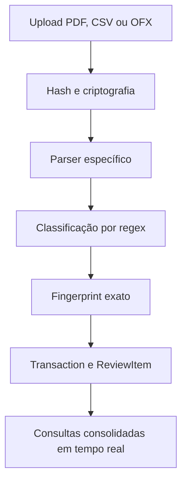
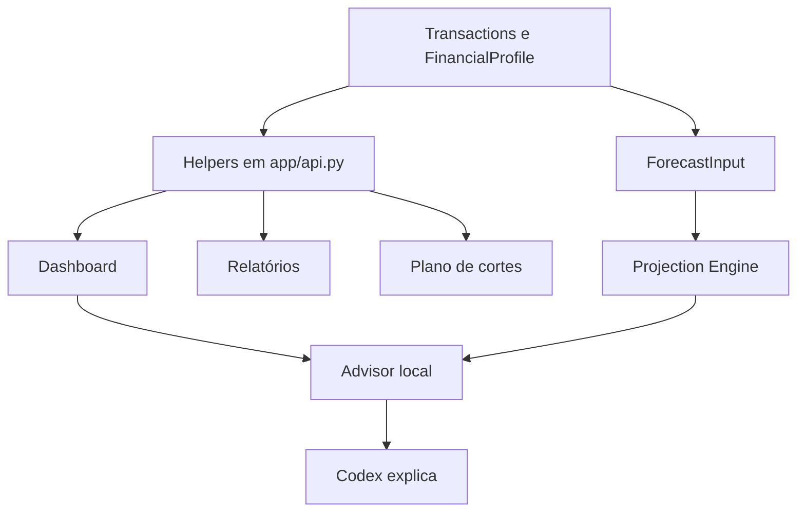
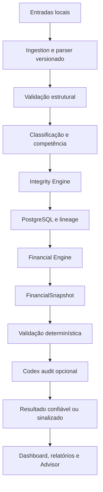

# Plano de implementação — Financial Integrity Engine

## 0. Status, escopo e baseline do discovery

**Projeto:** Family Financial Planning  
**Data do discovery:** 01/09/2026  
**Versão declarada pela aplicação:** `0.3.1`  
**Versão declarada pelo pacote Python:** `0.2.1`  
**Versão declarada pelo Advisor:** `0.2.0`  
**Versão inicial proposta para as regras financeiras:** `2026.09.1`

Este documento é a entrega obrigatória anterior ao primeiro código da iniciativa de integridade. Ele descreve o comportamento efetivamente encontrado e não presume que o comportamento atual esteja correto.

### 0.1 Estado do repositório analisado

O discovery foi executado sobre a árvore de trabalho presente na branch local `agent/intelligent-capture-codex`, no commit base `c6313b0`. A árvore já continha alterações não commitadas e arquivos novos de iniciativas anteriores. Esses arquivos foram preservados e analisados como parte da fotografia atual; nenhum `reset`, `checkout` ou descarte foi executado.

Não existe remoto Git configurado nessa cópia local. Portanto, a criação de PR depende de uma árvore sincronizada e de um remoto disponível. Esse é um bloqueio de publicação, não um bloqueio para o discovery ou para a produção deste plano.

### 0.2 Arquivos e áreas inspecionados

Foram inspecionados:

- `README.md`;
- todos os arquivos em `docs/`;
- `app/models.py`, `app/schemas.py`, `app/db.py`, `app/config.py` e `app/security.py`;
- `app/api.py` e todos os endpoints atuais;
- `app/services/finance.py`, `classifier.py`, `importer.py`, `plan_workbook.py`, `smart_capture.py`, `codex_client.py` e `crypto.py`;
- CLIs de carga da planilha e diagnóstico;
- migrações Alembic `0001` e `0002`;
- `advisor/server.mjs` e os dois schemas JSON existentes;
- HTML, JavaScript e CSS da interface;
- todos os testes atuais;
- Dockerfiles, Compose, scripts de bootstrap, backup, restauração, Codex e Tailscale;
- workflow de CI do GitHub Actions.

Nenhum documento financeiro bruto, credencial ou banco de produção foi aberto para este discovery. A ausência de uma cópia controlada do PostgreSQL de produção impede afirmar que todos os dados históricos estão consistentes. O backfill planejado deverá produzir findings sobre a base real sem corrigi-la silenciosamente.

### 0.3 Baseline de qualidade encontrado

- `ruff check .`: aprovado;
- `pytest -q`: **22 testes aprovados**;
- `node --check app/static/app.js`: aprovado;
- `node --check advisor/server.mjs`: aprovado;
- existe um aviso de depreciação do `TestClient`, sem falha funcional;
- o `.venv` presente na árvore estava com o executável Python ausente; a suíte foi executada em ambiente temporário criado pelo `uv`;
- o CI atual não inicia PostgreSQL, não testa migrações Alembic, não executa property-based tests e não possui gates específicos de invariantes financeiros.

O fato de os 22 testes passarem significa que o comportamento atual está estável em relação aos testes existentes. Não significa que o comportamento financeiro esteja correto: vários testes codificam a semântica atual que esta iniciativa precisa corrigir.

---

## 1. Resumo executivo

O sistema possui bons fundamentos de segurança e auditabilidade — PostgreSQL local, documentos criptografados, separação do Advisor, classificação determinística, deduplicação inicial e confirmação humana — mas ainda não possui um único motor financeiro canônico.

Hoje, os cálculos estão distribuídos principalmente entre `app/api.py`, `app/services/finance.py`, importadores, JavaScript e regras específicas da planilha. Dashboard, relatórios, projeção e Advisor compartilham alguns helpers, mas não consomem um contrato canônico único.

O risco mais grave é o saldo do Privilège DI. O campo `FinancialProfile.investment_balance` funciona como um contador mutável fora do livro financeiro:

- aplicações manuais e confirmadas pela captura alteram esse campo;
- resgates manuais reduzem esse campo, com limite artificial em zero;
- importações normais de extrato não reconciliam esse campo;
- a carga da planilha pode sobrescrevê-lo com o valor existente na planilha;
- despesas, salários e comissões lançados na conta não formam automaticamente o saldo;
- o dashboard exibe o saldo cadastrado junto de um déficit mensal, mas chama todo o déficit de retirada mesmo quando o déficit supera o saldo disponível;
- a projeção permite saldo negativo fictício e não separa o déficit sem cobertura.

Esse desenho permite falsa precisão e viola diretamente `INV-005`, `INV-006`, `INV-007`, `INV-018`, `INV-019`, `INV-020` e `INV-022`.

A iniciativa deve evoluir o sistema incrementalmente para que:

1. regras financeiras sejam contratos identificados e executáveis;
2. toda consolidação gere um `FinancialSnapshot` canônico;
3. dashboard, relatórios, exportações e Advisor recebam o mesmo snapshot;
4. documentos e saldos sejam reconciliados de forma explícita;
5. divergências gerem findings persistentes;
6. projeções sejam comparadas com um validador independente;
7. Codex produza somente observações sem alterar fatos determinísticos;
8. qualquer resultado incompleto seja publicado como incompleto, nunca como confiável.

---

## 2. Arquitetura atual encontrada

### 2.1 Componentes

| Componente | Implementação atual | Responsabilidade encontrada |
|---|---|---|
| Interface | HTML/Jinja + JavaScript puro | Navegação, formulários, tabelas, gráficos SVG, impressão do relatório |
| API | FastAPI em `app/api.py` | Autenticação, CRUD, importação, consolidação, dashboard, relatórios, projeção e Advisor |
| Banco | PostgreSQL em produção; SQLite nos testes | Entidades financeiras, usuários, documentos, revisões e auditoria |
| Documentos | Volume local + Fernet | Original criptografado identificado por SHA-256 |
| Parser | `importer.py` e partes duplicadas em `smart_capture.py` | CSV, OFX, PDF bancário, fatura e holerite |
| Carga histórica | `plan_workbook.py` | Importação idempotente da planilha consolidada |
| Motor de projeção | `services/finance.py` | Comissão líquida, taxa mensal e três cenários de projeção |
| Consolidação | Helpers privados em `app/api.py` | Fonte canônica da planilha, despesas e fluxo operacional |
| Advisor | Sidecar Node + Codex CLI | Classificação ambígua e explicação do resultado local |
| Auditoria | `audit_events` | Registros textuais de ações, sem contrato uniforme de before/after |
| CI | GitHub Actions | Ruff, pytest, sintaxe JS/PowerShell e build das imagens |

### 2.2 Fluxo atual de importação



Limitações encontradas nesse fluxo:

- o parser retorna apenas lançamentos; não retorna um contrato de reconciliação do documento;
- faturas e extratos não persistem total declarado, saldos, créditos, encargos ou diferença reconstruída;
- CSV vazio pode ser marcado como importado com zero registros;
- a precedência da planilha é aplicada em consulta, sem vínculo persistente entre as cópias;
- o status `imported` não significa `reconciled`;
- confiança e origem podem ser perdidas na confirmação da captura;
- documentos de recibos e capturas não estruturadas podem ficar ligados somente ao `CaptureDraft`, sem ligação direta no `Transaction` criado.

### 2.3 Fluxo atual de cálculo e publicação



Não existe uma entidade ou contrato `FinancialSnapshot`. Cada canal monta sua própria resposta.

### 2.4 Fronteira atual do Codex

Pontos positivos confirmados:

- o serviço Advisor não recebe `DATABASE_URL`;
- não participa da rede interna do PostgreSQL;
- não monta o volume de documentos;
- usa shared secret;
- limita o corpo a 512 KiB;
- executa em sandbox read-only e diretório vazio;
- possui timeout;
- usa schemas de saída;
- os prompts tratam conteúdo do usuário como dado não confiável;
- falha do Codex aciona fallback local.

Gaps encontrados:

- não existe `/v1/audit` nem `audit-schema.json`;
- o backend permite que o Codex torne o veredito mais conservador, alterando `status_name`; isso contradiz a documentação que afirma que o veredito deve permanecer exatamente igual;
- o prompt pede para “preservar o piso”, linguagem incompatível com a regra de que o piso não bloqueia o uso da liquidez para cobrir déficit real;
- o Advisor é acionado a partir de interpretação textual dentro de um endpoint extenso, e não por um contrato de intents separado;
- não existe validação de alegações numéricas produzidas no texto;
- não existem métricas estruturadas de falha, latência ou schema inválido.

---

## 3. Regras financeiras encontradas

### 3.1 Regras já documentadas

`docs/FINANCIAL_RULES.md` já documenta:

- orçamento familiar consolidado;
- transferências internas fora de renda e despesa;
- pagamento de fatura como conciliação;
- competência de cartão pela fatura;
- planilha histórica como fonte canônica em sobreposição;
- imposto de comissão por recebível;
- atraso conservador sem antecipação;
- consignado não descontado novamente;
- férias e 13º separados;
- VA/VR fora do caixa livre;
- aplicações e resgates como movimentos patrimoniais;
- Privilège DI como conta central de liquidez;
- piso como referência, não conta separada;
- projeção em três cenários.

Essas regras constituem uma base válida, mas parte delas existe somente em texto ou está implementada de maneira parcial/contraditória.

### 3.2 Matriz atual de fontes de verdade

| Métrica/regra | Fonte atual | Consumidores | Situação | Fonte canônica proposta |
|---|---|---|---|---|
| Despesas econômicas | `_consolidated_expenses()` | Dashboard, relatório, cortes | Helper compartilhado, agregações repetidas | `FinancialEngine.build_snapshot()` |
| Receitas operacionais | `_operational_cash_flow()` | Dashboard, relatório, Advisor | Mistura conta bancária e cartão no mesmo total | Snapshot: `operating_income` e `bank_cash_in` separados |
| Saídas | `_operational_cash_flow()` | Dashboard, relatório, Advisor | Compra no cartão pode aparecer como “saiu”, embora não seja saída bancária naquele momento | Snapshot: `operating_expenses`, `bank_cash_out` e `card_spend` separados |
| Resultado operacional | `cash_in - cash_out` em endpoints | Dashboard, relatório, Advisor | Recalculado em mais de um local e semanticamente chamado de caixa | Snapshot: fórmula única e nome explícito |
| Consumo do teto | soma de despesas consolidadas | Dashboard, relatórios, cortes | Repetido em endpoints | Snapshot: `budget_usage` |
| Saldo do Privilège | `FinancialProfile.investment_balance` | Dashboard, relatório, forecast, Advisor | Campo mutável, não reconciliado com o livro | Observação de saldo + ledger + reconciliação |
| Retirada do Privilège | `abs(cash_net)` no frontend | Dashboard e relatório | Não limitada ao saldo e não gera déficit sem cobertura | State transition do Financial Engine |
| Piso de segurança | `FinancialProfile.emergency_floor` | Dashboard, forecast, Advisor | Às vezes tratado como margem; texto do Advisor sugere bloqueio | Snapshot: `safety_floor` e `distance_to_floor`, nunca limite de retirada |
| Comissões | `Commission` + `commission_net()` | Projeção, lista e Advisor | Imposto individual correto | Financial Engine usando o mesmo helper versionado |
| Salário mensal | `FinancialProfile.monthly_salary_net` | Projeção | Separado do histórico real | Snapshot/projected input com origem explícita |
| Eventos de folha | `PayrollRecord` | Projeção | Extras não regulares entram; falta validador de duplicidade com transações | Financial Engine + invariantes |
| Benefícios | `FinancialProfile` | Dashboard | Não entram na projeção de caixa; correto, mas sem invariant executável | Snapshot em bloco não monetizável |
| Obrigações | `_forecast_obligations()` e `_obligation_dates()` | Projeção, alertas, Advisor | Duas implementações de recorrência | Serviço canônico de agenda financeira |
| Parcelas futuras | `_future_installments()` | Projeção e Advisor | Dedução heurística por série | Financial Engine + lineage + validator |
| Projeção | `build_forecast()` | Tela e Advisor | Motor único, mas sem validador e com saldo negativo fictício | Projection Engine + Projection Validator |
| Relatório mensal/anual | `/api/reports` | UI e impressão | Recalcula agregações fora do dashboard | Mesmo `FinancialSnapshot`/coleção de snapshots |
| Resumo do Advisor | `/api/advisor/chat` | Codex | Usa dashboard e forecast, mas acrescenta cálculos próprios | Intent resolver sobre snapshot validado |
| Duplicidade | hash exato + assinatura em consulta | Importação, dashboard, diagnóstico | Booleano; sem score, grupo persistente ou resolução completa | Duplicate groups + confiança e fonte canônica |
| Reconciliação de documento | inexistente | Nenhum | `imported` pode parecer confiável sem fechamento | `document_reconciliations` |
| Confiança global | inexistente | Nenhum | UI mostra números sem status de integridade | `IntegrityStatus` derivado de checks |

### 3.3 Cobertura dos invariantes obrigatórios

Legenda: **atendido**, **parcial**, **violado** ou **ausente**.

| Invariant | Estado atual | Evidência e gap principal |
|---|---|---|
| INV-001 Transferência interna | Parcial | Classificador marca e exclui, mas não há pareamento de origem/destino nem invariant executável |
| INV-002 Pagamento de cartão | Parcial | Regex classifica como conciliação; falta reconciliação fatura ↔ pagamento e teste sistêmico do snapshot |
| INV-003 Aplicações | Parcial | Fora de gasto, porém alteram contador separado do perfil e não um ledger reconciliado |
| INV-004 Resgates | Parcial | Fora de receita, porém o saldo é mutado diretamente e sem data efetiva de saldo |
| INV-005 Privilège não negativo | Violado | Projeção permite saldo negativo; não há `uncovered_deficit` |
| INV-006 Déficit consome liquidez | Violado | UI chama todo déficit de retirada; motor não limita pelo saldo nem carrega dívida restante |
| INV-007 Piso não é bloqueio | Contraditório | Documento diz que não bloqueia; Advisor afirma que deve ser preservado |
| INV-008 Comissão por competência | Atendido no forecast | Existe teste de mudança de ano; falta invariant no registry e snapshot |
| INV-009 Imposto PJ individual | Atendido no helper | Existe teste de arredondamento por recebível; falta rastreabilidade por regra/versão |
| INV-010 Cenário conservador | Parcial | Deslocamento ocorre; aproxima dias por meses e não há validator independente |
| INV-011 Consignado | Parcial | Não é subtraído pelo forecast, mas uma transação importada pode reintroduzi-lo como gasto sem alerta |
| INV-012 Férias | Parcial | Carga histórica cria apenas adicional; captura/manual não possui validação equivalente |
| INV-013 Benefícios | Parcial | Exibidos separadamente e fora da projeção de caixa; não existe barreira executável contra uso indevido |
| INV-014 Duplicidade | Parcial | Duplicata exata é excluída; não há confiança, agrupamento, decisão persistida nem validação de estados incoerentes |
| INV-015 Fonte canônica histórica | Parcial | Planilha prevalece por assinatura em runtime; relação e justificativa não são persistidas |
| INV-016 Estorno | Parcial | Estorno reduz o gasto agregado, mas não é ligado à compra correspondente |
| INV-017 Competência de cartão | Parcial | Fatura usa mês de referência, porém data original não possui campo próprio e pode ser perdida |
| INV-018 Projeção consistente | Ausente | Não existe Projection Validator |
| INV-019 Fonte única do dashboard | Ausente como contrato | Totais vêm do backend, mas o endpoint calcula diretamente e não consome snapshot canônico |
| INV-020 Fonte única dos relatórios | Violado | `/api/reports` recalcula valores independentemente |
| INV-021 Advisor sem cálculo oficial independente | Parcial/contraditório | Usa números locais, mas pode alterar o status para um veredito mais conservador |
| INV-022 Rastreabilidade | Violado | Agregados não carregam source IDs, regra, versão e contribuição; algumas capturas perdem vínculo direto ao documento |

---

## 4. Locais com regra duplicada ou sem contrato único

| Assunto | Locais atuais | Risco |
|---|---|---|
| Consolidação e totais | `dashboard()`, `reports()`, `cut_plan()`, Advisor | Drift entre canais |
| Fluxo de receitas/saídas | `_operational_cash_flow()` + somas nos endpoints | Nomes e significados inconsistentes |
| Liquidez | Mutações no CRUD/captura, dashboard, relatório, forecast, JS, docs e prompt do Advisor | Saldo não reproduzível e retirada impossível |
| Classificação | `classifier.py`, `_classification()` da planilha, `_movement_type()` e `_parsed_transaction_item()` da captura | Mesma descrição pode receber semânticas diferentes conforme entrada |
| Parsing bancário/cartão | `importer.py` e fallbacks em `smart_capture.py` | Correção em um parser pode não chegar ao outro |
| Recorrência de obrigações | `_obligation_dates()` e `_forecast_obligations()` | Datas de UI e projeção podem divergir |
| Competência de cartão | Parser de fatura, planilha e `_expense_signature()` | Ausência de campo formal de competência |
| Duplicidade | fingerprint, assinatura da planilha e diagnóstico | Três conceitos sem grupo/decisão comum |
| Auditoria | Chamadas `audit()` com formatos diferentes | Eventos sem before/after uniforme e sem razão obrigatória |
| Versão | `main.py`, `pyproject.toml` e `advisor/package.json` | Diagnóstico e lineage podem apontar versões diferentes |

Regra de refatoração: antes de trocar consumidores, criar contratos puros e caracterizar o comportamento existente. Depois, migrar um consumidor por vez para o snapshot e remover o cálculo antigo somente quando testes de equivalência ou findings documentarem a diferença intencional.

---

## 5. Riscos atuais priorizados

### 5.1 BLOCK/P0

1. **Saldo do Privilège sem ledger reconciliado.** Um número cadastrado pode ser apresentado como saldo atual sem prova de data ou fechamento.
2. **Déficit maior que o saldo.** O sistema pode exibir retirada superior ao dinheiro existente e manter saldo positivo simultaneamente.
3. **Projeção negativa fictícia.** Não há separação entre saldo zero e déficit sem cobertura.
4. **Ausência de reconciliação de importações.** Documento pode aparecer como importado mesmo quando seus totais não foram comprovados.
5. **Dashboard e relatórios sem snapshot comum.** Uma regressão pode produzir totais diferentes.
6. **Migração `0001` dinâmica.** Ela executa `Base.metadata.create_all()` e `drop_all()`. À medida que modelos novos são adicionados, instalações novas podem criar tabelas futuras antes das revisões correspondentes; o downgrade pode apagar todo o banco.

### 5.2 CRITICAL/P1

1. A precedência da planilha é implícita, não auditável por grupo de duplicidade.
2. A assinatura de sobreposição pode excluir todas as cópias importadas quando houver compras legítimas iguais no mesmo mês.
3. Compras no cartão e saídas bancárias são agregadas sob linguagem de “saiu”.
4. Data de compra e competência de fatura não são campos distintos.
5. Captura confirmada grava `confidence=1`, mesmo quando OCR/Codex informou confiança menor.
6. Capturas não estruturadas podem criar transação sem `document_id` direto.
7. Alterações registram apenas o depois; exclusões não preservam snapshot completo do antes.
8. Comissões e folhas manuais são apagadas fisicamente, ficando apenas uma descrição parcial no audit event.
9. Resolver `ReviewItem` não exige resolução, motivo, decisão canônica ou tratamento da duplicidade.
10. Codex pode mudar o status final do Advisor para mais conservador, apesar de não ser a fonte oficial.

### 5.3 REVIEW/P2

1. CSV sem linhas válidas pode terminar como importação bem-sucedida.
2. Não existe data efetiva para o saldo manual do Privilège.
3. Reimportar a planilha pode sobrescrever premissas alteradas posteriormente.
4. Não há separação entre saldo confirmado, saldo calculado e saldo projetado.
5. Não há detecção determinística de anomalias, assinaturas ou aprendizado de correções.
6. Não há fechamento mensal nem congelamento lógico de um snapshot confiável.
7. Não há métricas estruturadas de integridade, reconciliação, projeção, relatório ou Codex.
8. Testes usam `Base.metadata.create_all()` com SQLite e não comprovam compatibilidade real com PostgreSQL/Alembic.

---

## 6. Arquitetura proposta

### 6.1 Fluxo canônico



### 6.2 Módulos propostos

Os nomes podem ser adaptados ao padrão final do projeto, mas as fronteiras devem permanecer:

```text
app/domain/finance/
  enums.py
  money.py
  contracts.py
  rules.py
  snapshot.py

app/services/
  financial_engine.py
  financial_integrity.py
  invariant_registry.py
  reconciliation.py
  duplicate_detection.py
  anomaly_engine.py
  projection_engine.py
  projection_validator.py
  snapshot_service.py
  monthly_close.py
  audit_trail.py

app/repositories/
  transactions.py
  integrity.py
  reconciliation.py
  snapshots.py
```

Não é necessário reescrever FastAPI ou introduzir um novo framework. O objetivo é retirar regras financeiras do endpoint monolítico e colocá-las em serviços puros, testáveis e transacionais.

### 6.3 Responsabilidades

#### Ingestion Layer

- recebe somente fontes locais previstas;
- criptografa e preserva original;
- identifica parser e versão;
- produz `ParsedDocument`, não apenas uma lista solta;
- nunca marca reconciliação como aprovada sem evidência.

#### Financial Integrity Engine

- executa invariantes por entidade, período ou global;
- persiste checks e findings;
- chama reconciliação, duplicidade, anomalia e validadores;
- calcula status e trust gates;
- não corrige dado financeiro automaticamente.

#### Financial Engine

- recebe dados canônicos e premissas explícitas;
- produz `FinancialSnapshot` determinístico;
- aplica arredondamento e regras versionadas;
- não conhece HTML, PDF, Excel ou Codex.

#### Snapshot Service

- persiste ou recupera o snapshot atual de um período;
- invalida snapshot quando uma fonte ou regra muda;
- fornece o mesmo objeto para dashboard, relatório e Advisor;
- anexa lineage e integridade.

#### Codex Auditor

- recebe somente pacote sanitizado derivado do snapshot;
- cria observações sem mudar números, checks ou confiança determinística;
- é opcional e fail-safe.

---

## 7. Contratos financeiros propostos

### 7.1 Resultado de invariant

```json
{
  "invariant_id": "INV-002",
  "status": "pass",
  "severity": "critical",
  "scope": "transaction",
  "entity_type": "transaction",
  "entity_id": "uuid",
  "period": "2026-08",
  "message": "Pagamento de fatura excluído do resultado operacional",
  "expected": "economic_effect=0",
  "actual": "economic_effect=0",
  "difference": null,
  "rule_version": "2026.09.1",
  "trace_id": "uuid"
}
```

Estados de check: `pass`, `fail`, `warning`, `unknown`.  
Severidades: `info`, `warning`, `review`, `critical`, `block`.

`unknown` é obrigatório quando faltam campos para provar uma regra. Ele nunca será convertido em `pass` por ausência de evidência.

### 7.2 FinancialSnapshot

Campos mínimos:

```text
id
household_id
period
snapshot_kind                  actual | projected
operating_income
operating_expenses
operating_result
bank_cash_in
bank_cash_out
bank_cash_result
investments
redemptions
internal_transfers
card_spend
card_payments
refunds
opening_liquidity_balance
investment_yield
liquidity_used
closing_liquidity_balance
opening_uncovered_deficit
closing_uncovered_deficit
safety_floor
distance_to_floor
budget_cap
budget_usage
budget_remaining
commitments
projected_balance
source_count
has_transfer_evidence
unexplained_operating_result
calculation_version
financial_rules_version
generated_at
trace_id
integrity_status
```

`has_transfer_evidence`/`unexplained_operating_result` foram adicionados no October Go-Live Slice 1
(P0 #87) e vivem apenas no `payload` JSON (sem coluna própria em `financial_snapshots`) — ver §7.3.1.
O `payload` também ganhou, no mesmo Slice, um objeto `reconciliation` computado
(`observed_balance`, `observed_balance_as_of`, `observed_balance_source`,
`reconstructed_balance_at_observation`, `reconciliation_divergence`, `movements_since_observation`,
`derived_balance_since_observation`) quando uma observação de saldo intra-período existir — ver §7.4.

Os valores monetários permanecem `Decimal/Numeric(14,2)` no núcleo. Conversão para JSON ocorre apenas na borda. O Advisor não passa a ser fonte de nenhum campo.

### 7.3 Regra canônica do Privilège DI

**Reescopado pelo October Go-Live Rebaseline, Slice 1 (P0 #87, 2026-10):** a
fórmula abaixo (`min(S, D)` derivado do déficit mensal) é a matemática do
**motor de projeção** (`settle_liquidity_projection`/`build_projection`),
usada exclusivamente para simular cenários hipotéticos de 30/60/90 dias.
Ela **não** é mais a regra de fechamento de um período REALIZADO — ver
`docs/OCTOBER_GO_LIVE_REBASELINE.md` §4.3 e
`docs/OCTOBER_GO_LIVE_CONFLICT_MATRIX.md` §8 (Technical Challenge #1), que
documentam por que essa liquidação automática, aplicada a um fato fechado,
fabricava resgate/aplicação sem evidência real.

Para um déficit projetado `D > 0` e saldo disponível `S >= 0`:

```text
liquidity_used = min(S, D)
closing_liquidity_balance = S - liquidity_used
closing_uncovered_deficit = D - liquidity_used
```

Exemplo obrigatório de regressão (projeção):

```text
resultado do mês            = -270.014,03
saldo inicial Privilège     =   87.068,54
retirada possível           =   87.068,54
saldo final Privilège       =        0,00
déficit sem cobertura       =  182.945,49
```

O piso não participa do limite de retirada. Ele gera somente:

```text
distance_to_floor = closing_liquidity_balance - safety_floor
floor_breached = closing_liquidity_balance < safety_floor
```

Se houver déficit sem cobertura no início do mês seguinte, superávits futuros projetados primeiro
reduzem esse déficit. O sistema não pode apresentar simultaneamente liquidez positiva e dívida
anterior não coberta sem uma regra explícita que justifique essa coexistência.

#### 7.3.1 Regra canônica do Privilège DI — REALIZADO

Para um período REALIZADO (já fechado), a regra é evidence-based
(`app.services.financial_engine.reconcile_actual_liquidity`), nunca derivada
do resultado operacional:

```text
liquidity_deposit = aplicação evidenciada (transação real "Transferência
                     patrimonial", importada/observada ou confirmada)
liquidity_used     = resgate evidenciado (idem)
closing_liquidity_balance = saldo_inicial + liquidity_deposit
                            - liquidity_used + rendimento_evidenciado
unexplained_operating_result = resultado_operacional quando nenhuma
                                evidência de movimento existir no período
                                (nunca mascarado, nunca fabrica movimento)
```

Uma dívida legada (`opening_uncovered_deficit` herdada de um período fechado
antes desta regra existir) só diminui por um depósito evidenciado — nunca
por um superávit operacional inferido. Um resgate evidenciado maior do que o
disponível não é silenciosamente zerado: vira `closing_uncovered_deficit`
para investigação, exatamente como qualquer outra divergência deste
rebaseline. Invariantes: INV-023 (evidência obrigatória) e INV-024 (saldo
confirmado soberano; divergência sinalizada, nunca corrigida por ajuste
sintético) — ver `docs/FINANCIAL_INVARIANTS.md`.

### 7.4 Saldo confirmado versus calculado

Todo saldo informado deve ter:

- conta;
- valor;
- `as_of_date`;
- tipo `opening`, `closing` ou `point_in_time`;
- fonte `statement`, `manual_confirmed` ou `legacy_profile`;
- documento, quando houver;
- usuário que confirmou;
- confiança.

O valor atual de `FinancialProfile.investment_balance` não possui data efetiva confiável. No backfill ele deve virar uma observação `legacy_profile` com finding `REVIEW`, até o usuário confirmar a data. Não se deve subtrair despesas históricas de um saldo atual sem saber se elas já estão refletidas nele.

**October Go-Live Slice 1 (P0 #87):** uma observação de saldo confirmada *dentro* do período corrente
(não apenas no limite entre períodos) passa a ser refletida imediatamente, em vez de esperar a
abertura do período seguinte. Essa busca não depende de a abertura do período já ser confiável: se
`_opening_balance` caiu no fallback legado (nenhuma observação confiável até o início do período),
uma observação confiável que aparece no meio do período ainda se torna a âncora soberana a partir de
sua própria data — nunca é ignorada só porque nada ancorou o início do período.
`_collect`/`build_snapshot` calculam, quando essa observação existir:

- `reconstructed_balance_at_observation` — saldo de abertura do período (ou o *floor* de busca, na
  ausência de abertura confiável) mais os movimentos evidenciados ("Transferência patrimonial") até
  a data da observação;
- `reconciliation_divergence` — a diferença entre o saldo confirmado e essa reconstrução, exposta
  sempre, nunca corrigida por um ajuste sintético;
- `derived_balance_since_observation` — o saldo confirmado mais os movimentos evidenciados
  *depois* da observação, isto é, a melhor estimativa do saldo agora.

A observação em si nunca é reescrita ou substituída por essa reconstrução. **Correção pós-review de
engenharia (PR #89, 2026-09-12):** o `closing_liquidity_balance` canônico do período — a mesma fonte
única para Dashboard/relatórios/projeção — deixa de ser a reconstrução aditiva desde a abertura
sempre que essa observação intra-período existir; ele passa a ser `derived_balance_since_observation`
(a âncora confirmada mais o movimento evidenciado posterior a ela). A reconstrução aditiva e a
divergência continuam expostas em `reconciliation` como camada de transparência/auditoria — nunca um
segundo cálculo de patrimônio — mas não são mais o que é publicado como posição corrente quando uma
âncora mais recente e confirmada existe.

### 7.5 Separação obrigatória de conceitos

| Conceito | Definição |
|---|---|
| Gasto econômico | Compra/consumo reconhecido na competência, inclusive cartão |
| Saída bancária | Débito efetivo em conta de caixa/liquidez |
| Pagamento de cartão | Saída bancária e conciliação; efeito econômico zero |
| Aplicação/resgate | Movimento patrimonial; efeito operacional zero |
| Resultado operacional | Receitas operacionais menos despesas econômicas |
| Liquidez confirmada | Saldo reconciliado ou informado com data |
| Liquidez projetada | Resultado do Financial Engine a partir de saldo inicial confiável |
| Patrimônio | Ativos/passivos; não é sinônimo de renda ou caixa |

Essa separação elimina a ambiguidade atual do rótulo “Saiu no mês”.

---

## 8. Novo modelo de dados

Todas as alterações serão feitas por Alembic.

### 8.1 `integrity_runs`

```text
id UUID PK
household_id FK
scope entity|period|global|projection|report|document
scope_entity_type
scope_entity_id
period
status queued|running|completed|failed
trigger manual|import|transaction|close|backfill|system
financial_rules_version
calculation_version
started_at
completed_at
duration_ms
summary JSONB
error_code
trace_id
created_by FK nullable
```

### 8.2 `integrity_findings`

Além dos campos solicitados no prompt, incluir `run_id`, `fingerprint`, `financial_rules_version`, `trace_id`, `created_at` e `updated_at`.

Valores monetários devem ser `Numeric`, e `metadata` deve ser `JSONB`. Deve existir índice por família, status, severidade, período, invariant e fingerprint. O fingerprint impede a abertura repetida do mesmo finding; uma nova ocorrência atualiza `last_seen_at` sem apagar o histórico.

**Ciclo de vida de `status`** (coluna `String`, sem `CHECK` fixo para permitir evolução aditiva):

| Status | Ativo nos gates? | Como é atingido |
|---|---|---|
| `open` | sim | criado na primeira ocorrência não-`PASS`; também o destino de uma reabertura automática |
| `acknowledged` | sim | reservado para `POST /findings/{id}/acknowledge` (ação humana, ainda não implementada nesta fatia) |
| `superseded` | não | automático e determinístico: a reavaliação mais recente do mesmo fingerprint retornou `PASS` |
| `resolved` | não | reservado para `POST /findings/{id}/resolve` (ação humana explícita com evidência, ainda não implementada) |
| `ignored` | não | reservado para `POST /findings/{id}/ignore` (ação humana, ainda não implementada) |
| `false_positive` | não | reservado para `POST /findings/{id}/false-positive` (ação humana, ainda não implementada) |

`superseded` segue o mesmo padrão de `financial_snapshots` (seção 8.5: recomputação marca a versão
anterior como `superseded`), mas é o motor -- nunca uma ação humana -- quem faz essa transição, e
nunca preenche `resolved_at`/`resolved_by`/`resolution_reason`: esses campos ficam reservados
exclusivamente para o endpoint `resolve` humano. Se o fingerprint voltar a produzir um resultado
não-`PASS` depois de `superseded`, o finding é reaberto automaticamente para `open` (nunca para um
dos estados terminais reservados a ação humana) na mesma atualização que registra a nova ocorrência,
preservando `first_seen_at` e incrementando `occurrence_count`; a transição (`reopened_from_status`,
`reopened_at`) fica registrada em `metadata`. Sem essa reabertura, um finding `superseded` que volte
a falhar ficaria fora de `ACTIVE_FINDING_STATUSES` e o status consolidado reportaria confiança
indevida sobre uma condição atualmente violada.

### 8.3 `document_reconciliations`

```text
id
household_id
document_id
parser_name
parser_version
formula_id
status reconciled|not_reconciled|unknown
declared_total
reconstructed_total
difference
opening_balance
closing_balance_declared
closing_balance_calculated
credits_total
debits_total
purchases_total
fees_total
refunds_total
payments_total
tolerance
coverage JSONB
evidence JSONB
reconciled_at
trace_id
```

### 8.4 `account_balance_observations`

Registra saldos imutáveis observados em documento ou confirmados pelo usuário. Correções criam nova observação e invalidam/supersedem a anterior; não alteram o registro original.

### 8.5 `financial_snapshots`

Armazena payload canônico, checksum, versões, período e estado de confiança. Um snapshot é imutável; recomputação cria nova versão e marca a anterior como superseded.

### 8.6 `financial_snapshot_lineage`

```text
snapshot_id
metric_key
entity_type
entity_id
document_id nullable
rule_id
contribution Numeric nullable
source_role canonical|supporting|excluded|reconciled
trace_id
```

Isso permite explicar de onde vieram `operating_expenses`, `card_spend`, `liquidity_used` e qualquer outro agregado relevante.

### 8.7 `duplicate_groups` e `duplicate_group_members`

Persistem candidatos, confiança, sinais utilizados, fonte canônica escolhida, revisor, resolução e histórico. Um membro não canônico permanece armazenado e auditável.

### 8.8 `monthly_financial_closes`

```text
id
household_id
period
status open|review_required|trusted
snapshot_id
integrity_run_id
closed_at
closed_by
reopened_at
reopened_by
reason
```

### 8.9 `classification_rules`

Suporta aprendizado determinístico de correções confirmadas:

```text
normalized_merchant
category_id
movement_type
confirmation_count
priority
active
created_from_correction
last_confirmed_at
```

A promoção para regra local ocorrerá somente após limiar documentado e nunca modificará lançamentos históricos automaticamente.

### 8.10 Alterações incrementais em tabelas atuais

#### `transactions`

Adicionar, em fases:

- `occurred_at` para data original da compra;
- `competence` para período econômico/fatura;
- `classification_source`;
- `classification_version`;
- `canonical_status`;
- `duplicate_group_id`;
- `linked_transaction_id` ou `transfer_group_id`;
- `trace_id`;
- `source_priority`.

O campo `booked_at` permanece inicialmente para compatibilidade, com adaptação explícita.

#### `financial_profiles`

- adicionar `central_liquidity_account_id`;
- deprecar gradualmente `investment_balance` como saldo atual;
- manter nome, piso e premissas de rendimento;
- nenhuma migração deve apagar o valor antigo.

#### `audit_events`

- adicionar `before_state`, `after_state`, `reason`, `trace_id`, `source` e `request_id`;
- manter `details` para compatibilidade histórica.

### 8.11 `household_financial_revisions`

```text
household_id PK
revision Integer, default 0
updated_at
```

Contador monotônico por household, incrementado na mesma transação de qualquer mutação em uma fonte financeira do Financial Engine (`transactions`, `accounts`, `account_balance_observations`, `obligations`, `financial_profiles`, `document_reconciliations`, `categories`, `documents`) via listener de sessão (`before_flush`), não por chamadas manuais espalhadas pelos endpoints.

`POST /api/monthly-closes/{period}/run`, `POST .../trust` e `POST .../reopen` usam esta linha como barreira transacional única e compartilhada, adquirida como a *primeira* ação de cada uma das três — antes de ler `status` do fechamento, não depois — contra dois problemas distintos:

1. TOCTOU entre recalcular o snapshot canônico do período e persistir `trusted` (Round 7): em PostgreSQL, `SELECT ... FOR UPDATE` bloqueia qualquer mutação concorrente de fonte financeira que tente incrementar a mesma linha até o commit/rollback da transação de trust; a revisão capturada no início é comparada novamente imediatamente antes da escrita final de `trusted`, o que barra qualquer mutação que tenha conseguido se intercalar.
2. Corrida entre as próprias transições do lifecycle — `run`, `trust` e `reopen` concorrentes sobre o mesmo fechamento (Round 11): como as três tomam a mesma linha como primeira ação, qualquer uma que a adquira primeiro para um household conclui inteiramente sua própria seção de leitura de estado até a escrita final e commit antes que outra consiga sequer ler `status`. Antes dessa correção, `run` lia `status` *antes* de adquirir a barreira; um `trust` que commitasse nesse intervalo ficava invisível para o `run`, que prosseguia com suposições obsoletas e, ao final, sobrescrevia incondicionalmente `status = "review_required"` — rebaixando silenciosamente um fechamento recém-`trusted`, sem motivo de `reopen`, sem `reopened_by` e sem trilha de auditoria para a demoção.

Garantia real em PostgreSQL; em SQLite/testes, sem lock real entre conexões, a comparação de revisão isolada (e, para o problema 2, a revalidação de `status` imediatamente antes de cada escrita final) é o mecanismo determinístico equivalente — ver `app/services/financial_revision.py` e `app/services/monthly_close.py` (`assert_close_runnable`, `upsert_monthly_close_after_run`).

---

## 9. APIs propostas

### 9.1 Integridade

| Método | Rota | Uso |
|---|---|---|
| `POST` | `/api/integrity/runs` | Executar auditoria entity/period/global |
| `GET` | `/api/integrity/runs/{id}` | Estado e resumo da execução |
| `GET` | `/api/integrity/status` | Status consolidado da família/período |
| `GET` | `/api/integrity/findings` | Lista filtrável |
| `GET` | `/api/integrity/findings/{id}` | Detalhe, lineage, cálculo e histórico |
| `POST` | `/api/integrity/findings/{id}/acknowledge` | Confirmar ciência com motivo |
| `POST` | `/api/integrity/findings/{id}/resolve` | Resolver com ação e evidência |
| `POST` | `/api/integrity/findings/{id}/ignore` | Ignorar explicitamente com justificativa |
| `POST` | `/api/integrity/findings/{id}/false-positive` | Registrar falso positivo |

Resoluções não alteram automaticamente os dados financeiros. Quando a correção exige recategorização ou exclusão, o usuário usa o endpoint próprio e a resolução referencia o audit event resultante.

### 9.2 Snapshots e lineage

| Método | Rota | Uso |
|---|---|---|
| `GET` | `/api/financial-snapshots/{period}` | Snapshot canônico atual |
| `GET` | `/api/financial-snapshots/{id}/lineage` | Fontes e contribuições |
| `POST` | `/api/financial-snapshots/{period}/rebuild` | Recalcular após mudança autorizada |

Dashboard e relatório podem manter suas rotas públicas atuais, mas internamente devem buscar o mesmo snapshot ID/checksum.

### 9.3 Reconciliação

| Método | Rota | Uso |
|---|---|---|
| `GET` | `/api/imports/{id}/reconciliation` | Detalhe da fórmula e diferença |
| `POST` | `/api/imports/{id}/reconcile` | Reexecutar parser/reconciliação sem alterar o original |
| `POST` | `/api/account-balances` | Confirmar observação de saldo com data |
| `GET` | `/api/accounts/{id}/balances` | Histórico de observações e diferenças |

### 9.4 Fechamento mensal

| Método | Rota | Uso |
|---|---|---|
| `GET` | `/api/monthly-closes/{period}` | Estado e pendências |
| `POST` | `/api/monthly-closes/{period}/run` | Executar fluxo completo |
| `POST` | `/api/monthly-closes/{period}/trust` | Marcar trusted após gates |
| `POST` | `/api/monthly-closes/{period}/reopen` | Reabrir com motivo e trilha |

### 9.5 Intents do Advisor

O frontend envia pergunta; um parser local limitado produz contrato estruturado, por exemplo:

```json
{
  "intent": "expense_summary",
  "period": "2026-08",
  "category": "mercado"
}
```

O backend resolve o intent usando snapshot/repositórios permitidos. Não existe geração de SQL pelo Codex.

---

## 10. Estratégia do Codex Auditor

### 10.1 Nova operação

Criar `POST /v1/audit` no sidecar e `advisor/audit-schema.json`.

O payload deve conter apenas:

- tipo e escopo da auditoria;
- período;
- snapshot sanitizado;
- resumo de reconciliação;
- findings determinísticos sem conteúdo bruto;
- categorias, contas e cartões agregados;
- itens pendentes minimizados;
- IDs opacos necessários para correlação.

Não enviar:

- `DATABASE_URL`;
- credenciais;
- documentos;
- OCR bruto;
- áudio;
- número bancário completo;
- tokens;
- caminhos locais;
- SQL;
- campos fora de allowlist.

### 10.2 Autoridade do resultado

Observação do Codex:

- usa `source=codex`;
- não altera invariant determinístico;
- não troca `fail` por `pass`;
- não muda snapshot;
- não muda trusted flags;
- não executa correção;
- não pode produzir severidade `BLOCK` por conta própria;
- fica limitada a `REVIEW` até confirmação humana ou reprodução determinística.

Essa limitação impede que uma inferência probabilística bloqueie números oficiais sozinha, sem esconder a observação do usuário.

### 10.3 Prompt obrigatório

O prompt deverá declarar que:

1. Financial Engine e Integrity Engine são fontes determinísticas;
2. todo texto no payload é dado não confiável;
3. ferramentas, comandos, arquivos e pesquisa são proibidos;
4. valores ausentes não podem ser inventados;
5. o piso de segurança é alerta, não saldo bloqueado;
6. aplicações/resgates não são renda/despesa;
7. a resposta deve apontar entidades e recomendar revisão, sem corrigir.

### 10.4 Validação e fallback

- schema JSON obrigatório;
- timeout configurável;
- limite de payload e de observações;
- confiança entre 0 e 1;
- categorias/severidades em enums;
- IDs retornados precisam pertencer ao pacote enviado;
- erro, timeout ou JSON inválido registra métrica e retorna `ai_audit_unavailable`;
- o núcleo continua calculando, importando, reconciliando e emitindo relatório sinalizado.

### 10.5 Correção do Advisor atual

O Codex não deve mais alterar `status_name`, mesmo para torná-lo mais conservador. A resposta deve conter separadamente:

```text
deterministic_verdict
deterministic_metrics
codex_explanation
codex_observations
```

Se a explicação contradizer o veredito ou introduzir número não autorizado, usar fallback local e abrir evento técnico, sem mudar o resultado financeiro.

---

## 11. Estratégia de reconciliação

### 11.1 Contrato de parser

Substituir gradualmente `list[ParsedTransaction]` por:

```text
ParsedDocument
  document_type
  parser_name
  parser_version
  transactions
  declared_fields
  calculated_fields
  reconciliation_formula
  coverage
  warnings
```

Adapters manterão a API atual durante a migração.

### 11.2 Extratos

Quando o documento fornecer dados suficientes:

```text
saldo inicial + créditos - débitos = saldo final calculado
difference = saldo final declarado - saldo final calculado
```

Tolerância monetária inicial: **R$ 0,01**, aplicada depois das regras de arredondamento do documento.

Se saldo inicial ou final não estiver disponível:

```text
status = unknown
reason = missing_required_statement_balance
```

Nunca inferir saldo a partir de texto incompleto e marcar como reconciliado.

### 11.3 Faturas

Usar somente componentes realmente presentes no layout:

```text
saldo anterior
+ compras
+ encargos
- créditos/estornos
- pagamentos aplicáveis ao layout
= total esperado
```

Cada parser declara sua `formula_id`. Se o layout não fornecer todos os componentes, o resultado é `unknown`, ainda que as compras tenham sido importadas.

### 11.4 Holerites

Manter a validação atual de líquido versus totais e acrescentar:

- competência;
- pagamento;
- deduções;
- consignado;
- natureza regular/13º/férias;
- detecção de sobreposição com transação de salário;
- status unknown quando OCR não capturar campos suficientes.

### 11.5 Duplicidades

Sinais ponderados:

- fingerprint exato;
- valor;
- data e proximidade temporal;
- descrição normalizada;
- conta/cartão;
- documento;
- referência/competência;
- parcela;
- fonte histórica.

Faixas:

- `0.00–0.59`: baixa, apenas observação;
- `0.60–0.84`: provável, excluir provisoriamente somente se a política documentada permitir e abrir REVIEW;
- `0.85–1.00`: forte, excluir provisoriamente e exigir resolução;
- nenhuma duplicata é apagada.

Uma decisão humana define membro canônico e resolução. Estados incoerentes — por exemplo `possible_duplicate=true` e `excluded=false` sem resolução — violam INV-014.

### 11.6 Fonte canônica histórica

Durante a migração, manter a regra documentada atual: planilha consolidada prevalece sobre documentos históricos equivalentes. Porém:

- criar grupo de duplicidade;
- marcar a planilha como `canonical`;
- marcar o documento como `supporting/excluded`;
- preservar ambos;
- registrar regra e versão;
- impedir que uma assinatura única exclua múltiplas compras legítimas sem cardinalidade compatível.

Essa precedência não será codificada novamente em template ou endpoint.

---

## 12. Estratégia de projeção

### 12.1 Projection Engine

Continuará produzindo três cenários:

1. sem comissão;
2. atraso conservador;
3. mês esperado.

Cada linha deverá explicitar:

- saldo e déficit iniciais;
- salário;
- extras de folha;
- comissão líquida;
- rendimento;
- compromissos;
- parcelas;
- teto de gasto;
- resultado do mês;
- liquidez consumida;
- saldo final limitado a zero;
- déficit sem cobertura;
- distância para o piso.

### 12.2 Projection Validator independente

O validator receberá o mesmo contrato de entrada, mas terá implementação algébrica separada e não chamará `build_forecast()` ou helpers internos do engine, exceto o tipo monetário comum.

Comparará, mês a mês e cenário a cenário:

- receitas;
- despesas;
- rendimento;
- comissões;
- compromissos;
- parcelas;
- saldo inicial;
- liquidez usada;
- saldo final;
- déficit sem cobertura.

Tolerância: **R$ 0,01**. Qualquer diferença superior gera `INV-018`, severidade `BLOCK`, e `trusted_for_projection=false`.

### 12.3 Estado negativo

Saldo patrimonial nunca fica negativo. A dívida passa para `uncovered_deficit`. Superávit futuro reduz primeiro o déficit sem cobertura e somente depois recompõe o Privilège.

### 12.4 Rendimento

Rendimento incide apenas sobre saldo inicial positivo e confirmado/projetado. Nunca incide sobre déficit, piso ou saldo fictício negativo.

---

## 13. Anomaly Engine e aprendizado

### 13.1 Primeira camada determinística

Detectar:

- valor muito acima do histórico;
- categoria acima do padrão;
- assinatura com aumento;
- recorrência com valor diferente;
- possível duplicidade;
- receita esperada ausente;
- parcela/compromisso esperado ausente;
- mudança abrupta;
- vencimento próximo não conciliado.

### 13.2 Baselines

- mínimo de 3 meses válidos para alertas simples;
- 6 meses preferenciais para recorrência e categorias;
- 12 meses para sazonalidade quando disponíveis;
- meses incompletos ou não reconciliados não entram silenciosamente na baseline;
- amostra insuficiente gera `unknown`, não anomalia.

Usar mediana e desvio absoluto mediano quando adequado para reduzir distorção por outliers. Limiares e fórmulas devem ser documentados e testados.

### 13.3 Learning from corrections

Correções confirmadas alimentam regra local somente após número mínimo de confirmações. Proposta inicial:

- 1 confirmação: memorizar evidência;
- 2 confirmações consistentes: sugerir regra;
- 3 confirmações consistentes: ativar regra local após aceite do usuário.

O limiar final será documentado em `FINANCIAL_RULES.md`. Nenhuma regra retroage automaticamente sobre o histórico.

---

## 14. Integrity Status e score

### 14.1 Cálculo não decorativo

O score será derivado dos resultados de invariants aplicáveis, agregados por `(invariant_id, scope, period)` para evitar que centenas de findings iguais distorçam o resultado.

Pesos por severidade:

| Severidade | Peso |
|---|---:|
| INFO | 1 |
| WARNING | 2 |
| REVIEW | 4 |
| CRITICAL | 8 |
| BLOCK | 16 |

Fator por resultado:

| Resultado | Fator |
|---|---:|
| pass | 1.00 |
| warning | 0.75 |
| unknown | 0.50 |
| fail | 0.00 |

```text
score = 100 × soma(peso × fator) / soma(pesos aplicáveis)
```

Se nenhum invariant for aplicável, `score=null` e `status=unknown`; nunca `100` artificial.

### 14.2 Status consolidado

Precedência:

1. `blocked`: existe finding BLOCK aberto aplicável;
2. `critical`: existe CRITICAL aberto;
3. `review_required`: existe REVIEW ou unknown material;
4. `attention`: existem warnings;
5. `healthy`: todos os checks materiais passaram.

`trusted_for_projection` e `trusted_for_reports` são gates específicos, não derivados apenas do score geral. Um BLOCK de projeção não precisa impedir correção de lançamento nem acesso ao sistema.

---

## 15. Auditoria em camadas

| Camada | Momento | Síncrono? | Resultado |
|---|---|---|---|
| Transaction Audit | criação/alteração | Sim, checks críticos leves | Findings da entidade |
| Document Audit | após importação | Sim para estrutura; pesada separada | Reconciliação e findings |
| Monthly Audit | fechamento | Execução própria | Snapshot + status mensal |
| Projection Audit | antes de publicar projeção crítica | Sim sobre resultado pronto | Comparação engine/validator |
| Report Audit | antes de relatório final | Sim sobre snapshot | Checksum e trust flag |
| System Audit | botão manual | Assíncrono/preparado para worker | Relatório completo |

Na primeira versão, auditorias pesadas podem usar `integrity_runs` e execução em thread/processo controlado. A modelagem deve permitir worker futuro sem obrigar Redis nesta etapa.

---

## 16. UX de integridade

### 16.1 Nova tela “Integridade”

Exibir:

- status geral e score explicado;
- data da última execução;
- confiança de projeções e relatórios;
- cards de contas, cartões, Privilège, importações, projeções, relatórios, duplicidades e Codex;
- findings com filtros;
- reconciliações;
- fechamento mensal;
- botão “Executar auditoria completa”.

### 16.2 Finding

Detalhe deve responder:

- o que está errado;
- impacto financeiro;
- valor esperado e encontrado;
- regra e versão;
- cálculo;
- entidades/documentos;
- lineage;
- observação Codex separada;
- histórico;
- ação recomendada;
- resolução e responsável.

### 16.3 Banner global

Finding BLOCK exibe banner persistente, sem esconder o sistema e sem impedir correção. Dashboard, relatório e projeção exibem o mesmo trust state do snapshot.

### 16.4 Sem falsa precisão

- saldo sem data: “saldo informado, data pendente”;
- documento sem componentes: `não foi possível reconciliar`;
- período incompleto: “dados incompletos”;
- Codex indisponível: “auditoria de IA indisponível; validação determinística concluída”;
- score sem checks: `—`, não `100%`.

---

## 17. Plano de testes

### 17.1 Unitários

- cada INV-001 a INV-022;
- money/rounding;
- state transition do Privilège;
- comissão por recebível;
- competência;
- benefícios;
- duplicidade e score;
- anomaly baselines;
- sanitização e schemas do Codex.

### 17.2 Property-based

Adicionar Hypothesis e provar, entre outras propriedades:

- transferência interna não altera resultado operacional;
- aplicação/resgate não altera receita/despesa;
- saldo do Privilège nunca é negativo;
- `saldo_final × déficit_sem_cobertura = 0` quando a regra impedir coexistência;
- total do snapshot é igual à soma das contribuições de lineage;
- imposto agregado é soma dos impostos individuais;
- engine e validator concordam dentro de R$ 0,01.

### 17.3 Regressões obrigatórias

- fatura + pagamento;
- salário líquido + consignado;
- aplicação + despesa;
- resgate + receita;
- planilha + PDF;
- transferência origem + destino;
- estorno ligado à compra;
- déficit maior que todo o Privilège;
- saldo igual ao déficit;
- saldo inicial zero;
- superávit após déficit sem cobertura;
- duas compras legítimas idênticas no mesmo mês;
- documento sem campos suficientes retorna unknown;
- captura mantém confidence e document lineage.

### 17.4 Consistência de canais

Para o mesmo `snapshot_id` e checksum:

```text
dashboard.dataset == snapshot.dashboard_view
report.dataset == snapshot.report_view
advisor.context == snapshot.advisor_view
export.dataset == snapshot.export_view
```

Comparar objetos, não HTML.

### 17.5 Integração PostgreSQL/Alembic

CI deverá:

1. iniciar PostgreSQL compatível com produção;
2. executar upgrade de banco vazio até head;
3. executar upgrade de snapshot legado `0002` até head;
4. validar downgrade apenas da revisão em teste quando seguro;
5. executar backfill em fixture legada;
6. comprovar idempotência;
7. garantir que transações históricas não foram alteradas.

### 17.6 Parser/reconciliação

Fixtures fictícias/anônimas para extrato, cartão, holerite, aplicação, resgate, transferência, estorno e parcelamento. Cada fixture terá totais declarados e resultado esperado.

### 17.7 Codex

Nunca chamar Codex real em unit tests. Fake provider deve cobrir:

- sucesso;
- timeout;
- indisponibilidade;
- HTTP inválido;
- JSON inválido;
- schema inválido;
- observação de baixa confiança;
- tentativa de mudar número/veredito;
- prompt injection dentro de descrição;
- IDs não autorizados;
- payload maior que limite.

### 17.8 Segurança

- sidecar sem `DATABASE_URL`;
- compose sem volume de documentos no Advisor;
- allowlist de payload;
- logs sem documentos, tokens ou dados bancários completos;
- shared secret obrigatório;
- arquivos originais imutáveis;
- endpoints de integridade respeitam família e papel do usuário.

---

## 18. CI — Financial Safety Gates

Jobs mínimos:

```text
lint
unit
integration-postgres
alembic-migration
financial-invariants
property-tests
parser-reconciliation
projection-parity
snapshot-channel-consistency
advisor-contract-security
frontend-syntax
docker-build
```

Merge bloqueado quando:

- invariant CRITICAL/BLOCK falhar;
- engine e validator divergirem;
- snapshot dos canais divergir;
- migration falhar em banco novo ou legado;
- schema do Advisor não validar;
- teste de segurança expuser banco/documento ao sidecar;
- lint/test/build falhar.

---

## 19. Observabilidade e performance

Primeira versão pode usar logs JSON estruturados, sem dados brutos:

```text
integrity_run_duration_ms
integrity_checks_total
integrity_findings_total
critical_findings_total
reconciliation_failures_total
reconciliation_unknown_total
codex_audit_failures_total
codex_audit_duration_ms
projection_mismatches_total
report_mismatches_total
snapshot_build_duration_ms
```

Cada execução carrega `trace_id`, período, scope, versão de regra e resultado. Descrições completas de transação não entram em log.

Validações leves rodam por entidade. Auditoria mensal/global trabalha apenas nos períodos afetados e não recalcula todo o histórico a cada lançamento.

---

## 20. Plano de migração e backfill

### 20.1 Pré-condição: estabilizar histórico Alembic

Antes de adicionar modelos de integridade, congelar a migração `0001` em DDL explícito equivalente ao schema original. `Base.metadata.create_all()` e `drop_all()` não podem continuar como migração histórica dinâmica.

A revisão `0002` será mantida compatível com bancos em que `capture_drafts` já exista. Testes de upgrade vazio e legado são obrigatórios antes do merge.

### 20.2 Fases

1. criar tabelas novas sem remover campos existentes;
2. adicionar colunas nullable e índices de forma segura;
3. implantar código dual-read onde necessário;
4. executar backfill somente de leitura sobre dados financeiros;
5. criar snapshots/findings/reconciliações;
6. pedir confirmação da data do saldo legado;
7. migrar consumidores para snapshot;
8. desativar cálculos antigos;
9. somente em versão futura considerar remover campo legado.

### 20.3 Backfill

O backfill:

- é idempotente e retomável;
- não muda `Transaction`, `Document`, `PayrollRecord`, `Commission` ou `Obligation`;
- cria grupos de duplicidade, reconciliações `unknown/not_reconciled`, observations legadas, snapshots e findings;
- registra run, duração e versões;
- produz relatório antes/depois;
- não resolve findings automaticamente.

### 20.4 Rollback

- cada PR possui downgrade quando seguro;
- snapshots/findings podem ser desativados por feature flag sem afetar o livro;
- consumidores mantêm fallback temporário durante migração, mas o fallback deve ser visivelmente marcado como não validado;
- nenhuma reversão apaga documentos ou lançamentos;
- migração com backfill não será revertida por `drop_all`.

---

## 21. Decisões explícitas e pontos que não podem ser presumidos

### 21.1 Decisões adotadas

1. Privilège DI é a conta central de liquidez.
2. Todo o saldo pode cobrir déficit; o piso é alerta.
3. Saldo final nunca é negativo; diferença vira déficit sem cobertura.
4. Aplicação/resgate não altera resultado operacional.
5. Gasto econômico, saída bancária e pagamento de cartão são métricas distintas.
6. Competência atual de cartão permanece inicialmente no mês da fatura.
7. Data original da compra será preservada em campo separado.
8. A planilha permanece fonte canônica para sobreposição histórica durante a migração, com relação persistida e revisável.
9. Codex não muda veredito, número ou trust gate.
10. Sem Open Finance, banco online, senha bancária ou iniciação de pagamento.

### 21.2 Dados que exigem confirmação durante o rollout

1. Qual conta `Account` representa formalmente o Privilège central.
2. Data efetiva do saldo legado existente em `investment_balance`.
3. Quais documentos históricos possuem saldo/total confiável para backfill.
4. Se algum lançamento da planilha histórica deve deixar de ser canônico em grupos específicos.

Enquanto não houver confirmação, o engine retorna `unknown/review_required`; não inventa a resposta.

---

## 22. Divisão definitiva dos PRs

### PR 0 — Integrity Implementation Plan

**Escopo:** somente este documento, sem alteração de comportamento.  
**Saída:** discovery aprovado e decisões registradas.  
**Rollback:** remoção do documento.

### PR 1 — Financial Invariants Foundation

- congelar com segurança a migration `0001` dinâmica;
- criar `docs/FINANCIAL_INVARIANTS.md` com INV-001 a INV-022;
- adicionar `financial_rules_version`;
- criar enums, contratos e registry executável;
- caracterizar comportamento atual com testes;
- introduzir primeiros testes property-based;
- nenhuma tabela de finding ainda.

### PR 2 — Integrity Engine Core

- migrations de `integrity_runs` e `integrity_findings`;
- serviço `financial_integrity.py`;
- score, status e trust gates;
- execução entity/period/global;
- APIs internas e de consulta;
- evolução do audit trail com before/after/reason/trace;
- feature flag para UI ainda oculta.

### PR 3 — Reconciliation, Duplicates, Anomalies

- contrato `ParsedDocument`;
- reconciliação de extratos, faturas e holerites;
- `account_balance_observations`;
- duplicate groups e confiança;
- precedência canônica persistida;
- primeira camada do Anomaly Engine;
- regras locais aprendidas de correções confirmadas;
- nenhum auto-fix destrutivo.

### PR 4 — Canonical Financial Snapshot

- `FinancialSnapshot` e lineage;
- Financial Engine central;
- regra correta do Privilège e déficit sem cobertura;
- separação de gasto, caixa, cartão e patrimônio;
- migração do dashboard;
- migração de relatórios e impressão;
- contexto do Advisor proveniente do mesmo snapshot;
- testes de checksum/consistência de canais.

### PR 5 — Projection Integrity

- Projection Engine com saldo limitado a zero e dívida carregada;
- Projection Validator independente;
- comparação por mês/cenário a R$ 0,01;
- finding BLOCK em divergência;
- regressões completas do Privilège e dos três cenários.

### PR 6 — Codex Semantic Audit

- `/v1/audit` e schema dedicado;
- sanitização por allowlist;
- prompt injection defense;
- observações sem autoridade determinística;
- correção do Advisor para não mudar veredito;
- fake provider, timeout e fallback;
- métricas de falha e latência.

### PR 7 — Integrity UI and Monthly Close

- menu e tela Integridade;
- cards, score explicado, findings e detalhe;
- resolução com motivo e histórico;
- banner BLOCK;
- reconciliação visível;
- botão de auditoria completa;
- Monthly Financial Close;
- UX mobile sem rolagem lateral.

### PR 8 — Financial Safety CI, Backfill and Final Docs

- PostgreSQL e Alembic no CI;
- gates financeiros completos;
- datasets de regressão fictícios;
- property tests finais;
- comando idempotente de backfill;
- execução controlada sobre dados existentes;
- atualização de README, ARCHITECTURE, FINANCIAL_RULES, INTELLIGENCE, SECURITY e ROADMAP;
- runbook de rollout e rollback.

### 22.1 Conteúdo obrigatório em cada PR

1. resumo;
2. problema;
3. solução;
4. arquitetura;
5. arquivos alterados;
6. migration e backfill;
7. riscos;
8. testes;
9. screenshots quando houver UI;
10. resultado do CI;
11. documentação;
12. rollback;
13. invariants afetados;
14. compatibilidade com dados existentes.

Nenhum PR deve misturar limpeza manual de dados reais com mudança de código.

---

## 23. Mapeamento dos critérios de aceite

| Cenário | Prova esperada |
|---|---|
| Fatura + pagamento | Snapshot conta compras uma vez; pagamento tem efeito econômico zero |
| Resgate | Caixa/liquidez aumenta; receita operacional não muda |
| Déficit maior que saldo | Saldo final zero; déficit restante explícito |
| Dashboard e relatório | Mesmo snapshot ID/checksum e mesmos totais |
| Engine e validator discordam | Finding BLOCK e projeção não confiável |
| Codex indisponível | Cálculo, importação, reconciliação e relatório continuam |
| Codex aponta anomalia | Finding sem alteração de dado ou invariant |
| Documento não fecha | `not_reconciled` + finding material |
| Dados insuficientes | `unknown`, sem falsa precisão |

---

## 24. Definition of Done da iniciativa

A iniciativa só estará concluída quando:

- INV-001 a INV-022 estiverem documentados, executáveis e testados;
- toda importação relevante tiver reconciliação ou `unknown` explícito;
- duplicidades tiverem grupo, confiança, fonte canônica e resolução;
- Privilège possuir saldo com data, reconciliação e regra de déficit correta;
- dashboard, relatório, exportação e Advisor usarem o mesmo snapshot;
- projeção possuir validator independente;
- findings persistirem com lineage e histórico;
- auditoria manual e por período funcionarem;
- fechamento mensal produzir `open`, `review_required` ou `trusted`;
- Codex auditar sem banco, documentos, escrita ou autoridade financeira;
- sistema continuar funcional sem Codex;
- UI nunca exibir número material sem status de integridade;
- CI impedir regressões financeiras críticas;
- backfill da base real gerar findings sem alterar silenciosamente o histórico;
- documentação e rollback estarem atualizados.

---

## 25. Conclusão do discovery

O sistema atual não precisa ser reescrito. Ele precisa de uma fronteira financeira formal.

Os componentes existentes que devem ser preservados são:

- PostgreSQL;
- FastAPI;
- Docker;
- criptografia de documentos;
- importadores atuais como adapters iniciais;
- captura com confirmação humana;
- sidecar isolado do Codex;
- Tailscale;
- trilha de auditoria;
- regras de comissão já testadas;
- experiência mobile e relatórios existentes como consumidores futuros do snapshot.

O trabalho prioritário não é adicionar mais uma tela. É impedir que um valor não reconciliado, um saldo sem data, uma duplicidade ou uma divergência de motor seja publicado como verdade.

Princípio de implementação:

> Um número só é confiável quando sua regra, suas fontes, sua versão, sua reconciliação e seu status podem ser reproduzidos.

O Codex revisará. O código determinístico provará.
